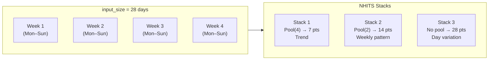
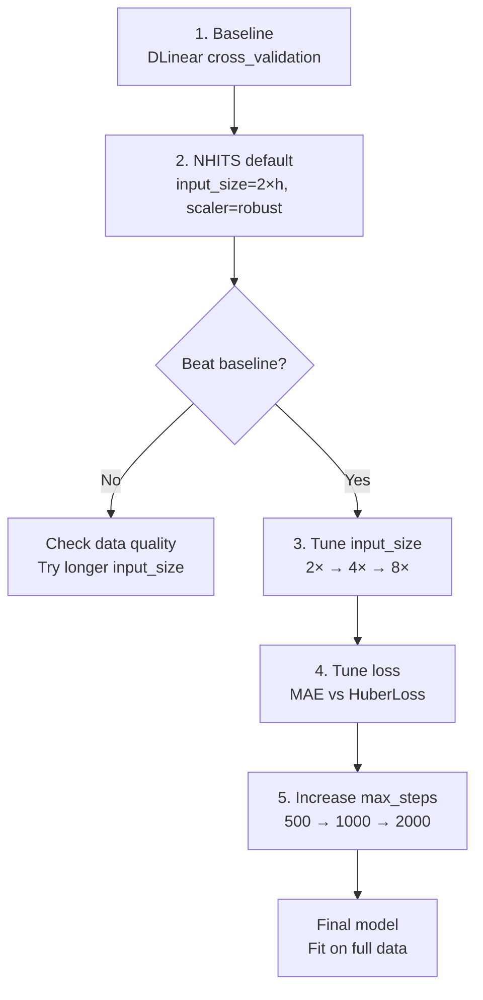

<!-- _class: lead -->

# Hyperparameter Tuning

## Module 01 — Point Forecasting
### Modern Time Series Forecasting with NeuralForecast

<!-- Speaker notes: This deck covers the four key hyperparameters that drive most of the quality difference in neural forecasting: input_size, scaler_type, loss function, and max_steps. The central message is that input_size is the most impactful choice — get it right first, then tune the others. We also cover cross_validation(), which is the only honest way to compare model configurations on time series data. -->

---

# The Four Key Hyperparameters

| Parameter | What it controls | Rule of thumb |
|---|---|---|
| `input_size` | Historical lookback window | **2–4× horizon** |
| `scaler_type` | Input normalization | `"robust"` for sales |
| `loss` | What the model minimizes | `MAE()` for sales |
| `max_steps` | Training iterations | 500–2000 |

**Most impactful first**: tune `input_size` before anything else.

<!-- Speaker notes: Open by orienting learners to what actually matters. Many practitioners get distracted by model architecture choices when the biggest gain comes from simply providing the right amount of historical context via input_size. For bakery sales data, moving from input_size=7 to input_size=28 typically reduces MAE by 20-30%. Scaler choice matters less but is important for robustness. Loss function determines the statistical property being optimized. max_steps is about training duration. -->

---

# input_size: The Most Important Choice

```python
results = {}
for input_size in [7, 14, 28, 56]:
    nf = NeuralForecast(
        models=[NHITS(h=7, input_size=input_size, max_steps=500)],
        freq="D"
    )
    cv = nf.cross_validation(df, n_windows=4)
    results[input_size] = mae(cv["y"], cv["NHITS"]).mean()
```

Typical result on bakery daily data:

| input_size | MAE | Context provided |
|---|---|---|
| 7 | ~23.4 | 1 weekly cycle |
| 14 | ~19.1 | 2 weekly cycles |
| **28** | **~16.8** | **4 weekly cycles** |
| 56 | ~16.2 | 8 weekly cycles |

<!-- Speaker notes: Walk through this table. The MAE numbers are illustrative but representative of the pattern seen on real bakery data. The improvement from 7 to 28 is large because NHITS's multi-rate MaxPool layers need multiple complete weekly cycles to extract the weekly pattern at different resolutions. Beyond 56, improvements diminish and may even reverse if very old data is irrelevant (e.g., pre-expansion inventory) or if the model starts overfitting. -->

---

# Why 4× Horizon Works

For `h=7` (weekly forecast), `input_size=28` gives NHITS **four complete weekly cycles**.



- Stack 1 (pool=4): sees 7 coarse points → learns monthly trend
- Stack 2 (pool=2): sees 14 points → learns weekly pattern
- Stack 3 (no pool): sees all 28 → handles daily residuals

<!-- Speaker notes: This diagram shows why 4× works structurally. Each NHITS stack uses a different pooling kernel. With input_size=28 and a stack with MaxPool(kernel=4), the effective sequence length is 7 — exactly one period of the weekly cycle, giving the model one weekly "summary". With MaxPool(kernel=2), it sees 14 points — two weekly cycles. Without pooling it sees all 28. This alignment between the seasonal period (7) and the pooling ratios (1x, 2x, 4x) is the reason 4× is the right default for daily data with weekly seasonality. -->

---

# scaler_type: Handling Outliers

NeuralForecast normalizes each window before the MLP and denormalizes the output:

$$x_{\text{scaled}} = \frac{x - \text{center}}{\text{scale}}$$

| scaler_type | center | scale | Robust to outliers? |
|---|---|---|---|
| `"standard"` | mean | std | No |
| `"minmax"` | min | max $-$ min | No |
| `"robust"` | median | IQR | **Yes** |
| `None` | — | — | Depends on data |

**For bakery sales**: use `"robust"`. Holiday spikes (3× normal sales) distort mean and std but not median and IQR.

<!-- Speaker notes: Scaler_type is applied per-window, not per-series. For each training window, NHITS computes the center and scale, normalizes, runs the MLP, then denormalizes the output. This means a window containing a Christmas spike won't distort the normalization for future windows. The robust scaler uses the median as center and the IQR (75th percentile minus 25th percentile) as scale. These statistics are resistant to outliers — a single extreme value does not shift them. For sales data with promotional spikes or holiday effects, this is the right default. -->

---

# scaler_type: Visual Comparison

<div class="columns">

**standard scaler** — Christmas spike distorts $\mu$

```
Regular week:  [80, 75, 90, 85, 120, 180, 200]
μ = 118, σ = 55
Normalized Christmas: (500-118)/55 = 6.9
→ Christmas dominates the gradient
```

**robust scaler** — median and IQR unaffected

```
Same week:
median = 90, IQR = 100
Normalized Christmas: (500-90)/100 = 4.1
→ Spike is visible but not dominant
```

</div>

```python
NHITS(h=7, input_size=28, max_steps=500, scaler_type="robust")
```

<!-- Speaker notes: This comparison makes the scaler difference concrete. With standard scaling, a single Christmas week with 500 units sold (vs 80-200 normally) produces a scaled value of 6.9, which contributes a squared gradient about 50x larger than normal days when using MSE loss. With robust scaling, the same day normalizes to 4.1, which is still an outlier but the distortion is much smaller. The robust scaler shifts the model's focus toward the typical weekly pattern rather than the exceptional days. -->

---

# Loss Functions

```python
from neuralforecast.losses.pytorch import MAE, MSE, MQLoss, HuberLoss

# Optimizes median — robust to outliers
NHITS(h=7, loss=MAE())

# Optimizes mean — sensitive to large errors
NHITS(h=7, loss=MSE())

# Trains probabilistic output (quantiles)
NHITS(h=7, loss=MQLoss())

# MSE near zero, MAE for large errors
NHITS(h=7, loss=HuberLoss(delta=1.0))
```

<!-- Speaker notes: The loss function determines what the model is statistically trained to produce. MAE trains the model to output the conditional median — it minimizes absolute differences, so outliers influence it proportionally. MSE trains the model to output the conditional mean — it squares errors, so outliers dominate training. For bakery sales with holiday spikes, MAE is appropriate: we want typical sales forecasts, not forecasts pulled toward exceptional events. MQLoss is used for probabilistic forecasting (covered in Module 02) — it simultaneously trains quantiles at multiple probability levels. -->

---

# Loss Function Selection

| Use case | Loss | Why |
|---|---|---|
| Sales forecasting | `MAE()` | Outliers present; median is target |
| Financial returns | `MSE()` | Large errors matter disproportionately |
| Energy demand | `HuberLoss()` | Mix: spikes happen but matter |
| Inventory planning | `MQLoss()` | Need upper/lower bounds |

$$\text{MAE} = \frac{1}{n}\sum |y_t - \hat{y}_t| \qquad \text{MSE} = \frac{1}{n}\sum (y_t - \hat{y}_t)^2$$

**For French Bakery**: `MAE()` — robust to the occasional holiday spike.

<!-- Speaker notes: Connect loss choice to business context. For inventory planning, a point forecast is not enough — you need to know whether to order the pessimistic or optimistic quantity. That requires quantile forecasts from MQLoss. For sales forecasting where you just want the best single estimate, MAE is appropriate. For financial risk management, MSE makes large prediction errors disproportionately costly during training, which aligns with how financial losses work in practice. -->

---

# max_steps and learning_rate

<div class="columns">

**max_steps**

```python
# Exploration
NHITS(h=7, max_steps=200)

# Standard
NHITS(h=7, max_steps=1000)

# Complex series
NHITS(h=7, max_steps=2000)
```

Start at 500. Increase if validation loss is still falling.

**learning_rate**

```python
# Default (works for most cases)
NHITS(h=7, learning_rate=1e-3)

# Lower for large models
NHITS(h=7, learning_rate=1e-4)
```

Default `1e-3` works in 90% of cases.

</div>

<!-- Speaker notes: max_steps is training duration. NeuralForecast uses a fixed number of gradient steps rather than epochs — internally it batches windows from the training data. With small datasets like bakery data (~1000 rows, 7 products), 500 steps is often enough for convergence. For large datasets (millions of rows, hundreds of series), more steps are needed. The learning rate default of 1e-3 uses the Adam optimizer's effective range for this architecture. Only lower it if you observe training loss oscillating rather than decreasing. -->

---

# Cross-Validation: Why It Matters

A single train/test split can be misleading:

```
Time series:  Jan ──────────── Dec
Single split: [── train ──────] [test]
              → one test window, may be atypical
```

Rolling window cross-validation evaluates across multiple windows:

```
Window 1: [train1] | [test1]
Window 2:  [train2] | [test2]
Window 3:   [train3] | [test3]
Window 4:    [train4] | [test4]
```

Each window's error independently measured → stable, unbiased comparison.

<!-- Speaker notes: This is the core motivation for cross-validation on time series. A single held-out test period may coincide with an unusually quiet period (leading to optimistic evaluation) or an unusually volatile period (pessimistic evaluation). Rolling window cross-validation gives you one MAE per window — you can see whether the model is stable across time or whether its accuracy varies by season. For bakery data, models typically perform worse on December windows (holiday season) than on February windows (quiet period). -->

---

# cross_validation() API

```python
nf = NeuralForecast(
    models=[NHITS(h=7, input_size=28, max_steps=1000, scaler_type="robust")],
    freq="D"
)

cv_df = nf.cross_validation(
    df=df,
    n_windows=4,    # number of test windows
    step_size=7,    # days between window start points
)

# Output columns: unique_id, ds, cutoff, y, NHITS
print(cv_df.head())
```

`cutoff` = the last training date for that window.  
`y` = actual value.  
`NHITS` = model prediction.

<!-- Speaker notes: Walk through the parameters. n_windows controls how many evaluation windows are used. step_size controls the gap between them — with step_size=h (default), windows advance exactly one forecast horizon at a time, which avoids overlap. The cutoff column is critical: it tells you when training data ended for each prediction, which lets you diagnose whether the model's accuracy varies by season. By default, the model is trained once on the full dataset minus the last n_windows*h observations, then evaluated on rolling windows without retraining. Set refit=True to retrain on each window (more accurate but much slower). -->

---

# Evaluating Cross-Validation Results

```python
from utilsforecast.losses import mae, mse
from utilsforecast.evaluation import evaluate

# Aggregate across all windows and series
overall_mae = mae(cv_df["y"], cv_df["NHITS"]).mean()
print(f"Overall MAE: {overall_mae:.2f}")

# Per-window: check stability over time
per_window = cv_df.groupby("cutoff").apply(
    lambda w: mae(w["y"], w["NHITS"]).mean()
).rename("MAE")
print(per_window)

# Per-series: find which products are hardest to forecast
per_series = cv_df.groupby("unique_id").apply(
    lambda s: mae(s["y"], s["NHITS"]).mean()
).rename("MAE")
print(per_series.sort_values(ascending=False))
```

<!-- Speaker notes: Show the three levels of analysis. Overall MAE gives a single number for model comparison. Per-window MAE reveals whether accuracy degrades at certain times (e.g., during holidays). Per-series MAE shows which products are harder to forecast — croissants may be more volatile than baguettes, for example. This breakdown helps you decide whether to use a single model for all series or specialized models for difficult series. -->

---

# Tuning Workflow



<!-- Speaker notes: This flowchart is the practical tuning recipe. Start with DLinear as baseline — if NHITS with default settings cannot beat DLinear, something is wrong (data quality, feature engineering, or the signal is genuinely linear). Once NHITS beats baseline, tune input_size first because it has the highest impact. Then tune loss function based on business context. Only increase max_steps after the architecture choices are settled — more training helps more when the model has the right structure. -->

---

# Complete Tuning Example

```python
from neuralforecast import NeuralForecast
from neuralforecast.models import NHITS, DLinear
from neuralforecast.losses.pytorch import MAE
from utilsforecast.losses import mae

# Baseline
cv_base = NeuralForecast(
    models=[DLinear(h=7, input_size=28, max_steps=500)], freq="D"
).cross_validation(df, n_windows=4)
print(f"Baseline: {mae(cv_base['y'], cv_base['DLinear']).mean():.2f}")

# NHITS with best config
cv_nhits = NeuralForecast(
    models=[NHITS(
        h=7, input_size=28, max_steps=1000,
        scaler_type="robust", loss=MAE()
    )], freq="D"
).cross_validation(df, n_windows=4)
print(f"NHITS:    {mae(cv_nhits['y'], cv_nhits['NHITS']).mean():.2f}")
```

<!-- Speaker notes: This is the complete two-model comparison that learners should use as their starting point. Run DLinear first to establish the floor. Then run NHITS with the recommended configuration. If the improvement is less than 5%, the bakery dataset for that product is likely too simple or too short for neural models to find non-linear patterns. If the improvement is 10%+, it justifies neural modeling and warrants further tuning. -->

---

# Key Takeaways

1. **`input_size`** is the most impactful hyperparameter — try 2×, 4×, 8× horizon
2. **`scaler_type="robust"`** handles sales outliers (holidays, promotions)
3. **`MAE()` loss** is appropriate for sales data; `MSE()` for when large errors are costly
4. **`max_steps=500`** for exploration; 1000–2000 for final training
5. **`cross_validation()`** is the only honest way to compare configurations
6. Always **benchmark against DLinear** — neural models must earn their complexity

<!-- Speaker notes: Summarize the five actionable rules. Emphasize that the most common mistake is tuning model architecture (NHITS vs NBEATS vs PatchTST) before tuning the data input (input_size, scaler_type). The architecture is less important than the quality of the input window. Next: Notebook 01 trains NHITS on the bakery data, evaluates with MAE and MSE, and plots the actual vs predicted. Notebook 02 puts cross_validation() into practice and compares NHITS against DLinear. -->

---

<!-- _class: lead -->

# Next: Notebook 01
## Training NHITS on French Bakery Data

Load data → fit model → evaluate → plot

<!-- Speaker notes: The notebook takes the concepts from these two guides and applies them to the actual bakery dataset. Learners will run training end-to-end, see MAE and MSE numbers, and generate actual vs predicted plots. The notebook is designed to complete in under 15 minutes, including training time. For faster execution, max_steps is set to 500 — sufficient for learning but not optimal for production. -->
