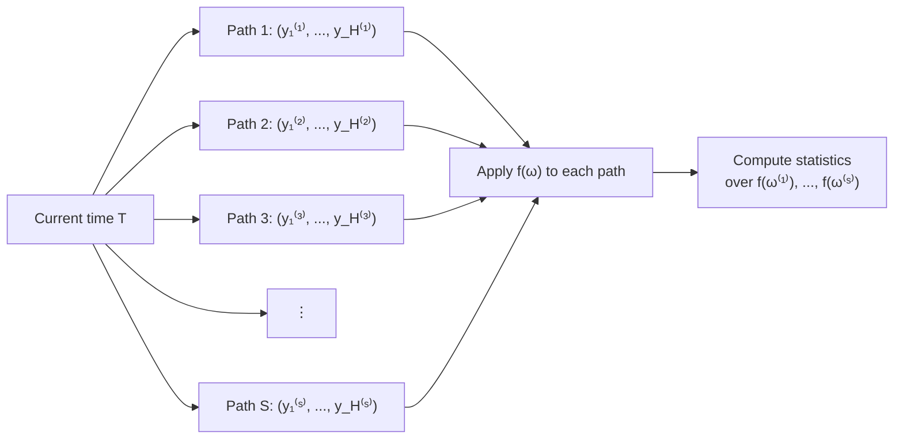

# Sample Paths — The Correct Uncertainty Framework

## In Brief

A probabilistic forecast gives you marginal distributions: the uncertainty around day 1, then day 2, then day 3, independently. A sample path gives you something more powerful — a single plausible trajectory for the entire forecast horizon, drawn from the joint distribution. Run hundreds of these paths and you can answer any business question by applying a function to each path and computing statistics over the results.

Start here: loading real French Bakery sales data, training NHITS with quantile loss, and generating sample paths with `.simulate()`.

```python
import pandas as pd
from neuralforecast import NeuralForecast
from neuralforecast.models import NHITS
from neuralforecast.losses.pytorch import MQLoss
from neuralforecast.utils import AirPassengersDF  # placeholder import; bakery data loaded below

# Load French Bakery dataset (daily sales, multiple SKUs)
url = "https://raw.githubusercontent.com/Nixtla/neuralforecast/main/nbs/data/french_bakery_data.csv"
df = pd.read_csv(url, parse_dates=["ds"])
df_train = df[df["ds"] < "2023-01-01"]

# Train NHITS with MQLoss to get marginal quantile estimates
model = NHITS(
    h=7,                          # 7-day forecast horizon
    input_size=28,                # 4 weeks of look-back
    loss=MQLoss(level=[80, 90]),  # quantile levels used to fit marginal CDFs
    scaler_type="robust",
    max_steps=500,
)
nf = NeuralForecast(models=[model], freq="D")
nf.fit(df_train)

# Generate 200 sample paths — each is one plausible 7-day trajectory
# Returns a DataFrame: columns unique_id, ds, sample_1 … sample_200
paths_df = nf.models[0].simulate(futr_df=None, step_size=1, n_paths=200)
print(paths_df.shape)          # (n_series * 7, 202)
print(paths_df.head())

# Answer a business question directly from paths:
# P(total weekly sales > 500 units) for the first SKU
sku_paths = paths_df[paths_df["unique_id"] == paths_df["unique_id"].iloc[0]]
sample_cols = [c for c in sku_paths.columns if c.startswith("sample_")]
weekly_totals = sku_paths[sample_cols].sum(axis=0)   # sum each path over 7 days
prob = (weekly_totals > 500).mean()
print(f"P(weekly total > 500) ≈ {prob:.3f}")
```

That is the complete workflow. Every concept in this guide unpacks what happens inside those five steps.

---

## 1. Building Intuition: A Minimal Random Walk

Before the formal definitions, a stripped-down example makes the shape of the idea clear. A random walk has no parameters to fit — you can see exactly what "sample path" means without any model machinery.

```python
import numpy as np

rng = np.random.default_rng(42)

# Simulate 200 sample paths of a random walk over 14 steps
n_paths, horizon = 200, 14
innovations = rng.normal(0, 1, size=(n_paths, horizon))
paths = np.cumsum(innovations, axis=1)  # shape: (n_paths, horizon)

# Each row is one plausible future trajectory
print(f"Path shape: {paths.shape}")          # (200, 14)
print(f"Path 0 first 5 steps: {paths[0, :5].round(2)}")

# Answer a business question: P(cumulative sum > 10) after 14 steps
prob = (paths.sum(axis=1) > 10).mean()
print(f"P(total > 10 over 14 days) ≈ {prob:.3f}")
```

The key observation: each row is a self-consistent trajectory. Step 5 in path 0 is not drawn independently from step 4 — it grew from it. That temporal consistency is what distinguishes a sample path from a bag of independent quantile draws. Now the formal statement:

---

## 2. What Are Sample Paths?

A sample path is one draw from the joint forecast distribution over the entire horizon.

**Marginal distribution** for step $t$: $F_t(y) = P(y_{T+t} \leq y \mid \mathcal{F}_T)$

This gives uncertainty for each step individually, as if all other steps do not exist.

**Joint distribution** over the full horizon $H$: $F_{1:H}(y_1, \ldots, y_H) = P(Y_{T+1} \leq y_1, \ldots, Y_{T+H} \leq y_H \mid \mathcal{F}_T)$

This encodes the correlations between steps — the temporal structure of uncertainty.

A **sample path** $\omega^{(s)}$ is one draw from this joint distribution:

$$\omega^{(s)} = \left(y_1^{(s)}, y_2^{(s)}, \ldots, y_H^{(s)}\right), \quad s = 1, \ldots, S$$

Each path is internally consistent: if Monday is high, Tuesday in that path reflects the realistic follow-on, not an independent draw.



---

## 3. The Monte Carlo Framework

Once you have $S$ sample paths, any business question becomes a three-step calculation:

1. **Simulate**: generate $S$ paths $\{\omega^{(s)}\}_{s=1}^S$
2. **Apply**: compute a function $f(\omega^{(s)})$ for each path
3. **Aggregate**: compute statistics over $\{f(\omega^{(1)}), \ldots, f(\omega^{(S)})\}$

This framework is universal. The function $f$ can be:

- A sum (total demand over the week)
- A maximum (worst-case single day)
- A threshold crossing (first day stock runs out)
- A complex business rule (trigger reorder when cumulative demand exceeds safety stock)

```python
# The universal Monte Carlo template
def answer_business_question(paths, f, quantile=0.80):
    """
    paths: np.ndarray of shape (n_paths, horizon)
    f:     callable, applied to each path (shape: horizon,)
    Returns the `quantile` percentile of f applied across all paths.
    """
    results = np.array([f(paths[s]) for s in range(len(paths))])
    return np.quantile(results, quantile)

# Example: 80th percentile of weekly total demand
weekly_total_80 = answer_business_question(
    paths,
    f=lambda path: path.sum(),
    quantile=0.80
)
print(f"80th percentile weekly total: {weekly_total_80:.1f}")

# Example: 80th percentile of worst single day
worst_day_80 = answer_business_question(
    paths,
    f=lambda path: path.max(),
    quantile=0.80
)
print(f"80th percentile worst day: {worst_day_80:.1f}")
```

---

## 4. Why Marginal Quantiles Are Insufficient

The 80th percentile quantile for day $t$ tells you: "On day $t$ alone, I need $q_t$ units with 80% confidence."

But the question "How much total inventory do I need for the whole week at 80% confidence?" cannot be answered by summing marginal quantiles.

**The mathematical problem:** The sum of marginal 80th percentiles is not the 80th percentile of the sum.

$$Q_{0.8}\left(\sum_{t=1}^H y_t\right) \neq \sum_{t=1}^H Q_{0.8}(y_t)$$

The gap between these two quantities depends on the inter-step correlation. For positively correlated series (common in demand), the right side overestimates. For negatively correlated series (mean-reverting), it underestimates. The only correct approach uses the joint distribution — which sample paths provide.

```python
# Demonstrate the inequality concretely
rng = np.random.default_rng(42)
n_paths, H = 10_000, 7

# Positively correlated series: AR(1) with phi=0.7
phi = 0.7
paths_ar = np.zeros((n_paths, H))
paths_ar[:, 0] = rng.normal(100, 10, n_paths)
for t in range(1, H):
    paths_ar[:, t] = phi * paths_ar[:, t-1] + rng.normal(0, 10, n_paths)

# True 80th percentile of weekly total (joint distribution)
true_80th = np.quantile(paths_ar.sum(axis=1), 0.80)

# Naive: sum of marginal 80th percentiles
marginal_80th_sum = np.quantile(paths_ar, 0.80, axis=0).sum()

print(f"True 80th pct of weekly total:      {true_80th:.1f}")
print(f"Sum of marginal 80th percentiles:   {marginal_80th_sum:.1f}")
print(f"Overestimate by:                    {marginal_80th_sum - true_80th:.1f} units")
```

With $\phi = 0.7$, the naive sum overstates the true 80th percentile — a practitioner following the marginal approach would over-order every week.

---

## 5. Answering Probability Questions Exactly

Sample paths give direct answers to probability questions that have no clean closed form under marginal distributions.

**Probability that weekly total exceeds a threshold $c$:**

$$P\!\left(\sum_{t=1}^H y_t > c\right) \approx \frac{1}{S} \sum_{s=1}^S \mathbf{1}\!\left[\sum_{t=1}^H y_t^{(s)} > c\right]$$

**Probability that stock-out occurs before day $k$:**

$$P\!\left(\exists\, t \leq k : \sum_{j=1}^t y_j^{(s)} > \text{stock}\right) \approx \frac{1}{S} \sum_{s=1}^S \mathbf{1}\!\left[\min_{t \leq k} \left(\text{stock} - \sum_{j=1}^t y_j^{(s)}\right) < 0\right]$$

```python
def probability_exceeds_threshold(paths, threshold):
    """P(weekly total > threshold) estimated from sample paths."""
    weekly_totals = paths.sum(axis=1)
    return (weekly_totals > threshold).mean()

def probability_stockout_before(paths, stock_level, by_day):
    """P(cumulative demand exceeds stock_level by day `by_day`)."""
    cumulative = np.cumsum(paths[:, :by_day], axis=1)
    stockout = (cumulative > stock_level).any(axis=1)
    return stockout.mean()

# Example with AR(1) paths
p_exceed = probability_exceeds_threshold(paths_ar, threshold=750)
p_stockout = probability_stockout_before(paths_ar, stock_level=400, by_day=4)

print(f"P(weekly total > 750):         {p_exceed:.3f}")
print(f"P(stock-out within 4 days):    {p_stockout:.3f}")
```

---

## 6. Sample Paths vs. Quantile Forecasts: A Visual Comparison

```python
import matplotlib.pyplot as plt
import numpy as np

rng = np.random.default_rng(0)
n_paths, H = 100, 14
phi = 0.6

# Generate AR(1) sample paths
paths = np.zeros((n_paths, H))
paths[:, 0] = rng.normal(100, 15, n_paths)
for t in range(1, H):
    paths[:, t] = phi * paths[:, t-1] + (1 - phi) * 100 + rng.normal(0, 12, n_paths)

days = np.arange(1, H + 1)

fig, axes = plt.subplots(1, 2, figsize=(14, 5))

# Left: Sample paths (the correct view)
ax = axes[0]
for s in range(n_paths):
    ax.plot(days, paths[s], color="steelblue", alpha=0.08, linewidth=0.8)
ax.plot(days, np.median(paths, axis=0), color="navy", linewidth=2, label="Median")
ax.fill_between(
    days,
    np.quantile(paths, 0.10, axis=0),
    np.quantile(paths, 0.90, axis=0),
    alpha=0.25, color="steelblue", label="80% band from paths"
)
ax.set_title("Sample Paths (joint distribution)")
ax.set_xlabel("Forecast day")
ax.set_ylabel("Demand")
ax.legend()

# Right: Marginal quantiles (the limited view)
ax = axes[1]
ax.plot(days, np.median(paths, axis=0), color="navy", linewidth=2, label="Median")
ax.fill_between(
    days,
    np.quantile(paths, 0.10, axis=0),
    np.quantile(paths, 0.90, axis=0),
    alpha=0.25, color="orange", label="80% marginal quantile band"
)
ax.set_title("Marginal Quantiles (independent per step)")
ax.set_xlabel("Forecast day")
ax.set_ylabel("Demand")
ax.legend()

plt.suptitle("Same model, different information content", fontweight="bold")
plt.tight_layout()
plt.savefig("sample_paths_vs_quantiles.png", dpi=150, bbox_inches="tight")
plt.show()
```

The bands look identical — but only the left panel can answer questions about sums, maxima, or threshold crossings over the full horizon. The right panel's bands are statistically independent intervals; combining them across time requires assumptions the marginal view cannot support.

---

## 7. How NeuralForecast Implements Sample Paths

NeuralForecast v3.1.6+ exposes a `.simulate()` method on any model trained with `MQLoss`. Under the hood, it applies the Gaussian Copula method (covered in the next guide) to generate paths that respect the temporal autocorrelation of your data.

```python
from neuralforecast import NeuralForecast
from neuralforecast.models import NHITS
from neuralforecast.losses.pytorch import MQLoss

# Train with quantile loss to get marginal distributions
model = NHITS(
    h=7,
    input_size=28,
    loss=MQLoss(level=[80, 90]),
    scaler_type="robust",
    max_steps=500,
)
nf = NeuralForecast(models=[model], freq="D")
nf.fit(df_train)

# Generate 100 sample paths
# Returns DataFrame with columns: unique_id, ds, sample_1, ..., sample_100
paths_df = nf.models[0].simulate(
    futr_df=None,
    step_size=1,
    n_paths=100,
)
print(paths_df.shape)  # (n_series * 7, 102)
```

Notebook 01 walks through the full implementation step by step, including data loading, training diagnostics, and path visualisation.

---

## Key Concepts

| Concept | Definition |
|---|---|
| **Sample path** | One draw $\omega^{(s)} = (y_1^{(s)}, \ldots, y_H^{(s)})$ from the joint forecast distribution |
| **Joint distribution** | $F_{1:H}$: the multivariate distribution encoding correlations across all forecast steps |
| **Marginal distribution** | $F_t$: distribution of step $t$ alone, ignoring all other steps |
| **Monte Carlo framework** | Simulate paths → apply function → compute statistics |
| **Temporal correlation** | The tendency for adjacent forecast steps to co-vary in the same direction |

---

## Next: The Gaussian Copula Method

Module 02 guide covers exactly how neuralforecast constructs sample paths using the Gaussian Copula — building from marginal quantile forecasts to correlated joint draws in six precise steps.
