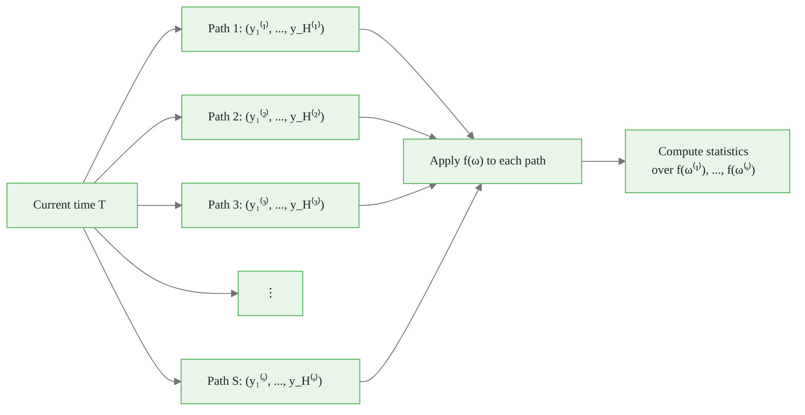

# Sample Paths — The Correct Uncertainty Framework

> **Reading time:** ~11 min | **Module:** 3 — Sample Paths | **Prerequisites:** Module 2

## In Brief

A probabilistic forecast gives you marginal distributions: the uncertainty around day 1, then day 2, then day 3, independently. A sample path gives you something more powerful — a single plausible trajectory for the entire forecast horizon, drawn from the joint distribution. Run hundreds of these paths and you can answer any business question by applying a function to each path and computing statistics over the results.

Start here: generating sample paths from a random walk in six lines.


The following implementation builds on the approach above:



---

## 2. The Monte Carlo Framework

Once you have $S$ sample paths, any business question becomes a three-step calculation:

<div class="callout-key">

<strong>Key Point:</strong> Once you have $S$ sample paths, any business question becomes a three-step calculation:

1.

</div>


1. **Simulate**: generate $S$ paths $\{\omega^{(s)}\}_{s=1}^S$
2. **Apply**: compute a function $f(\omega^{(s)})$ for each path
3. **Aggregate**: compute statistics over $\{f(\omega^{(1)}), \ldots, f(\omega^{(S)})\}$


<div class="flow">
<div class="flow-step mint">1. Simulate</div>
<div class="flow-arrow">&#8594;</div>
<div class="flow-step amber">2. Apply</div>
<div class="flow-arrow">&#8594;</div>
<div class="flow-step blue">3. Aggregate</div>
</div>

This framework is universal. The function $f$ can be:

- A sum (total demand over the week)
- A maximum (worst-case single day)
- A threshold crossing (first day stock runs out)
- A complex business rule (trigger reorder when cumulative demand exceeds safety stock)


The following implementation builds on the approach above:

<div class="code-window">
<div class="code-header">
<div class="dots"><span class="dot-red"></span><span class="dot-yellow"></span><span class="dot-green"></span></div>

```python

# The universal Monte Carlo template
def answer_business_question(paths, f, quantile=0.80):
    """
    paths: np.ndarray of shape (n_paths, horizon)
    f:     callable, applied to each path (shape: horizon,)
    Returns the `quantile` percentile of f applied across all paths.
    """
    results = np.array([f(paths[s]) for s in range(len(paths))])
    return np.quantile(results, quantile)

# Example: 80th percentile of weekly total demand
weekly_total_80 = answer_business_question(
    paths,
    f=lambda path: path.sum(),
    quantile=0.80
)
print(f"80th percentile weekly total: {weekly_total_80:.1f}")

# Example: 80th percentile of worst single day
worst_day_80 = answer_business_question(
    paths,
    f=lambda path: path.max(),
    quantile=0.80
)
print(f"80th percentile worst day: {worst_day_80:.1f}")
```

</div>
</div>

---

## 3. Why Marginal Quantiles Are Insufficient

The 80th percentile quantile for day $t$ tells you: "On day $t$ alone, I need $q_t$ units with 80% confidence."

<div class="callout-insight">

<strong>Insight:</strong> The 80th percentile quantile for day $t$ tells you: "On day $t$ alone, I need $q_t$ units with 80% confidence."

But the question "How much total inventory do I need for the whole week at 80% confiden...

</div>


But the question "How much total inventory do I need for the whole week at 80% confidence?" cannot be answered by summing marginal quantiles.

**The mathematical problem:** The sum of marginal 80th percentiles is not the 80th percentile of the sum.

$$Q_{0.8}\left(\sum_{t=1}^H y_t\right) \neq \sum_{t=1}^H Q_{0.8}(y_t)$$

The gap between these two quantities depends on the inter-step correlation. For positively correlated series (common in demand), the right side overestimates. For negatively correlated series (mean-reverting), it underestimates. The only correct approach uses the joint distribution — which sample paths provide.


<div class="code-window">
<div class="code-header">
<div class="dots"><span class="dot-red"></span><span class="dot-yellow"></span><span class="dot-green"></span></div>
<span class="filename">example.py</span>
</div>

```python

# Demonstrate the inequality concretely
rng = np.random.default_rng(42)
n_paths, H = 10_000, 7

# Positively correlated series: AR(1) with phi=0.7
phi = 0.7
paths_ar = np.zeros((n_paths, H))
paths_ar[:, 0] = rng.normal(100, 10, n_paths)
for t in range(1, H):
    paths_ar[:, t] = phi * paths_ar[:, t-1] + rng.normal(0, 10, n_paths)

# True 80th percentile of weekly total (joint distribution)
true_80th = np.quantile(paths_ar.sum(axis=1), 0.80)

# Naive: sum of marginal 80th percentiles
marginal_80th_sum = np.quantile(paths_ar, 0.80, axis=0).sum()

print(f"True 80th pct of weekly total:      {true_80th:.1f}")
print(f"Sum of marginal 80th percentiles:   {marginal_80th_sum:.1f}")
print(f"Overestimate by:                    {marginal_80th_sum - true_80th:.1f} units")
```

</div>
</div>

With $\phi = 0.7$, the naive sum overstates the true 80th percentile — a practitioner following the marginal approach would over-order every week.

---

## 4. Answering Probability Questions Exactly

Sample paths give direct answers to probability questions that have no clean closed form under marginal distributions.

<div class="callout-warning">

<strong>Warning:</strong> Sample paths give direct answers to probability questions that have no clean closed form under marginal distributions.


**Probability that weekly total exceeds a threshold $c$:**

$$P\!\left(\sum_{t=1}^H y_t > c\right) \approx \frac{1}{S} \sum_{s=1}^S \mathbf{1}\!\left[\sum_{t=1}^H y_t^{(s)} > c\right]$$

**Probability that stock-out occurs before day $k$:**

$$P\!\left(\exists\, t \leq k : \sum_{j=1}^t y_j^{(s)} > \text{stock}\right) \approx \frac{1}{S} \sum_{s=1}^S \mathbf{1}\!\left[\min_{t \leq k} \left(\text{stock} - \sum_{j=1}^t y_j^{(s)}\right) < 0\right]$$

```python
def probability_exceeds_threshold(paths, threshold):
    """P(weekly total > threshold) estimated from sample paths."""
    weekly_totals = paths.sum(axis=1)
    return (weekly_totals > threshold).mean()

def probability_stockout_before(paths, stock_level, by_day):
    """P(cumulative demand exceeds stock_level by day `by_day`)."""
    cumulative = np.cumsum(paths[:, :by_day], axis=1)
    stockout = (cumulative > stock_level).any(axis=1)
    return stockout.mean()

# Example with AR(1) paths
p_exceed = probability_exceeds_threshold(paths_ar, threshold=750)
p_stockout = probability_stockout_before(paths_ar, stock_level=400, by_day=4)

print(f"P(weekly total > 750):         {p_exceed:.3f}")
print(f"P(stock-out within 4 days):    {p_stockout:.3f}")
```

---


## 5. Sample Paths vs. Quantile Forecasts: A Visual Comparison

```python
import matplotlib.pyplot as plt
import numpy as np

rng = np.random.default_rng(0)
n_paths, H = 100, 14
phi = 0.6

# Generate AR(1) sample paths
paths = np.zeros((n_paths, H))
paths[:, 0] = rng.normal(100, 15, n_paths)
for t in range(1, H):
    paths[:, t] = phi * paths[:, t-1] + (1 - phi) * 100 + rng.normal(0, 12, n_paths)

days = np.arange(1, H + 1)

fig, axes = plt.subplots(1, 2, figsize=(14, 5))

# Left: Sample paths (the correct view)
ax = axes[0]
for s in range(n_paths):
    ax.plot(days, paths[s], color="steelblue", alpha=0.08, linewidth=0.8)
ax.plot(days, np.median(paths, axis=0), color="navy", linewidth=2, label="Median")
ax.fill_between(
    days,
    np.quantile(paths, 0.10, axis=0),
    np.quantile(paths, 0.90, axis=0),
    alpha=0.25, color="steelblue", label="80% band from paths"
)
ax.set_title("Sample Paths (joint distribution)")
ax.set_xlabel("Forecast day")
ax.set_ylabel("Demand")
ax.legend()

# Right: Marginal quantiles (the limited view)
ax = axes[1]
ax.plot(days, np.median(paths, axis=0), color="navy", linewidth=2, label="Median")
ax.fill_between(
    days,
    np.quantile(paths, 0.10, axis=0),
    np.quantile(paths, 0.90, axis=0),
    alpha=0.25, color="orange", label="80% marginal quantile band"
)
ax.set_title("Marginal Quantiles (independent per step)")
ax.set_xlabel("Forecast day")
ax.set_ylabel("Demand")
ax.legend()

plt.suptitle("Same model, different information content", fontweight="bold")
plt.tight_layout()
plt.savefig("sample_paths_vs_quantiles.png", dpi=150, bbox_inches="tight")
plt.show()
```

The bands look identical — but only the left panel can answer questions about sums, maxima, or threshold crossings over the full horizon. The right panel's bands are statistically independent intervals; combining them across time requires assumptions the marginal view cannot support.

---

## 6. How NeuralForecast Implements Sample Paths

NeuralForecast v3.1.6+ exposes a `.simulate()` method on any model trained with `MQLoss`. Under the hood, it applies the Gaussian Copula method (covered in the next guide) to generate paths that respect the temporal autocorrelation of your data.

```python
from neuralforecast import NeuralForecast
from neuralforecast.models import NHITS
from neuralforecast.losses.pytorch import MQLoss

# Train with quantile loss to get marginal distributions
model = NHITS(
    h=7,
    input_size=28,
    loss=MQLoss(level=[80, 90]),
    scaler_type="robust",
    max_steps=500,
)
nf = NeuralForecast(models=[model], freq="D")
nf.fit(df_train)

# Generate 100 sample paths

# Returns DataFrame with columns: unique_id, ds, sample_1, ..., sample_100
paths_df = nf.models[0].simulate(
    futr_df=None,
    step_size=1,
    n_paths=100,
)
print(paths_df.shape)  # (n_series * 7, 102)
```

The complete implementation with real French Bakery data is in Notebook 01.

---

## Key Concepts

| Concept | Definition |
|---|---|
| **Sample path** | One draw $\omega^{(s)} = (y_1^{(s)}, \ldots, y_H^{(s)})$ from the joint forecast distribution |
| **Joint distribution** | $F_{1:H}$: the multivariate distribution encoding correlations across all forecast steps |
| **Marginal distribution** | $F_t$: distribution of step $t$ alone, ignoring all other steps |
| **Monte Carlo framework** | Simulate paths → apply function → compute statistics |
| **Temporal correlation** | The tendency for adjacent forecast steps to co-vary in the same direction |

---

## Next: The Gaussian Copula Method

Module 02 guide covers exactly how neuralforecast constructs sample paths using the Gaussian Copula — building from marginal quantile forecasts to correlated joint draws in six precise steps.


## Practice Questions

**Question 1 — Conceptual:** Based on the concepts in this guide, explain in your own words why the core technique matters and when you would choose it over alternatives.

**Question 2 — Application:** Sketch out how you would apply the main concept from this guide to a real-world dataset or problem you have encountered. What would you need to watch out for?


---

## Cross-References

<a class="link-card" href="./01_sample_paths_theory.md">
  <div class="link-card-title">Companion Slides</div>
  <div class="link-card-description">Interactive slide deck covering the key concepts with visual examples.</div>
</a>

<a class="link-card" href="../notebooks/01_generating_sample_paths.ipynb">
  <div class="link-card-title">Hands-on Notebook</div>
  <div class="link-card-description">15-minute micro-notebook with guided exercises and real data.</div>
</a>
