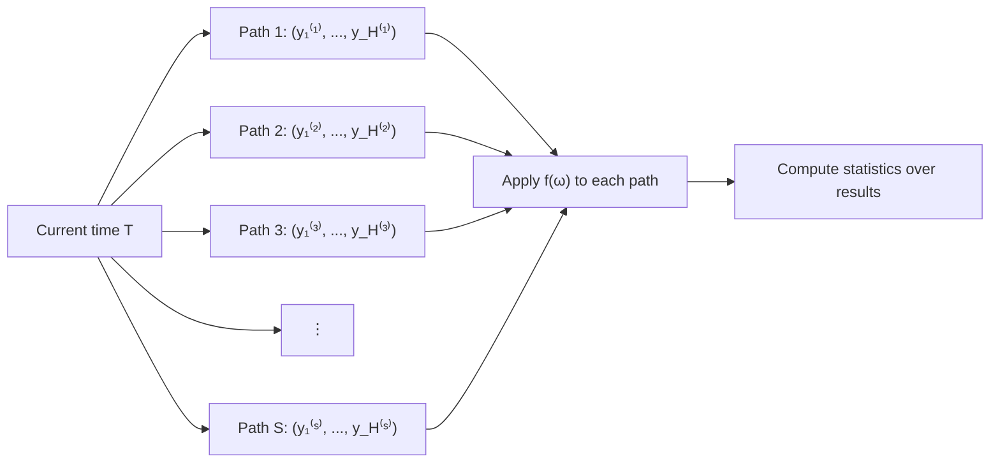

<!-- _class: lead -->

# Sample Paths
## The Correct Uncertainty Framework

### Module 03 — Sample Paths
#### Modern Time Series Forecasting with NeuralForecast

<!-- Speaker notes: This is the core module of the course. Modules 01 and 02 built the foundation — point forecasting, then probabilistic forecasting with quantiles. This module introduces the concept that resolves the fundamental limitation of marginal quantiles: sample paths drawn from the joint forecast distribution. Every business application in the rest of the course depends on this framework. -->

---

# The Problem We Solved in Module 02

Module 02 showed that **quantile forecasts fail for multi-step decisions**.

Marginal quantile at step $t$: $Q_\alpha(y_{T+t})$

This answers: *"What is the 80th percentile of demand on day $t$?"*

It **cannot** answer:
- What is the 80th percentile of my **weekly total**?
- When is the latest safe **reorder point**?
- What is my **worst-case day** this week?

<!-- Speaker notes: Recap the Module 02 cliffhanger. The audience already understands that quantiles fail. Now we introduce the solution. The key insight: quantiles give per-step marginals; we need the joint distribution over the whole horizon. -->

---

# The Solution: Sample Paths

A **sample path** is one draw from the joint forecast distribution:

$$\omega^{(s)} = \left(y_1^{(s)},\ y_2^{(s)},\ \ldots,\ y_H^{(s)}\right), \quad s = 1, \ldots, S$$

Each path is a **complete, internally consistent future**.

If Monday is high in path $s$, Tuesday in path $s$ reflects the realistic follow-on — not an independent draw.

<!-- Speaker notes: The word "internally consistent" is the key differentiator. In a marginal quantile world, each day is drawn independently. In a sample path, the days co-vary as they do in real data. A high-demand Monday correlates with a high-demand Tuesday in the same path. -->

---

# Paths Fan Out From the Present



<!-- Speaker notes: This diagram is the mental model for the whole module. Each path starts from the same point (current time T) and fans out differently. The spread of paths represents genuine uncertainty. After generating all paths, we apply a business function to each one and compute statistics over those results. -->

---

# Marginal vs. Joint Distribution

<div class="columns">

**Marginal** — step $t$ alone:
$$F_t(y) = P(y_{T+t} \leq y \mid \mathcal{F}_T)$$

Good for: "What is the 80th percentile **on day 3**?"

**Joint** — all steps together:
$$F_{1:H}(y_1, \ldots, y_H) = P(Y_{T+1} \leq y_1, \ldots, Y_{T+H} \leq y_H \mid \mathcal{F}_T)$$

Good for: "What is the 80th percentile **over the whole week**?"

</div>

Sample paths draw from $F_{1:H}$. Quantile forecasts only describe each $F_t$.

<!-- Speaker notes: This slide makes the mathematical distinction precise. Marginal distributions strip out the joint structure — they treat each step as if it were the only step. The joint distribution keeps the correlations intact. Sample paths are draws from the joint distribution, which is why they contain more information than marginal quantiles. -->

---

# The Monte Carlo Framework

Three steps answer **any** business question:

```
1. SIMULATE   → generate S sample paths
2. APPLY      → compute f(ω⁽ˢ⁾) for each path
3. AGGREGATE  → compute statistics over results
```

The function $f$ can be:

| Business question | Function $f(\omega)$ |
|---|---|
| Weekly total demand | $\sum_{t=1}^H y_t$ |
| Worst-case single day | $\max_t y_t$ |
| First day demand > threshold | $\min\{t : y_t > c\}$ |
| Reorder timing | First $t$ where $\sum_{j=1}^t y_j > \text{stock}$ |

<!-- Speaker notes: The Monte Carlo framework is the universal tool. Once you have sample paths, the analytical problem reduces to defining f clearly and computing it for each path. Every question in Notebook 02 follows this exact three-step structure. Emphasize that f can be any deterministic function — no restrictions. -->

---

# One Path in Code

```python
import numpy as np

rng = np.random.default_rng(42)

# 200 paths, 14-day horizon — shape: (n_paths, horizon)
n_paths, horizon = 200, 14
innovations = rng.normal(0, 1, size=(n_paths, horizon))
paths = np.cumsum(innovations, axis=1)

print(f"paths.shape = {paths.shape}")  # (200, 14)

# Each ROW is one complete plausible future
print(paths[0].round(2))  # [-0.50, -0.23, 0.89, ...]
```

The shape convention: **rows are paths, columns are horizon steps**.

Every function you write operates on one row at a time.

<!-- Speaker notes: The (n_paths, horizon) shape convention is used throughout the course. Rows are paths, columns are time steps. When we apply a function to paths, we iterate over rows or use numpy's axis parameter. Establishing this convention now prevents confusion in the notebooks. -->

---

# The Universal Monte Carlo Template

```python
def answer_business_question(paths, f, quantile=0.80):
    """
    paths    : np.ndarray (n_paths, horizon)
    f        : callable applied to each path (shape: horizon,)
    quantile : the risk level to report
    """
    results = np.array([f(paths[s]) for s in range(len(paths))])
    return np.quantile(results, quantile)

# 80th percentile of weekly total
total_80 = answer_business_question(
    paths, f=lambda p: p.sum(), quantile=0.80
)

# 80th percentile of worst single day
max_80 = answer_business_question(
    paths, f=lambda p: p.max(), quantile=0.80
)
```

<!-- Speaker notes: This template is copied verbatim into Notebook 02. The pattern is: define f, call the template, get your answer. The function is deliberately simple — a list comprehension followed by np.quantile. More complex functions (reorder timing, safety stock) follow exactly the same structure with a more elaborate f. -->

---

# Why Summing Marginals Fails

The 80th percentile of a sum is **not** the sum of 80th percentiles:

$$Q_{0.8}\!\left(\sum_{t=1}^H y_t\right) \neq \sum_{t=1}^H Q_{0.8}(y_t)$$

The gap depends on **inter-step correlation**.

| Correlation structure | Effect on naive sum |
|---|---|
| Positive (AR(1), $\phi > 0$) | Naive sum **overestimates** |
| Zero (independent) | Naive sum **overestimates** (subadditivity of quantiles) |
| Negative (mean-reverting) | Naive sum **overestimates** even more |

<!-- Speaker notes: The inequality is the mathematical proof that marginals are insufficient for any multi-step question. For positively correlated series like daily demand (high Monday tends to mean high Tuesday), the naive sum of marginal quantiles is always too large. For mean-reverting series the error is in the same direction. Only joint draws give the correct answer. -->

---

# Demonstrating the Gap

```python
rng = np.random.default_rng(42)
n_paths, H = 10_000, 7
phi = 0.7  # strong positive autocorrelation

# AR(1) sample paths
paths = np.zeros((n_paths, H))
paths[:, 0] = rng.normal(100, 10, n_paths)
for t in range(1, H):
    paths[:, t] = phi * paths[:, t-1] + rng.normal(0, 10, n_paths)

# Correct answer (from joint distribution)
true_80 = np.quantile(paths.sum(axis=1), 0.80)

# Naive answer (sum of marginals)
naive_80 = np.quantile(paths, 0.80, axis=0).sum()

print(f"True 80th pct of weekly total:   {true_80:.1f}")
print(f"Sum of marginal 80th pcts:       {naive_80:.1f}")
print(f"Overestimate:                    {naive_80 - true_80:.1f} units")
```

With $\phi = 0.7$: the naive approach over-orders by roughly **35 units per week**.

<!-- Speaker notes: Run this code live if possible. With 10,000 paths the answer is stable. The overestimate of ~35 units over 7 days is significant — it corresponds to unnecessary holding cost every week. With real bakery data the magnitude will differ, but the direction is always the same: positive autocorrelation means the naive sum is always too high. -->

---

# Probability Questions Are Exact

With sample paths, probability questions become **counting problems**:

$$P\!\left(\sum_{t=1}^H y_t > c\right) \approx \frac{1}{S} \sum_{s=1}^S \mathbf{1}\!\left[\sum_{t=1}^H y_t^{(s)} > c\right]$$

```python
def probability_exceeds(paths, threshold):
    return (paths.sum(axis=1) > threshold).mean()

def probability_stockout(paths, stock, by_day):
    cum = np.cumsum(paths[:, :by_day], axis=1)
    return (cum > stock).any(axis=1).mean()
```

No closed-form algebra required. Just simulate, apply the indicator, average.

<!-- Speaker notes: The indicator function approach is the most important practical tool. Any event can be expressed as a Boolean condition on a path. Apply it to all paths and average to get the probability. This handles events that have no closed-form expression under any parametric distribution. -->

---

# What Sample Paths Look Like

```
Path 1: [98, 102, 115, 97, 89, 111, 108]   → total: 720
Path 2: [105, 99, 96, 88, 102, 95, 100]    → total: 685
Path 3: [112, 118, 121, 107, 115, 122, 119] → total: 814
   ⋮
Path 100: [95, 88, 91, 103, 97, 94, 99]    → total: 667

Weekly totals: [720, 685, 814, ..., 667]
80th percentile of totals → YOUR ANSWER
```

Each path is realistic. Path 3 shows a strong demand week. Path 2 shows a slow week. Both are possible futures — the model assigns probability to each.

<!-- Speaker notes: This concrete example grounds the abstraction. Show the audience that each row is a recognizable sequence of demand values — not random noise, but structured trajectories. The weekly totals vary across paths, and taking the 80th percentile of those totals is the only rigorous answer to the inventory question. -->

---

# NeuralForecast `.simulate()` API

```python
from neuralforecast import NeuralForecast
from neuralforecast.models import NHITS
from neuralforecast.losses.pytorch import MQLoss

model = NHITS(
    h=7,
    input_size=28,
    loss=MQLoss(level=[80, 90]),
    scaler_type="robust",
    max_steps=500,
)
nf = NeuralForecast(models=[model], freq="D")
nf.fit(df_train)

# Generate 100 internally consistent sample paths
paths_df = nf.models[0].simulate(n_paths=100)
# Returns: columns unique_id, ds, sample_1, ..., sample_100
```

The Gaussian Copula method (Guide 02) explains exactly how `.simulate()` works internally.

<!-- Speaker notes: This slide previews the neuralforecast API without diving into implementation. The key message: one API call generates n_paths internally consistent trajectories. The Gaussian Copula method in Guide 02 opens the black box. For now, learners see that the interface is simple even though the internals are sophisticated. -->

---

# Sample Paths vs. Quantile Bands: Visual

<div class="columns">

**Sample paths** (joint distribution):
- Each line is one complete trajectory
- Trajectories co-vary realistically
- Can answer any downstream question
- Captures path-dependent events

**Quantile bands** (marginal distribution):
- Wide band at each step independently
- No information about co-movement
- Cannot aggregate across steps correctly
- Bands look similar — but contain less information

</div>

**The bands look identical. The information content is not.**

<!-- Speaker notes: This is a critical pedagogical point. The 80% band computed from sample paths and the 80% marginal quantile band will look visually almost identical on a plot. The difference only becomes apparent when you try to use them for a multi-step question. This is why practitioners don't notice the problem until they make a costly wrong decision. -->

---

# Summary: The Sample Path Framework

| | Marginal Quantiles | Sample Paths |
|---|---|---|
| What you get | $Q_\alpha(y_t)$ per step | Complete trajectories $\omega^{(s)}$ |
| Temporal correlation | Ignored | Preserved |
| Multi-step questions | Wrong | Correct |
| Probability of joint events | Not possible | Counting problem |
| Business decisions | Approximate | Rigorous |

<!-- Speaker notes: This comparison table is the key takeaway slide. Each row identifies a specific capability difference. The bottom line: for any decision that involves more than one forecast step, sample paths are the correct tool and marginal quantiles give wrong answers. -->

---

# Next: The Gaussian Copula Method

Guide 02 opens the black box behind `.simulate()`:

1. Train with MQLoss → marginal quantiles per step
2. Estimate AR(1) autocorrelation on differenced data
3. Build Toeplitz correlation matrix $\Sigma$
4. Cholesky decomposition $\Sigma = LL^T$
5. Apply $\Phi(z)$ → uniform $[0,1]$
6. Inverse quantile transform → forecast scale

Each step has both **mathematical derivation** and **working code**.

<!-- Speaker notes: The six-step preview gives learners a roadmap for what is coming. Emphasize that these steps are not arbitrary — each one solves a specific technical problem: stationarity, temporal correlation, the bridge from Gaussian space to quantile space. The mathematical and code representations reinforce each other. -->
