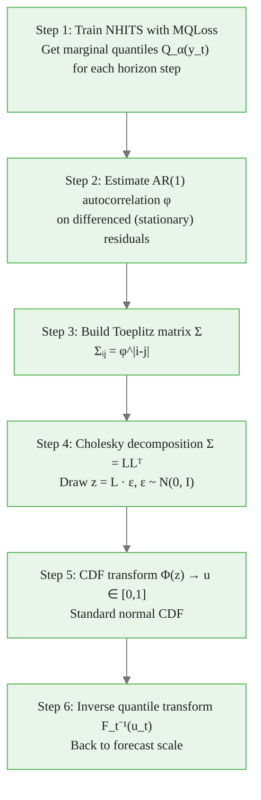

# The Gaussian Copula Method for Sample Path Generation

> **Reading time:** ~15 min | **Module:** 3 — Sample Paths | **Prerequisites:** Module 2

## In Brief

NeuralForecast's `.simulate()` uses the Gaussian Copula method to generate sample paths. It starts from marginal quantile forecasts — which NHITS with MQLoss already produces — and builds correlated joint trajectories that respect the temporal autocorrelation of your data. This guide walks through all six steps with mathematics and working code.

Start with the complete working example, then study each step in detail.


The following implementation builds on the approach above:



---

## Step 1: Train with MQLoss — Marginal Quantiles

NHITS trained with `MQLoss(level=[80, 90])` produces, for each horizon step $t$, an estimate of the quantile function $Q_\alpha(y_{T+t})$ at requested levels $\alpha \in \{0.05, 0.10, \ldots, 0.90, 0.95\}$.

<div class="callout-key">

<strong>Key Point:</strong> NHITS trained with `MQLoss(level=[80, 90])` produces, for each horizon step $t$, an estimate of the quantile function $Q_\alpha(y_{T+t})$ at requested levels $\alpha \in \{0.05, 0.10, \ldots, 0.90, 0....

</div>


These are **marginal** quantile forecasts: the distribution of step $t$ conditioned only on history, without reference to other steps.


The following implementation builds on the approach above:

<div class="code-window">
<div class="code-header">
<div class="dots"><span class="dot-red"></span><span class="dot-yellow"></span><span class="dot-green"></span></div>

```python

# Inspect the marginal quantile forecasts
forecasts = nf.predict()
print(forecasts.columns.tolist())

# ['unique_id', 'ds', 'NHITS', 'NHITS-lo-90', 'NHITS-lo-80',

#  'NHITS-hi-80', 'NHITS-hi-90']

# These are the quantile estimates for each step
print(forecasts[["ds", "NHITS-lo-80", "NHITS", "NHITS-hi-80"]].to_string())
```

</div>
</div>

At this point we have the marginal forecasts. The problem: these treat each day independently. The Gaussian Copula will stitch them into correlated paths.

---

## Step 2: Estimate AR(1) Autocorrelation

To build paths with realistic temporal correlation, we need to know how strongly adjacent days co-vary. The AR(1) coefficient $\phi$ captures this.

<div class="callout-info">

<strong>Info:</strong> To build paths with realistic temporal correlation, we need to know how strongly adjacent days co-vary.

</div>


**Why differencing?** AR(1) estimation requires a stationary time series. Raw demand often has trend and seasonality. First-differencing removes both, leaving residuals that satisfy the stationarity assumption.

$$\Delta y_t = y_t - y_{t-1}$$

**Fitting the AR(1) model on differenced data:**

$$\Delta y_t = \phi \cdot \Delta y_{t-1} + \varepsilon_t, \quad \varepsilon_t \sim N(0, \sigma^2)$$


<div class="code-window">
<div class="code-header">
<div class="dots"><span class="dot-red"></span><span class="dot-yellow"></span><span class="dot-green"></span></div>
<span class="filename">example.py</span>
</div>

```python
from scipy.stats import pearsonr

def estimate_ar1_phi(series: np.ndarray) -> float:
    """
    Estimate AR(1) coefficient from a time series.
    Differences the series first to ensure stationarity.
    """
    diff = np.diff(series)           # first-order differences
    phi, _ = pearsonr(diff[:-1], diff[1:])   # correlation of lag-1 pairs
    # Clip to valid range; numerical issues can push slightly outside [-1, 1]
    return float(np.clip(phi, -0.999, 0.999))

# Estimate phi from training data
y_train = df_train["y"].values
phi = estimate_ar1_phi(y_train)
print(f"Estimated AR(1) coefficient: phi = {phi:.4f}")
```

</div>
</div>

Typical values for daily retail demand: $\phi \in [0.3, 0.7]$, reflecting moderate positive autocorrelation (busy days cluster together).

---

## Step 3: Build the Toeplitz Correlation Matrix

The AR(1) model implies a specific correlation structure: the correlation between steps $i$ and $j$ decays geometrically with their distance.

<div class="callout-warning">

<strong>Warning:</strong> The AR(1) model implies a specific correlation structure: the correlation between steps $i$ and $j$ decays geometrically with their distance.

</div>


$$\Sigma_{ij} = \phi^{|i-j|}, \quad i,j \in \{1, \ldots, H\}$$

This is a **Toeplitz matrix** — constant along each diagonal. For $H = 7$:

$$\Sigma = \begin{pmatrix}
1 & \phi & \phi^2 & \phi^3 & \phi^4 & \phi^5 & \phi^6 \\
\phi & 1 & \phi & \phi^2 & \phi^3 & \phi^4 & \phi^5 \\
\phi^2 & \phi & 1 & \phi & \phi^2 & \phi^3 & \phi^4 \\
\vdots & & & \ddots & & & \vdots \\
\phi^6 & \phi^5 & \phi^4 & \phi^3 & \phi^2 & \phi & 1
\end{pmatrix}$$

```python
from scipy.linalg import toeplitz

def build_toeplitz_correlation(phi: float, h: int) -> np.ndarray:
    """
    Build AR(1) Toeplitz correlation matrix.
    Entry (i,j) = phi^|i-j|.
    """
    first_row = np.array([phi ** k for k in range(h)])
    return toeplitz(first_row)

H = 7
Sigma = build_toeplitz_correlation(phi, H)
print("Toeplitz correlation matrix (7x7):")
print(np.round(Sigma, 3))
```

The diagonal is 1 (each step is perfectly correlated with itself). Off-diagonals decay geometrically — steps far apart share little correlation.

---

## Step 4: Cholesky Decomposition and Correlated Normal Draws

To draw from a multivariate normal with correlation structure $\Sigma$, use the Cholesky decomposition:

<div class="callout-insight">

<strong>Insight:</strong> To draw from a multivariate normal with correlation structure $\Sigma$, use the Cholesky decomposition:

$$\Sigma = LL^T$$

where $L$ is lower triangular.

</div>


$$\Sigma = LL^T$$

where $L$ is lower triangular. Independent standard normal draws $\varepsilon \sim N(0, I_H)$ are transformed into correlated draws $z$ via:

$$z = L \cdot \varepsilon \implies z \sim N(0, \Sigma)$$

```python
def generate_correlated_normals(L: np.ndarray, n_paths: int) -> np.ndarray:
    """
    Generate correlated standard normal draws.
    
    Parameters
    ----------
    L       : Lower Cholesky factor (H, H)
    n_paths : Number of sample paths
    
    Returns
    -------
    z : np.ndarray of shape (n_paths, H)
        Each row is one draw from N(0, Sigma)
    """
    H = L.shape[0]
    rng = np.random.default_rng(42)
    # Draw independent standard normals: shape (H, n_paths)
    epsilon = rng.standard_normal(size=(H, n_paths))
    # Apply Cholesky: z has shape (H, n_paths), each column correlated
    z = L @ epsilon
    return z.T  # (n_paths, H): rows are paths, columns are horizon steps

# Cholesky decomposition
L = np.linalg.cholesky(Sigma)
print(f"L shape: {L.shape}")

# Generate 100 correlated normal draws
z = generate_correlated_normals(L, n_paths=100)
print(f"z shape: {z.shape}")   # (100, 7)

# Verify correlation structure matches Sigma (approximately)
empirical_corr = np.corrcoef(z.T)
print(f"Empirical vs target correlation (step 0 vs step 1):")
print(f"  Target:   {Sigma[0,1]:.4f}")
print(f"  Empirical:{empirical_corr[0,1]:.4f}")
```

With 100 paths the empirical correlation will be close but not exact. With 10,000 paths it converges to the target.

---

## Step 5: CDF Transform — Correlated Normals to Uniform [0,1]

The correlated normal draws $z_{t}^{(s)}$ live on $\mathbb{R}$. We need to map them to probabilities in $[0, 1]$ so we can later apply the quantile function of the forecast distribution.

<div class="callout-key">

<strong>Key Point:</strong> The correlated normal draws $z_{t}^{(s)}$ live on $\mathbb{R}$.

</div>


The standard normal CDF $\Phi$ provides an exact, monotone mapping:

$$u_t^{(s)} = \Phi\!\left(z_t^{(s)}\right) \in [0, 1]$$

Because $\Phi$ is monotone, it preserves the rank ordering (and hence the correlation structure) of the $z$ draws. Each $u_t^{(s)}$ is a probability level, uniformly distributed on $[0,1]$ but **correlated across time** just as the $z$ values were.

```python
from scipy.stats import norm

def normals_to_uniforms(z: np.ndarray) -> np.ndarray:
    """
    Apply standard normal CDF element-wise.
    Maps correlated normals to correlated uniforms.
    
    z : np.ndarray (n_paths, H) — correlated N(0,1) draws
    Returns: np.ndarray (n_paths, H) — uniform [0,1] values
    """
    return norm.cdf(z)  # element-wise Phi(z)

u = normals_to_uniforms(z)
print(f"u shape:  {u.shape}")         # (100, 7)
print(f"u range:  [{u.min():.3f}, {u.max():.3f}]")   # always in [0,1]
print(f"u mean:   {u.mean():.3f}")    # approximately 0.5

# Verify correlation is preserved through the transform
corr_u = np.corrcoef(u.T)[0, 1]
corr_z = np.corrcoef(z.T)[0, 1]
print(f"Correlation preserved: z[0,1]={corr_z:.4f}, u[0,1]={corr_u:.4f}")
```

The correlation is preserved because $\Phi$ is a rank-preserving (monotone) transformation. This is the copula insight: separate the marginal distributions from the dependence structure.

---

## Step 6: Inverse Quantile Transform — Back to Forecast Scale

The final step maps each uniform probability $u_t^{(s)}$ back to the forecast scale using the inverse quantile function of step $t$'s marginal distribution.

The model has already estimated this function via MQLoss: given quantile levels $\alpha_1 < \alpha_2 < \ldots < \alpha_K$ and their corresponding forecast values $q_{t,1} < q_{t,2} < \ldots < q_{t,K}$, we interpolate to find $F_t^{-1}(u_t^{(s)})$.

$$y_t^{(s)} = F_t^{-1}\!\left(u_t^{(s)}\right) \approx \text{interp}\!\left(u_t^{(s)};\, (\alpha_1, q_{t,1}), \ldots, (\alpha_K, q_{t,K})\right)$$

```python
def inverse_quantile_transform(
    u: np.ndarray,
    quantile_levels: np.ndarray,
    quantile_forecasts: np.ndarray,
) -> np.ndarray:
    """
    Map uniform [0,1] values back to forecast scale using interpolation.
    
    Parameters
    ----------
    u                 : (n_paths, H) uniform values
    quantile_levels   : (K,) quantile levels, e.g. [0.05, 0.10, ..., 0.95]
    quantile_forecasts: (H, K) quantile forecast values from the model
    
    Returns
    -------
    paths : (n_paths, H) sample paths in forecast scale
    """
    n_paths, H = u.shape
    paths = np.zeros((n_paths, H))
    for t in range(H):
        paths[:, t] = np.interp(
            u[:, t],          # probability levels for step t across all paths
            quantile_levels,  # known quantile levels
            quantile_forecasts[t],  # model's quantile estimates at step t
        )
    return paths

# Example: extract quantile forecasts from model output

# (In practice, neuralforecast.simulate() handles this internally)
quantile_levels = np.array([0.05, 0.10, 0.20, 0.30, 0.40, 0.50,
                             0.60, 0.70, 0.80, 0.90, 0.95])

# Simulate using the fitted model's built-in method
paths_df = nf.models[0].simulate(n_paths=100)
path_cols = [c for c in paths_df.columns if c.startswith("sample_")]
paths_array = paths_df[path_cols].values.T   # (n_paths, H)

print(f"Final paths shape:  {paths_array.shape}")  # (100, 7)
print(f"Path range:         [{paths_array.min():.0f}, {paths_array.max():.0f}]")
print(f"Mean path total:    {paths_array.sum(axis=1).mean():.0f}")
```

---

## Complete Manual Implementation

The six steps assembled into a single function — matching what `.simulate()` does internally:

```python
from scipy.linalg import toeplitz
from scipy.stats import norm, pearsonr

def gaussian_copula_paths(
    quantile_levels: np.ndarray,
    quantile_forecasts: np.ndarray,
    y_train: np.ndarray,
    n_paths: int = 100,
    seed: int = 42,
) -> np.ndarray:
    """
    Generate sample paths via the Gaussian Copula method.
    
    Parameters
    ----------
    quantile_levels   : (K,) sorted quantile levels in [0,1]
    quantile_forecasts: (H, K) quantile values per horizon step
    y_train           : 1D training series for AR(1) estimation
    n_paths           : number of paths to generate
    seed              : random seed for reproducibility
    
    Returns
    -------
    paths : (n_paths, H) sample paths in the original scale
    """
    H = quantile_forecasts.shape[0]
    
    # Step 2: estimate AR(1) phi from differenced training data
    diff = np.diff(y_train)
    phi, _ = pearsonr(diff[:-1], diff[1:])
    phi = float(np.clip(phi, -0.999, 0.999))
    
    # Step 3: Toeplitz correlation matrix
    first_row = np.array([phi ** k for k in range(H)])
    Sigma = toeplitz(first_row)
    
    # Step 4: Cholesky decomposition and correlated draws
    L = np.linalg.cholesky(Sigma)
    rng = np.random.default_rng(seed)
    epsilon = rng.standard_normal(size=(H, n_paths))
    z = (L @ epsilon).T    # (n_paths, H)
    
    # Step 5: normal CDF → uniform [0,1]
    u = norm.cdf(z)        # (n_paths, H)
    
    # Step 6: inverse quantile transform
    paths = np.zeros((n_paths, H))
    for t in range(H):
        paths[:, t] = np.interp(u[:, t], quantile_levels, quantile_forecasts[t])
    
    return paths

# Usage
print("Manual Gaussian Copula implementation complete.")
print(f"phi estimated from training data: {phi:.4f}")
```

---

## Validating the Paths

A well-generated set of paths should satisfy three properties:

1. **Correct marginals:** The distribution of any single column should match the model's marginal quantile forecast for that step.
2. **Correct correlation:** Adjacent columns should be correlated with magnitude approximately $\phi$.
3. **Plausible range:** No path should contain negative demand or extreme outliers far outside the training range.


<div class="flow">
<div class="flow-step mint">1. Correct marginals:</div>
<div class="flow-arrow">&#8594;</div>
<div class="flow-step amber">2. Correct correlation:</div>
<div class="flow-arrow">&#8594;</div>
<div class="flow-step blue">3. Plausible range:</div>


```python

# Validation checks
paths = paths_array  # from nf.models[0].simulate()

print("=== Path Validation ===")
print(f"Shape: {paths.shape}")
print(f"Min value: {paths.min():.1f}")
print(f"Max value: {paths.max():.1f}")

# Check marginal quantile alignment (step 1 only, for brevity)
p10_step1 = np.quantile(paths[:, 0], 0.10)
p90_step1 = np.quantile(paths[:, 0], 0.90)
print(f"\nStep 1 marginal check:")
print(f"  10th pct from paths: {p10_step1:.1f}")
print(f"  90th pct from paths: {p90_step1:.1f}")

# Check temporal correlation
step_corr = np.corrcoef(paths.T)
print(f"\nAdjacent step correlation (steps 1-2): {step_corr[0,1]:.4f}")
print(f"Far step correlation (steps 1-7):      {step_corr[0,6]:.4f}")
```

---

## Summary: The Six Steps

| Step | Input | Operation | Output |
|------|-------|-----------|--------|
| 1 | Training data + model | Train NHITS with MQLoss | Marginal quantile forecasts $Q_\alpha(y_t)$ |
| 2 | Training data | AR(1) on $\Delta y_t$ | Autocorrelation $\phi$ |
| 3 | $\phi$, $H$ | Toeplitz construction | Correlation matrix $\Sigma$ |
| 4 | $\Sigma$ | Cholesky: $\Sigma = LL^T$, draw $z = L\varepsilon$ | Correlated normals $z \sim N(0,\Sigma)$ |
| 5 | $z$ | Apply $\Phi(\cdot)$ | Correlated uniforms $u \in [0,1]$ |
| 6 | $u$, $Q_\alpha(y_t)$ | Interpolate inverse quantile | Sample paths in forecast scale |

The `.simulate()` API executes all six steps in a single call. The manual implementation above is for understanding — use the API in production.

---

## Next: Business Decision Notebooks

Notebook 01 trains the model on real French Bakery data and generates 100 sample paths.  
Notebook 02 applies the Monte Carlo framework to three business decision problems.


## Practice Questions

**Question 1 — Conceptual:** Based on the concepts in this guide, explain in your own words why the core technique matters and when you would choose it over alternatives.

**Question 2 — Application:** Sketch out how you would apply the main concept from this guide to a real-world dataset or problem you have encountered. What would you need to watch out for?


---

## Cross-References

<a class="link-card" href="./02_gaussian_copula.md">
  <div class="link-card-title">Companion Slides</div>
  <div class="link-card-description">Interactive slide deck covering the key concepts with visual examples.</div>
</a>

<a class="link-card" href="../notebooks/01_generating_sample_paths.ipynb">
  <div class="link-card-title">Hands-on Notebook</div>
  <div class="link-card-description">15-minute micro-notebook with guided exercises and real data.</div>
</a>
