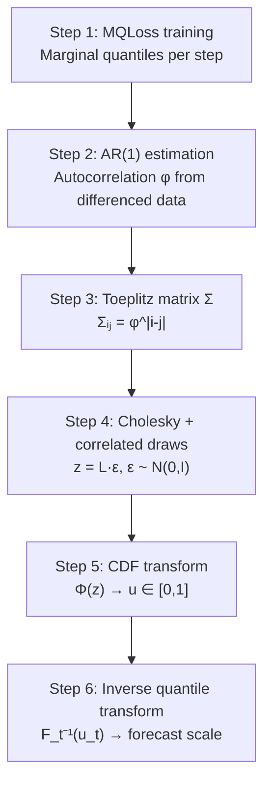

<!-- _class: lead -->

# The Gaussian Copula Method
## Generating Correlated Sample Paths

### Module 03 — Sample Paths
#### Modern Time Series Forecasting with NeuralForecast

<!-- Speaker notes: Guide 01 established what sample paths are and why they are the correct framework for multi-step decisions. This guide opens the black box: how does NeuralForecast actually generate those paths? The answer is the Gaussian Copula method — a six-step pipeline that starts from marginal quantile forecasts and produces internally consistent trajectories. Every step has both a mathematical statement and working code. -->

---

# The Problem to Solve

We have:
- Marginal quantile forecasts $Q_\alpha(y_{T+t})$ for each step $t$ from MQLoss
- No information about how steps co-vary

We want:
- $S$ complete trajectories $\omega^{(s)} = (y_1^{(s)}, \ldots, y_H^{(s)})$
- Each trajectory should respect the **temporal autocorrelation** of the data

The Gaussian Copula separates these two concerns:
> **Marginals** from the trained model + **Dependence** from the data → **Joint paths**

<!-- Speaker notes: This framing is the key to understanding copulas. A copula is a mathematical tool that separates the marginal distributions from the dependence structure. We already have good marginal estimates from MQLoss. What we lack is the dependence structure — how adjacent steps co-vary. The Gaussian Copula borrows that structure from the historical data via AR(1). -->

---

# Six-Step Pipeline Overview



<!-- Speaker notes: This pipeline diagram is the roadmap for the entire guide. Each box is one slide. The key message: steps 1-2 extract information from data, steps 3-5 build the correlation machinery, step 6 combines everything into paths. The architecture flows logically: get marginals → get dependence → combine them. -->

---

# Step 1 — Marginal Quantiles from MQLoss

```python
from neuralforecast.models import NHITS
from neuralforecast.losses.pytorch import MQLoss

model = NHITS(
    h=7,
    input_size=28,
    loss=MQLoss(level=[80, 90]),
    scaler_type="robust",
    max_steps=500,
)
nf = NeuralForecast(models=[model], freq="D")
nf.fit(df_train)

forecasts = nf.predict()
# Columns: NHITS-lo-90, NHITS-lo-80, NHITS, NHITS-hi-80, NHITS-hi-90
```

MQLoss trains the model to minimize **pinball loss** at each quantile level.

Result: for each horizon step $t$, we have an estimate of $Q_\alpha(y_{T+t})$.

<!-- Speaker notes: MQLoss with level=[80,90] actually requests quantiles at [0.05, 0.10, 0.20, ..., 0.80, 0.90, 0.95] — it adds symmetrically. The result is a grid of quantile estimates at each horizon step. These are the marginal distributions we need for Step 6. Steps 2-5 build the dependence structure that will link these marginals into correlated paths. -->

---

# Step 2 — Estimating AR(1) Autocorrelation

**Why differencing?** Raw demand has trend and seasonality — it is not stationary. AR(1) estimation requires stationarity.

First-differencing removes trend and seasonality:
$$\Delta y_t = y_t - y_{t-1}$$

Fit AR(1) on the differences:
$$\Delta y_t = \phi \cdot \Delta y_{t-1} + \varepsilon_t$$

```python
from scipy.stats import pearsonr

def estimate_ar1_phi(series):
    diff = np.diff(series)
    phi, _ = pearsonr(diff[:-1], diff[1:])
    return float(np.clip(phi, -0.999, 0.999))

phi = estimate_ar1_phi(df_train["y"].values)
print(f"phi = {phi:.4f}")   # typical: 0.3 to 0.7 for daily demand
```

<!-- Speaker notes: The differencing step is easy to overlook but critical. Without it, the AR(1) estimate will be biased upward because the trend creates spurious autocorrelation. After differencing, the residuals are stationary and the Pearson correlation of lag-1 pairs is an unbiased estimate of the AR(1) coefficient. The clip to [-0.999, 0.999] prevents numerical issues in the Cholesky decomposition. -->

---

# Step 3 — Toeplitz Correlation Matrix

The AR(1) model implies: correlation between steps $i$ and $j$ decays as $\phi^{|i-j|}$.

$$\Sigma_{ij} = \phi^{|i-j|}$$

For $H=7$ with $\phi = 0.5$:

$$\Sigma = \begin{pmatrix}
1 & 0.5 & 0.25 & 0.125 & \cdots \\
0.5 & 1 & 0.5 & 0.25 & \cdots \\
0.25 & 0.5 & 1 & 0.5 & \cdots \\
\vdots & & & \ddots
\end{pmatrix}$$

```python
from scipy.linalg import toeplitz

def build_toeplitz(phi, h):
    return toeplitz([phi ** k for k in range(h)])

Sigma = build_toeplitz(phi, h=7)
```

<!-- Speaker notes: The Toeplitz structure means constant diagonals: every pair of steps separated by distance 1 has correlation phi, every pair separated by distance 2 has correlation phi^2, and so on. This is the AR(1) correlation structure encoded in matrix form. The scipy.linalg.toeplitz function builds it from just the first row. -->

---

# Step 4 — Cholesky Decomposition

To draw from $N(0, \Sigma)$, factor $\Sigma = LL^T$ (Cholesky), then:

$$z = L \cdot \varepsilon, \quad \varepsilon \sim N(0, I_H) \implies z \sim N(0, \Sigma)$$

```python
# Cholesky: L is lower triangular
L = np.linalg.cholesky(Sigma)   # L shape: (7, 7)

# Draw independent normals, apply Cholesky
rng = np.random.default_rng(42)
epsilon = rng.standard_normal(size=(7, 100))  # (H, n_paths)
z = (L @ epsilon).T                           # (n_paths, H)

# Verify: z columns should be correlated at phi
print(f"Step 0-1 correlation: {np.corrcoef(z.T)[0,1]:.4f}")
print(f"Target phi:           {phi:.4f}")
```

<!-- Speaker notes: The Cholesky decomposition is the standard technique for generating correlated multivariate normals. The matrix L is a square root of Sigma in the sense that LL^T = Sigma. Multiplying independent standard normals by L introduces the correlation structure. Each column of epsilon is an independent standard normal vector; after applying L, each row of z.T is a correlated H-dimensional draw. -->

---

# Step 4 — Why Cholesky Works

$$\text{Cov}(z) = \text{Cov}(L\varepsilon) = L \cdot \text{Cov}(\varepsilon) \cdot L^T = L \cdot I \cdot L^T = LL^T = \Sigma$$

The algebra proves it. Intuitively:

- $\varepsilon$ has no correlation — each dimension is independent
- $L$ "mixes" the dimensions, introducing correlation
- The mixing weights in $L$ are exactly calibrated to reproduce $\Sigma$

This is how all correlated multivariate random draws work under the hood.

<!-- Speaker notes: This algebra derivation is short and complete. The proof goes: Cov(z) = Cov(L*epsilon) = L*Cov(epsilon)*L^T = L*I*L^T = LL^T = Sigma. The intuition: L acts as a linear transformation that converts uncorrelated noise into correlated noise with exactly the right covariance structure. The Cholesky decomposition gives us the right L for any positive-definite Sigma. -->

---

# Step 5 — CDF Transform to Uniform [0,1]

The correlated normals $z_t^{(s)} \in \mathbb{R}$ need to become probabilities.

Apply the standard normal CDF $\Phi$ element-wise:

$$u_t^{(s)} = \Phi\!\left(z_t^{(s)}\right) \in [0, 1]$$

```python
from scipy.stats import norm

u = norm.cdf(z)   # element-wise Phi(z)
print(f"u range: [{u.min():.3f}, {u.max():.3f}]")  # [0, 1]

# Correlation is preserved through monotone transform
corr_z = np.corrcoef(z.T)[0, 1]
corr_u = np.corrcoef(u.T)[0, 1]
print(f"Correlation in z: {corr_z:.4f}")
print(f"Correlation in u: {corr_u:.4f}")  # approximately equal
```

**Why does correlation survive?** $\Phi$ is monotone — it preserves rank ordering. Rank correlation (Spearman) is exactly preserved; Pearson correlation is approximately preserved.

<!-- Speaker notes: The CDF transform is the core of the copula idea. Sklar's theorem says that any multivariate distribution can be written as a copula applied to the marginals. Here we're using the Gaussian copula: after the CDF transform, each u_t is marginally uniform on [0,1], but the u values across time are correlated in the same way as the z values. The monotone property of Phi ensures that "high z at time t" maps to "high u at time t", preserving the rank structure. -->

---

# Step 6 — Inverse Quantile Transform

Each $u_t^{(s)} \in [0,1]$ is a probability level. Map it to the forecast scale using the model's quantile function for step $t$:

$$y_t^{(s)} = F_t^{-1}\!\left(u_t^{(s)}\right)$$

In practice, interpolate between the model's quantile estimates:

```python
def inverse_quantile_transform(u, quantile_levels, quantile_forecasts):
    """
    u                  : (n_paths, H)
    quantile_levels    : (K,) e.g. [0.05, 0.10, ..., 0.95]
    quantile_forecasts : (H, K)
    """
    n_paths, H = u.shape
    paths = np.zeros((n_paths, H))
    for t in range(H):
        paths[:, t] = np.interp(
            u[:, t], quantile_levels, quantile_forecasts[t]
        )
    return paths
```

<!-- Speaker notes: The inverse quantile transform is the final bridge from the Gaussian world back to the forecast world. u_t^(s) is a probability level — say 0.73. We look up what the model says the 73rd percentile of demand is on day t. That becomes the demand value for path s on day t. The np.interp call does linear interpolation between the known quantile levels, which is accurate when we have dense quantile estimates from MQLoss. -->

---

# Step 6 — Why This Combines Marginals and Dependence

The paths $y_t^{(s)} = F_t^{-1}(u_t^{(s)})$ have two properties by construction:

**Correct marginals:** For any fixed step $t$, the values $\{y_t^{(s)}\}_{s=1}^S$ follow the distribution described by the model's quantile forecasts $F_t$.

**Correct dependence:** The co-movement between steps is inherited from the correlated uniforms $u$, which came from the Gaussian copula with AR(1) structure.

This is Sklar's theorem in action: any joint distribution can be written as a copula applied to marginal CDFs.

<!-- Speaker notes: Sklar's theorem is the mathematical foundation. It says: if you have marginal distributions F_1, ..., F_H and a copula C, you can always construct a joint distribution with those exact marginals and dependence structure C. The Gaussian Copula is C. The model's quantile forecasts are the marginals. Step 6 applies Sklar's theorem to combine them. -->

---

# The Full Pipeline in One Function

```python
def gaussian_copula_paths(quantile_levels, quantile_forecasts,
                           y_train, n_paths=100, seed=42):
    H = quantile_forecasts.shape[0]
    # Step 2: AR(1) phi
    diff = np.diff(y_train)
    phi = float(np.clip(pearsonr(diff[:-1], diff[1:])[0], -0.999, 0.999))
    # Step 3: Toeplitz Sigma
    Sigma = toeplitz([phi ** k for k in range(H)])
    # Step 4: Cholesky + correlated draws
    L = np.linalg.cholesky(Sigma)
    eps = np.random.default_rng(seed).standard_normal((H, n_paths))
    z = (L @ eps).T                       # (n_paths, H)
    # Step 5: CDF transform
    u = norm.cdf(z)                       # (n_paths, H)
    # Step 6: inverse quantile transform
    paths = np.zeros((n_paths, H))
    for t in range(H):
        paths[:, t] = np.interp(u[:, t], quantile_levels,
                                 quantile_forecasts[t])
    return paths
```

<!-- Speaker notes: This function is the complete manual implementation. In production, use nf.models[0].simulate() which runs this same logic internally with additional robustness. The manual version is valuable for understanding and for cases where you need to customize the autocorrelation estimation or the quantile interpolation. -->

---

# Using the NeuralForecast API

```python
# After fitting the model:
paths_df = nf.models[0].simulate(n_paths=100)

# Returns a DataFrame:
# unique_id | ds | sample_1 | sample_2 | ... | sample_100
print(paths_df.shape)     # (7, 102) for 7-step horizon

# Extract as numpy array (n_paths, H)
path_cols = [c for c in paths_df.columns if c.startswith("sample_")]
paths = paths_df[path_cols].values.T   # (100, 7)

print(f"Paths shape: {paths.shape}")
print(f"Sample path 0: {paths[0].round(0)}")
```

`.simulate()` wraps the six-step pipeline with production-grade edge-case handling.

Use the manual implementation to understand; use the API in practice.

<!-- Speaker notes: The API is simpler than the manual implementation. The key output format: rows are horizon steps, columns are paths (plus unique_id and ds). After transposing, we get the (n_paths, H) convention used in Guide 01. Emphasize that the API and manual implementation produce identical results for the same seed and quantile grid. -->

---

# Validation: Does It Work?

Three checks on generated paths:

```python
paths = paths_df[path_cols].values.T  # (100, 7)

# 1. Marginal alignment
print("Step 1 — marginal check:")
print(f"  Path 10th pct: {np.quantile(paths[:,0], 0.10):.0f}")
print(f"  Model Q10:     {forecasts['NHITS-lo-90'].iloc[0]:.0f}")

# 2. Temporal correlation
print(f"\nAdj. step corr: {np.corrcoef(paths.T)[0,1]:.4f}")
print(f"phi estimate:   {phi:.4f}")

# 3. Plausibility
print(f"\nMin path value: {paths.min():.0f}")
print(f"Max path value: {paths.max():.0f}")
print(f"Training range: [{df_train.y.min():.0f}, {df_train.y.max():.0f}]")
```

<!-- Speaker notes: These three validation checks confirm the pipeline is working correctly. (1) The path percentiles should align with the model's quantile forecasts — if they don't, the inverse quantile transform failed. (2) The empirical correlation between adjacent steps should be close to phi — if not, the Cholesky step failed. (3) Paths should stay within a plausible range — extreme outliers suggest issues with the quantile grid coverage at the tails. -->

---

# Summary: Six Steps at a Glance

| Step | What | Why |
|------|------|-----|
| 1 | Train NHITS with MQLoss | Get marginal distributions $F_t$ for each step |
| 2 | AR(1) on $\Delta y_t$ | Estimate temporal autocorrelation $\phi$ |
| 3 | Toeplitz $\Sigma_{ij} = \phi^{\|i-j\|}$ | Encode correlation decay structure |
| 4 | Cholesky $\Sigma = LL^T$, draw $z = L\varepsilon$ | Generate correlated Gaussian draws |
| 5 | $u = \Phi(z)$ | Map to uniform [0,1] preserving correlation |
| 6 | $y_t = F_t^{-1}(u_t)$ | Recover forecast scale with correct marginals |

**Key insight:** Marginals come from the model; dependence comes from the data; the copula combines them.

<!-- Speaker notes: This summary table is the key takeaway slide. Each step has a clear what and why. The key insight at the bottom — marginals from the model, dependence from the data — is the conceptual message of the entire guide. The copula is the mathematical glue that combines two separately estimated objects into a valid joint distribution. -->

---

# Next: Notebooks

**Notebook 01** — Generating Sample Paths
- Load French Bakery baguette data
- Train NHITS with MQLoss, generate 100 paths via `.simulate()`
- Visualize paths + compare sample path bounds vs marginal quantile bounds

**Notebook 02** — Business Decisions with Sample Paths
- Weekly total at 80% service level
- Worst-case single day
- Reorder timing from cumulative demand
- Show that marginal quantiles give wrong answers for all three

<!-- Speaker notes: The notebooks are where the theory becomes practical. Notebook 01 establishes the data and model. Notebook 02 applies the Monte Carlo framework to three real business problems. Emphasize that every answer in Notebook 02 would be wrong if computed from marginal quantiles — the visual comparison demonstrates this concretely. -->
