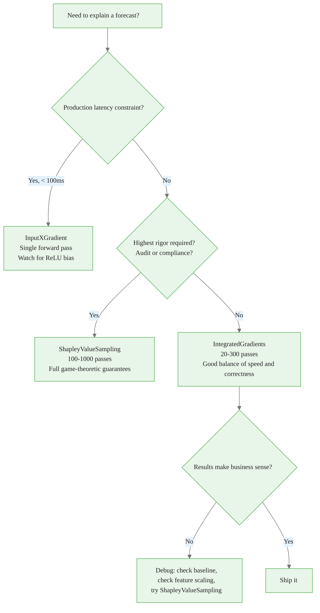

# Explainability Methods for Neural Forecasting Models

> **Reading time:** ~11 min | **Module:** 4 — Explainability | **Prerequisites:** Module 1

<div class="callout-danger">

<strong>Important:</strong> NeuralForecast does not natively support model explainability. There is no <code>.explain()</code> method in the NeuralForecast API. For interpretability, use <a href="https://captum.ai/">Captum</a> with the underlying PyTorch models, or use inherently interpretable models like NHITS which provide basis function decompositions. The attribution theory covered in this guide is correct — apply it using Captum directly on the PyTorch model extracted from a trained NeuralForecast instance.

</div>

## In Brief

Neural forecasting models like NHITS produce accurate forecasts but offer no built-in explanation of which inputs drove each prediction. This guide covers three attribution methods that answer the question: "Why did the model forecast this value?" These methods are implemented via the Captum library applied to the underlying PyTorch models.


The following implementation shows how to use Captum directly with a trained NeuralForecast model:

<div class="code-window">
<div class="code-header">
<div class="dots"><span class="dot-red"></span><span class="dot-yellow"></span><span class="dot-green"></span></div>

```python
from neuralforecast import NeuralForecast
from neuralforecast.models import NHITS
from neuralforecast.losses.pytorch import MSE, MAE
from captum.attr import IntegratedGradients

# Train model with exogenous features
models = [NHITS(
    h=28,
    input_size=56,
    futr_exog_list=["published", "is_holiday"],
    max_steps=1000,
    loss=MSE(),
    valid_loss=MAE()
)]
nf = NeuralForecast(models=models, freq="D")
nf.fit(df=train, val_size=28)

# Access the underlying PyTorch model for explainability
pytorch_model = nf.models[0]

# Use Captum's IntegratedGradients on the PyTorch model
ig = IntegratedGradients(pytorch_model)
# See Captum documentation for full usage: https://captum.ai/
```

</div>
</div>

<div class="callout-key">

<strong>Key Concept:</strong> Neural forecasting models like NHITS produce accurate forecasts but offer no built-in explanation of which inputs drove each prediction. Use Captum (a PyTorch model interpretability library) to compute attributions on the underlying PyTorch models. Inherently interpretable models like NHITS also provide basis function decompositions that can be inspected directly.

</div>


---

## 1. Why Explainability Matters

A model that produces accurate forecasts but cannot be interrogated creates three problems for practitioners.

<div class="callout-insight">

<strong>Insight:</strong> A model that produces accurate forecasts but cannot be interrogated creates three problems for practitioners.

</div>


**Trust and adoption.** Stakeholders who cannot understand why a model issued a specific forecast are less likely to act on it. A commodity trader who sees a model predict a 40% price spike needs to know whether that prediction is driven by real supply signals or a data artifact. Attribution methods provide that answer.

**Debugging model failures.** When a model underperforms on a new data slice, attributions reveal whether the model is using irrelevant features, attending to lags that should not matter, or ignoring features that business logic says are crucial. This makes the debugging process concrete and fast.

**Regulatory and compliance requirements.** Financial institutions operating under model risk management frameworks (SR 11-7 in the US, SS3/18 in the UK) are required to document and explain model behavior. Attribution methods produce the audit trail those frameworks require.

**Stakeholder communication.** A business summary like "publishing an article added 610 visitors to the 28-day forecast" is far more actionable than presenting raw forecast numbers. Attribution methods are the translation layer between model internals and business language.

---

## 2. The Three Attribution Methods

### Method 1: Integrated Gradients

<div class="callout-key">

<strong>Key Point:</strong> ### Method 1: Integrated Gradients

**Core idea.** Integrated Gradients (IG) attributes a prediction to each input feature by integrating the gradient of the model output with respect to that input al...

</div>


**Core idea.** Integrated Gradients (IG) attributes a prediction to each input feature by integrating the gradient of the model output with respect to that input along a straight path from a baseline (e.g., all zeros) to the actual input.

**Mathematical formulation.** For a model $f: \mathbb{R}^n \to \mathbb{R}$ and an input $x \in \mathbb{R}^n$ with baseline $x' \in \mathbb{R}^n$:

$$\text{IG}_i(x) = (x_i - x'_i) \times \int_{\alpha=0}^{1} \frac{\partial f(x' + \alpha(x - x'))}{\partial x_i} \, d\alpha$$

The integral is approximated as a Riemann sum with $m$ steps:

$$\text{IG}_i(x) \approx (x_i - x'_i) \times \sum_{k=1}^{m} \frac{\partial f\left(x' + \frac{k}{m}(x - x')\right)}{\partial x_i} \times \frac{1}{m}$$

In practice $m$ ranges from 20 to 300, meaning 20 to 300 forward passes through the model.

**Completeness property.** IG satisfies the completeness axiom:

$$\sum_{i=1}^{n} \text{IG}_i(x) = f(x) - f(x')$$

The attributions sum to the difference between the prediction and the baseline prediction. This is what makes IG trustworthy: the attributions fully account for the prediction.

**Implementation note.** Use the `captum` library directly, which implements IG via `IntegratedGradients` from `captum.attr`. Extract the PyTorch model from the trained NeuralForecast instance and pass it to Captum.


The following implementation shows how to use Captum directly:

<div class="code-window">
<div class="code-header">
<div class="dots"><span class="dot-red"></span><span class="dot-yellow"></span><span class="dot-green"></span></div>

```python
from captum.attr import IntegratedGradients

# Extract the trained PyTorch model
pytorch_model = nf.models[0]

# Apply Integrated Gradients via Captum
ig = IntegratedGradients(pytorch_model)
# attributions = ig.attribute(input_tensor, baselines=baseline_tensor)
```

</div>
</div>

---

### Method 2: Input × Gradient

**Core idea.** Input × Gradient (IxG) approximates attribution with a single backward pass. It multiplies each input value by the gradient of the model output at that input:

$$\text{IxG}_i(x) = x_i \times \frac{\partial f(x)}{\partial x_i}$$

**Why this is fast.** A single backward pass computes all gradients simultaneously, making IxG as fast as one training step. For large-scale production use where latency matters, IxG is the practical choice.

**The bias problem with ReLU networks.** IxG violates additivity. For networks with ReLU activations, the gradient is zero wherever the neuron is off. A feature can have a large input value but zero gradient if the ReLU is inactive, and IxG will attribute zero to that feature — even if it was causally important in training. This is the **saturation problem** and it means IxG attributions should be interpreted with caution in deep networks.


The following implementation builds on the approach above:

<div class="code-window">
<div class="code-header">
<div class="dots"><span class="dot-red"></span><span class="dot-yellow"></span><span class="dot-green"></span></div>

```python
from captum.attr import InputXGradient

ixg = InputXGradient(pytorch_model)
# attributions = ixg.attribute(input_tensor)
```

</div>
</div>

---

### Method 3: Shapley Value Sampling

**Core idea.** Shapley values come from cooperative game theory. They distribute the "payout" (the model prediction) fairly among all players (features) based on each feature's marginal contribution across all possible coalitions.

**Formal definition.** For feature $i$ in a model with feature set $N$:

$$\phi_i = \sum_{S \subseteq N \setminus \{i\}} \frac{|S|!(|N|-|S|-1)!}{|N|!} \left[ f(S \cup \{i\}) - f(S) \right]$$

where $f(S)$ is the model output with only features in coalition $S$ active (remaining features replaced by their expected value).

**Monte Carlo approximation.** Exact Shapley computation is exponential in the number of features. The sampling approximation permutes the feature order randomly and estimates each feature's marginal contribution:

1. Sample a random permutation of all features
2. For each position in the permutation, compute $f(\text{prefix} \cup \{i\}) - f(\text{prefix})$
3. Repeat 100 to 1000 times and average

This requires 100 to 1000 forward passes per prediction, making Shapley the slowest method by a significant margin.

**Additivity guarantee.** Like IG, Shapley values are additive:

$$\sum_{i=1}^{n} \phi_i = f(x) - E[f(x)]$$


<div class="code-window">
<div class="code-header">
<div class="dots"><span class="dot-red"></span><span class="dot-yellow"></span><span class="dot-green"></span></div>
<span class="filename">example.py</span>
</div>

```python
from captum.attr import ShapleyValueSampling

svs = ShapleyValueSampling(pytorch_model)
# attributions = svs.attribute(input_tensor)
```

</div>
</div>

---

## 3. Comparison Table

| Property | Integrated Gradients | Input × Gradient | Shapley Value Sampling |
|---|---|---|---|
| **Forward passes** | 20–300 | 1 | 100–1000 |
| **Speed** | Fast | Fastest | Slow |
| **Additive?** | Yes | No | Yes (theoretically) |
| **Baseline required** | Yes | No | Yes (expected value) |
| **ReLU bias** | Handles correctly | Susceptible | Handles correctly |
| **Implementation** | captum | captum | shap / captum |
| **Captum class** | `IntegratedGradients` | `InputXGradient` | `ShapleyValueSampling` |
| **When to use** | Default; balance of speed and correctness | Real-time production; first-pass diagnosis | Offline analysis; highest rigor |

---

## 4. Mathematical Relationships Between Methods

All three methods are instances of a general attribution framework. Define an attribution function $A: \mathbb{R}^n \times \mathcal{F} \to \mathbb{R}^n$ that assigns a score to each feature. The methods differ in how they satisfy or violate the following axioms:

<div class="callout-info">

<strong>Info:</strong> All three methods are instances of a general attribution framework.

</div>


**Sensitivity.** If the model output changes when feature $i$ changes and the baseline is unchanged, $A_i \neq 0$.

**Implementation invariance.** Two models that are functionally identical (same input-output mapping) must have identical attributions regardless of implementation.

**Completeness.** $\sum_i A_i(x) = f(x) - f(x')$.

IG satisfies all three. IxG violates completeness. Shapley sampling satisfies all three asymptotically (with enough samples).

---

## 5. Choosing a Method in Practice

Follow this decision tree:

<div class="callout-warning">

<strong>Warning:</strong> Follow this decision tree:


For most time series forecasting use cases, **Integrated Gradients is the right default**.




For most time series forecasting use cases, **Integrated Gradients is the right default**. It is fast enough for batch offline analysis, additive (so attributions are interpretable), and handles ReLU activations correctly.

---


## 6. Working with Captum Attributions

When using Captum directly with the underlying PyTorch model, the attribution output depends on the Captum method used. The general pattern:

```python
from captum.attr import IntegratedGradients

# Extract trained PyTorch model from NeuralForecast
pytorch_model = nf.models[0]

ig = IntegratedGradients(pytorch_model)
attributions = ig.attribute(input_tensor, baselines=baseline_tensor)

# attributions has the same shape as input_tensor
# Each value represents the attribution of that input feature to the output
```

The attributions tensor has the same shape as the input tensor. Each value represents how much that input feature contributed to the model's output. For time series models, this lets you identify which lags and which exogenous features drove the forecast.

For NHITS specifically, you can also inspect the basis function decompositions directly, since NHITS decomposes the forecast into contributions from different temporal scales — this provides a form of built-in interpretability without needing external attribution methods.

Full interpretation guidance is covered in `02_interpreting_attributions.md`.

---

## 7. Prerequisites

- NeuralForecast installed: `pip install neuralforecast`
- captum installed: `pip install captum`
- shap installed (for Shapley method and waterfall plots): `pip install shap`
- Familiarity with Module 01 (NHITS and basic NeuralForecast API)

---

## What's Next

- `02_interpreting_attributions.md` — Tensor shapes in depth, visualization techniques, business interpretation
- `notebooks/01_explain_api.ipynb` — End-to-end walkthrough with synthetic blog traffic data
- `notebooks/02_attribution_visualization.ipynb` — Comparing all three methods side by side


---

## Cross-References

<a class="link-card" href="./01_explainability_methods.md">
  <div class="link-card-title">Companion Slides</div>
  <div class="link-card-description">Interactive slide deck covering the key concepts with visual examples.</div>
</a>

<a class="link-card" href="../notebooks/01_explain_api.ipynb">
  <div class="link-card-title">Hands-on Notebook</div>
  <div class="link-card-description">15-minute micro-notebook with guided exercises and real data.</div>
</a>
