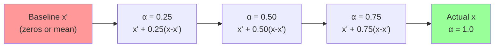
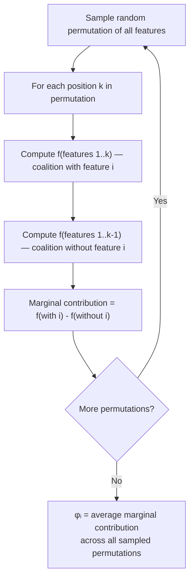
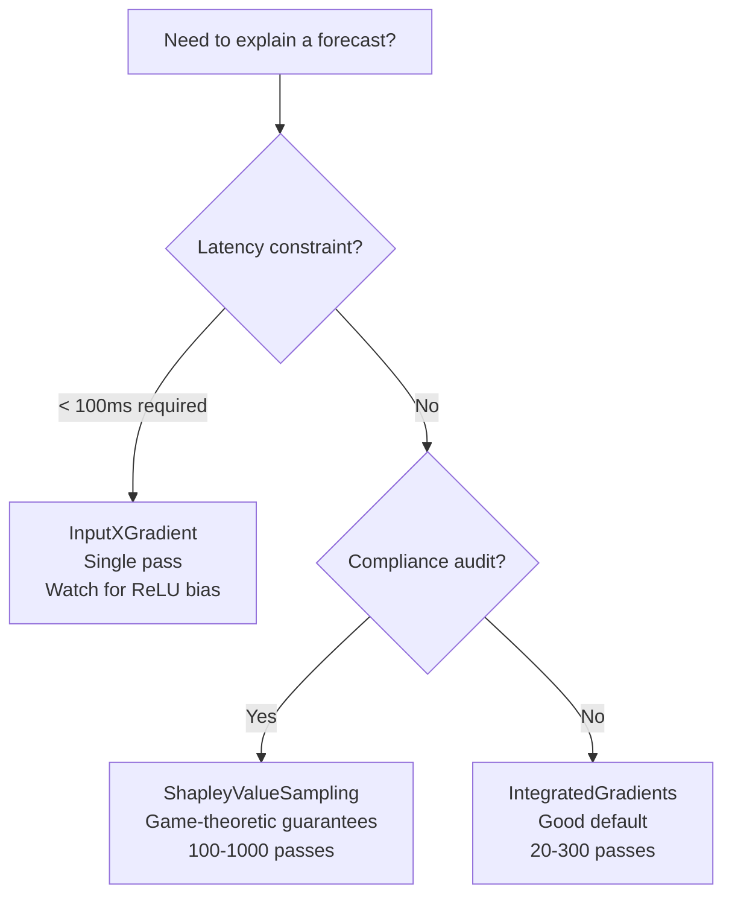

<!-- _class: lead -->

# Explainability for Neural Forecasting Models
## Attribution Methods: IG, Input×Gradient, Shapley

### Module 04 -- Explainability

<!-- Speaker notes: Welcome to Module 4. We shift from building accurate forecasts to understanding why the model produces the forecasts it does. This is where neural time series models move from black boxes to decision-support tools. -->

---

# Why Explainability Matters

Three problems that un-explainable models create:

1. **Trust gap** -- stakeholders won't act on forecasts they can't interrogate
2. **Silent failures** -- wrong features can drive good in-sample accuracy but fail out-of-sample
3. **Compliance** -- SR 11-7 (US) and SS3/18 (UK) require documented model explanations

> "Publishing an article raised the 28-day visitor forecast by ~610." That sentence is actionable. A 28-day matrix of numbers is not.

<!-- Speaker notes: Ask the room: has anyone had a model rejected by a risk committee not because it was inaccurate but because it could not be explained? Attribution methods solve that problem. -->

---

# The .explain() API in One Slide

```python
from neuralforecast import NeuralForecast
from neuralforecast.models import NHITS
from neuralforecast.losses.pytorch import MSE, MAE

models = [NHITS(
    h=28, input_size=56,
    futr_exog_list=["published", "is_holiday"],
    max_steps=1000, loss=MSE(), valid_loss=MAE()
)]
nf = NeuralForecast(models=models, freq="D")
nf.fit(df=train, val_size=28)

# One call returns predictions AND attributions
fcsts_df, explanations = nf.explain(
    futr_df=futr_df,
    explainer="IntegratedGradients"   # or InputXGradient or ShapleyValueSampling
)
```

**`explanations`** is a dict with keys: `insample`, `futr_exog`, `baseline_predictions`

<!-- Speaker notes: Show this slide twice if needed. The key point is that .explain() is a drop-in complement to .predict(). No architectural changes required. -->

---

# Three Attribution Methods at a Glance

| Property | Integrated Gradients | Input × Gradient | Shapley Sampling |
|---|---|---|---|
| Forward passes | 20--300 | 1 | 100--1000 |
| Speed | Fast | Fastest | Slow |
| Additive? | Yes | No | Yes |
| ReLU safe? | Yes | No | Yes |
| Best for | Default use | Production latency | Audit/compliance |

<!-- Speaker notes: Walk through each column. Emphasize that "additive" means attributions sum to the prediction difference from baseline -- this is what makes them trustworthy and auditable. -->

---

<!-- _class: lead -->

# Method 1: Integrated Gradients

<!-- Speaker notes: IG is the workhorse of neural network explainability. Introduced by Sundararajan, Taly, and Yan in 2017. The key innovation is integrating along a path rather than evaluating the gradient at a single point. -->

---

# Integrated Gradients: The Idea

We want to know: how much did input feature $i$ contribute to the forecast?

**The problem with a single gradient:** gradients at saturated neurons (post-ReLU) are zero -- they miss contributions that occurred earlier in the path.

**IG's solution:** integrate the gradient along the straight-line path from a baseline input $x'$ to the actual input $x$.



Gradient is evaluated at each step. The area under the curve is the attribution.

<!-- Speaker notes: Analogy: think of driving from city A to city B. A single-point gradient only tells you the slope at the destination. IG tells you the total elevation change along the full route. -->

---

# Integrated Gradients: The Math

For model $f$, input $x$, baseline $x'$, and feature $i$:

$$\text{IG}_i(x) = (x_i - x'_i) \times \int_{\alpha=0}^{1} \frac{\partial f(x' + \alpha(x - x'))}{\partial x_i} \, d\alpha$$

Approximated with $m$ steps (Riemann sum):

$$\text{IG}_i(x) \approx (x_i - x'_i) \times \frac{1}{m} \sum_{k=1}^{m} \frac{\partial f\left(x' + \frac{k}{m}(x - x')\right)}{\partial x_i}$$

**Completeness guarantee:**

$$\sum_{i=1}^{n} \text{IG}_i(x) = f(x) - f(x')$$

Attributions exactly account for the gap between prediction and baseline. No missing attribution.

<!-- Speaker notes: The completeness guarantee is what separates IG from simpler gradient-based methods. It means you can add up all the attributions and get back the exact prediction difference. This is critical for stakeholder communication. -->

---

# Integrated Gradients: Cost and Baseline

**Computational cost:** $m$ forward+backward passes. NeuralForecast default is 50 steps.

**Baseline choice matters.** The baseline $x'$ defines the "no information" reference:

| Baseline | Meaning | When to use |
|---|---|---|
| All zeros | Feature absent | Sparse or binary features |
| Feature mean | Typical behavior | Continuous features |
| Random noise average | Model-agnostic neutral | When unsure |

For blog traffic with binary features `published` and `is_holiday`, zeros is the natural baseline: "no article published, not a holiday."

<!-- Speaker notes: Ask: what would a bad baseline look like? Answer: a baseline that is itself unusual (e.g., a spike) would make IG attribute the spike to all features, confounding the analysis. -->

---

<!-- _class: lead -->

# Method 2: Input × Gradient

<!-- Speaker notes: The fastest method. Single backward pass. Used when latency matters more than correctness guarantees. -->

---

# Input × Gradient: Speed at a Cost

**Formula:** one backward pass, no integration:

$$\text{IxG}_i(x) = x_i \times \frac{\partial f(x)}{\partial x_i}$$

**Why it's fast:** a single backward pass computes all $\frac{\partial f}{\partial x_i}$ simultaneously. Cost is equivalent to one training step.

**The ReLU saturation problem:**

```python
# ReLU kills gradients when neuron is off
# If a hidden unit h = max(0, Wx + b) and Wx + b < 0:
#   gradient = 0
# IxG attributes 0 to x_i even if x_i was large
# The feature appears unimportant — but it was simply saturated
```

**Verdict:** Use IxG for first-pass exploratory analysis and production latency-constrained settings. Do not use it as the sole evidence in an audit.

<!-- Speaker notes: IxG was one of the earliest gradient-based attribution methods. Its failure mode is subtle: it gives the right answer when the network is in a linear regime but silently fails when ReLU saturates. Always cross-check with IG if the results look wrong. -->

---

<!-- _class: lead -->

# Method 3: Shapley Value Sampling

<!-- Speaker notes: Shapley values come from game theory. Lloyd Shapley won the 2012 Nobel Prize in Economics partly for this work. The translation to ML was popularized by Scott Lundberg's SHAP library. -->

---

# Shapley Values: Fair Credit Assignment

**Game theory framing:** treat features as players in a cooperative game where the payout is the model prediction. Shapley values distribute that payout fairly.

**Formal definition** for feature $i$ in feature set $N$:

$$\phi_i = \sum_{S \subseteq N \setminus \{i\}} \frac{|S|!(|N|-|S|-1)!}{|N|!} \left[ f(S \cup \{i\}) - f(S) \right]$$

**Intuition:** for every possible ordering of all features, compute feature $i$'s marginal contribution when it joins the coalition. Average those marginal contributions over all orderings.

**Cost:** $|N|!$ coalitions — exponential. Monte Carlo sampling makes it tractable.

<!-- Speaker notes: The factorial term in the formula is a weighting factor that ensures every coalition size is treated equally. This is what makes Shapley values "fair" in the game-theoretic sense. -->

---

# Shapley Sampling: Monte Carlo Approximation



**100–1000 permutations** gives stable estimates. Each permutation requires one forward pass.

**Additivity guarantee:** $\sum_i \phi_i = f(x) - E[f(x)]$

<!-- Speaker notes: The SHAP library (TreeSHAP, KernelSHAP) has made this practical. For neural networks, the captum implementation is used under the hood in NeuralForecast. -->

---

# Choosing a Method: Decision Guide



**Practical rule:** start with IntegratedGradients. If results don't match business intuition, cross-check with ShapleyValueSampling. Use InputXGradient only when speed is the binding constraint.

<!-- Speaker notes: This is the most actionable slide in the deck. Print this flowchart and put it on your wall. Most practitioners waste time debating methods when IG + a sanity check covers 90% of cases. -->

---

# The `explanations` Dictionary

```python
fcsts_df, explanations = nf.explain(futr_df=futr_df, explainer="IntegratedGradients")

explanations.keys()
# dict_keys(['insample', 'futr_exog', 'baseline_predictions'])
```

<div class="columns">

**`insample`**
Past lag attributions
Shape: `[batch, horizon, series, output, input_size, 2]`
Last dim: `[lag_value, attribution_score]`

**`futr_exog`**
Exogenous feature attributions
Shape: `[batch, horizon, series, output, input_size+horizon, n_features]`

**`baseline_predictions`**
Model output at baseline input
Shape: `[batch, horizon, series, output]`

</div>

Full tensor parsing in `02_interpreting_attributions.md`.

<!-- Speaker notes: The shape notation will feel dense. Tell students not to memorize it now — the next guide and notebooks walk through each dimension with real code. -->

---

# Module 04 Summary

Three methods, one API, clear trade-offs:

| | IG | IxG | Shapley |
|---|---|---|---|
| Speed | Fast | Fastest | Slow |
| Additive | Yes | No | Yes |
| Safe with ReLU | Yes | No | Yes |
| Default choice | Yes | No | No |

**Key takeaway:** `.explain()` is a drop-in call. IntegratedGradients is the right default. Attributions turn "the model predicted X" into "feature Y contributed Z to the forecast."

**Next:** `02_interpreting_attributions.md` -- tensor shapes, heatmaps, waterfall plots, business narratives

<!-- Speaker notes: End with the business narrative framing. The technical content is a means to an end. The goal is a sentence a commodity trader or content manager can act on. -->
