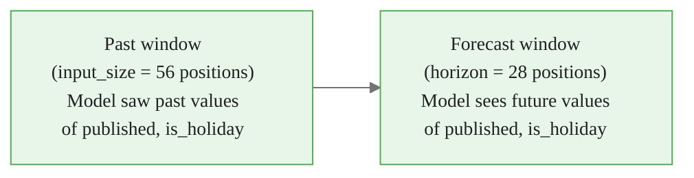
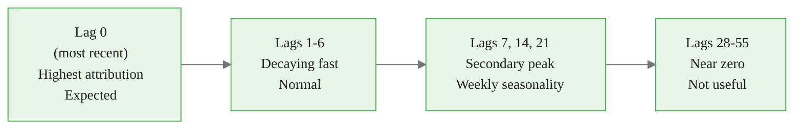

<!-- _class: lead -->

# Interpreting Attribution Tensors
## Shapes, Visualizations, Business Narratives

### Module 04 -- Explainability

<!-- Speaker notes: In the previous guide we learned what the three methods are. Now we learn how to read the output. The explanations dict is the deliverable -- but it's opaque until you know how to parse it. This guide makes it legible. -->

---

# Parsing the explanations Dict

<div class="code-window">
<div class="code-header">
<div class="dots"><span class="dot-red"></span><span class="dot-yellow"></span><span class="dot-green"></span></div>
<span class="filename">example.py</span>
</div>

```python
fcsts_df, explanations = nf.explain(
    futr_df=futr_df, explainer="IntegratedGradients"
)

insample      = explanations["insample"]
futr_exog     = explanations["futr_exog"]
baseline_pred = explanations["baseline_predictions"]

print(insample.shape)      # (1, 28, 1, 1, 56, 2)
print(futr_exog.shape)     # (1, 28, 1, 1, 84, 2)
print(baseline_pred.shape) # (1, 28, 1, 1)
```
</div>

Three tensors. Each captures a different part of the model's attention. Let's decode each shape.


<div class="callout-insight">
<strong>Insight:</strong> This is a key takeaway from this section that connects to the broader course themes.
</div>

<!-- Speaker notes: Live-code this step with students. The shape output is the first concrete confirmation that the API worked. -->

---

# The insample Tensor

**Shape:** `[batch, horizon, series, output, input_size, 2]`

<div class="columns">

| Dimension | Meaning |
|---|---|
| `batch` | Prediction batch (usually 1) |
| `horizon` | Forecast step 1 to $h$ |
| `series` | Which time series |
| `output` | Output dim (1 = point) |
| `input_size` | Past lag index |
| `2` | `[value, attribution]` |

The last dimension is always a pair: the actual lag value and its attribution score.

</div>

<div class="code-window">
<div class="code-header">
<div class="dots"><span class="dot-red"></span><span class="dot-yellow"></span><span class="dot-green"></span></div>
<span class="filename">example.py</span>
</div>

```python
# Attribution scores: shape (horizon, input_size)
attr = insample[0, :, 0, 0, :, 1]   # index 1 = attribution
vals = insample[0, :, 0, 0, :, 0]   # index 0 = actual value
```
</div>


<div class="callout-key">
<strong>Key Point:</strong> Remember this concept — it appears repeatedly in later modules.
</div>

<!-- Speaker notes: The final dimension of size 2 is easy to overlook. Always use index 1 for attribution scores and index 0 for the actual lag values. Confusing these is the most common mistake when first parsing the tensor. -->

---

# The futr_exog Tensor

**Shape:** `[batch, horizon, series, output, input_size+horizon, n_features]`

Why `input_size + horizon` positions?



Future exogenous features are known for BOTH past and future dates. The model attends to both windows. Attribution tensor reflects both.

```python
input_size = 56
# Positions 0..55: lookback window attributions
# Positions 56..83: forecast window attributions
published_future = futr_exog[0, :, 0, 0, input_size:, 0]  # (horizon, horizon)
```


<div class="callout-warning">
<strong>Warning:</strong> This is a common source of confusion. Pay close attention to the distinction here.
</div>

<!-- Speaker notes: This is the dimension that confuses practitioners most. The input_size+horizon length is not a bug -- it reflects the full context window the model uses for future covariates. -->

---

# What baseline_predictions Tells You

**Shape:** `[batch, horizon, series, output]`

This is what the model predicts when given the **baseline input** (all zeros for binary features).

```python
baseline_day1 = float(baseline_pred[0, 0, 0, 0])
actual_day1   = float(fcsts_df["NHITS"].iloc[0])

print(f"Baseline prediction, day 1: {baseline_day1:.0f} visitors")
print(f"Actual prediction, day 1:   {actual_day1:.0f} visitors")
print(f"Attribution gap:            {actual_day1 - baseline_day1:.0f} visitors")
```

The attribution gap is what all the attribution scores must add up to (completeness guarantee for IG).

**Real example:** baseline ~500 visitors, actual forecast ~1110 visitors on a day an article is published → 610 visitors explained by `published` + lags.


<div class="callout-info">
<strong>Info:</strong> This detail is useful context but not required to memorize.
</div>

<!-- Speaker notes: The baseline prediction is the "reference point" for the whole analysis. If you change the baseline, all attributions change. This is why choosing a meaningful baseline (zeros for binary features) is important. -->

---

<!-- _class: lead -->

# Visualization 1: Lag Attribution Heatmap

<!-- Speaker notes: The heatmap is the most information-dense visualization. It shows the full attribution landscape across all forecast steps and all lag positions simultaneously. -->

---

# Heatmap: Forecast Steps × Lag Positions

```python
attr = insample[0, :, 0, 0, :, 1]   # shape (28, 56)

fig, ax = plt.subplots(figsize=(14, 6))
im = ax.imshow(attr, aspect="auto", cmap="RdBu_r")
plt.colorbar(im, ax=ax, label="Attribution Score")
ax.set_xlabel("Lag Position (0 = most recent)")
ax.set_ylabel("Forecast Step")
ax.set_title("NHITS Lag Attribution Heatmap")
plt.show()
```

**Reading the heatmap:**

- **Dark red column at lag 0** → model heavily weights the most recent observation
- **Red bands at lags 7, 14, 21** → model captures weekly seasonality
- **Uniform gray** → those lags are irrelevant to the forecast

<!-- Speaker notes: Ask students: what pattern would you expect for a strongly seasonal series? Answer: bright bands at lags 7, 14, 21, 28 (weekly), or 365 (annual). The heatmap makes seasonality attribution visible. -->

---

# Expected Lag Attribution Pattern



**Red flag:** distant lags outranking recent lags without a seasonal explanation → possible data leakage or overfitting.

<!-- Speaker notes: The pattern on this slide is the "healthy" attribution signature for a daily series with weekly seasonality. Any major deviation from this pattern is worth investigating. -->

---

<!-- _class: lead -->

# Visualization 2: Waterfall Plot

<!-- Speaker notes: The waterfall plot is the most stakeholder-friendly visualization. It tells the complete story of a single forecast in one image. -->

---

# Waterfall Plot: Feature Contributions

The waterfall shows how each feature's attribution adds to or subtracts from the baseline prediction.

```python
import shap

# Build shap.Explanation from NeuralForecast tensors
attr_per_feature = futr_exog[0, 0, 0, 0, :, :].sum(axis=0)  # (n_features,)
base_value = float(baseline_pred[0, 0, 0, 0])

explanation = shap.Explanation(
    values=attr_per_feature,
    base_values=base_value,
    feature_names=["published", "is_holiday"]
)

shap.plots.waterfall(explanation)
```

**What you see:**
- Horizontal bar for each feature
- Red bar = positive contribution (raises forecast)
- Blue bar = negative contribution (lowers forecast)
- Final value = baseline + all contributions

<!-- Speaker notes: The waterfall plot is the one visualization you can show to a non-technical stakeholder. Point to each bar and say "publishing an article adds 610 visitors." That is actionable. -->

---

# Reading the Blog Traffic Waterfall

```
E[f(x)] = 500 (baseline: typical day, no article, no holiday)
    +610  published = 1        ████████████████ (article published)
     -15  is_holiday = 0       ▌ (not a holiday, small positive)
    ─────────────────────────────
f(x) = 1095  (forecast for article publication day)
```

**Business interpretation:**
- Publishing an article is worth ~610 additional visitors
- Holiday effect is small and slightly negative
- The model learned real publishing lift from historical data

This is the sentence that goes in a dashboard or a model card.

<!-- Speaker notes: Have students compute this themselves in the notebook. The exact numbers will differ for synthetic data but the pattern -- large positive bar for "published" -- should be consistent if the data is generated correctly. -->

---

<!-- _class: lead -->

# Visualization 3: Feature Importance Bar Chart

<!-- Speaker notes: The bar chart is the right summary visualization when you have more than 2-3 features. It aggregates across all forecast steps to give a single importance ranking. -->

---

# Bar Chart: Mean Absolute Attribution per Feature

```python
# Mean absolute attribution over horizon × positions
attr_by_horizon = futr_exog[0, :, 0, 0, :, :].sum(axis=1)  # (28, n_features)
mean_abs = np.abs(attr_by_horizon).mean(axis=0)             # (n_features,)

fig, ax = plt.subplots(figsize=(8, 4))
ax.barh(["published", "is_holiday"], mean_abs, color=["#2196F3", "#FF9800"])
ax.set_xlabel("Mean Absolute Attribution")
ax.set_title("Feature Importance: Blog Traffic NHITS")
plt.show()
```

**Key insight:** mean absolute attribution is the right aggregation. Raw mean would cancel positive and negative contributions. Absolute value captures total influence regardless of direction.

<!-- Speaker notes: If a practitioner had 20 features, this bar chart would immediately show the top-5 drivers. The heatmap and waterfall would then be applied selectively to the top features. -->

---

# Validating Attributions Against Business Logic

| Attribution pattern | Business interpretation | Action |
|---|---|---|
| `published` large positive | Publishing drives traffic | Expected. Validate magnitude. |
| `is_holiday` small negative | Holidays reduce readership | Expected. Plausible. |
| `is_holiday` large positive | Holidays drive traffic spike | Investigate. Check data quality. |
| Lag 30 dominates lag 0 | Model ignores recent data | Red flag. Check training data. |
| All near-zero attributions | Model not using these features | Retrain with more data or tune `input_size`. |

**The validation rule:** attributions that contradict domain knowledge are hypotheses, not facts. They require investigation, not immediate rejection of the model.

<!-- Speaker notes: This table is the most practically useful thing in the guide. Build it collaboratively with domain experts for each new forecasting application. -->

---

# The Completeness Sanity Check

For Integrated Gradients:
$$\sum_{\text{all features}} \text{attribution}_i \approx f(x) - f(x')$$

```python
predicted  = float(fcsts_df["NHITS"].iloc[0])
baseline   = float(baseline_pred[0, 0, 0, 0])

insample_total = insample[0, 0, 0, 0, :, 1].sum()
exog_total     = futr_exog[0, 0, 0, 0, :, :].sum()

reconstructed = baseline + insample_total + exog_total
print(f"Predicted:     {predicted:.1f}")
print(f"Reconstructed: {reconstructed:.1f}")
print(f"Gap:           {abs(predicted - reconstructed):.2f}")
# Gap should be < 1% of prediction magnitude
```

If the gap is large, check: correct explainer method used? Correct batch/series indices?

<!-- Speaker notes: The completeness check is the quickest way to verify the attribution pipeline is working correctly. A gap larger than 1-2% suggests an indexing error or a mismatch between the prediction and the attribution. -->

---

# From Numbers to Narrative

**Template for business communication:**

> "Over the [H]-day forecast horizon, the model attributes [X] additional daily [target units] to [feature name]. This is a [Y]% lift over the baseline of [Z] [units] on [baseline condition] days. [Second feature] contributes a smaller [positive/negative] [W] [units], consistent with [business explanation]."

**Applied to blog traffic:**

> "Over the 28-day forecast horizon, the model attributes approximately 610 additional daily visitors to publishing activity. This is a 122% lift over the baseline of 500 visitors on non-publishing days. Holiday effects contribute a smaller negative 15 visitors, consistent with reduced readership during public holidays."

<!-- Speaker notes: Have students write this narrative for their own synthetic data results. The act of writing it forces them to check whether the numbers make sense and identify when something is wrong. -->

---

# Module 04 Summary

<div class="columns">

**Tensor shapes decoded:**
- `insample`: `[B, H, S, O, L, 2]` -- lag attributions
- `futr_exog`: `[B, H, S, O, L+H, F]` -- feature attributions
- `baseline_pred`: `[B, H, S, O]` -- reference point

**Three visualizations:**
- Heatmap: attention across lags and steps
- Waterfall: per-feature story for one step
- Bar chart: feature ranking summary

</div>

**Validation checklist:** recent lags dominate, features align with business logic, completeness gap is small.

**Next:** `notebooks/01_explain_api.ipynb` -- end-to-end walkthrough with synthetic blog traffic data

<!-- Speaker notes: The three visualizations form a natural sequence: heatmap for model diagnostics, waterfall for stakeholder communication, bar chart for feature selection guidance. Use all three together. -->
