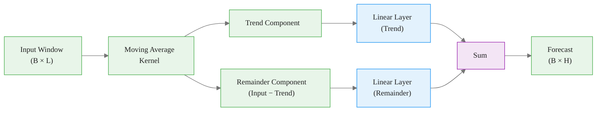

# DLinear: A Simple Linear Baseline That Beats Transformers

> **Reading time:** ~11 min | **Module:** 5 — DLinear | **Prerequisites:** Module 1

## In Brief

DLinear (Zeng et al., 2023) demonstrates that a simple linear model can match or outperform many Transformer-based architectures on long-horizon forecasting benchmarks. The key idea: decompose the input into trend and remainder components using a moving average, then apply separate linear layers to each. No attention, no embeddings, no gating — just two linear maps.

Start here: the code below trains DLinear on the AirPassengers dataset in under a minute.

The following implementation builds on the approach above:

The architecture has two components:

1. **Decomposition** — a moving average kernel separates trend from remainder
2. **Two linear layers** — one maps trend to forecast, the other maps remainder to forecast; outputs are summed

1. Moving Average Decomposition

&#8594;

2. Two Linear Projections

&#8594;

3. Sum

The simplicity is the point. DLinear serves as the baseline that any more complex model must beat.

---

## 4. Component 1: Series Decomposition

DLinear uses a moving average kernel to separate the input window into trend and remainder:

<strong>Key Concept:</strong> The decomposition block applies a moving average to extract trend, then subtracts it from the input to get the remainder. This is the same idea as classical STL decomposition, but learned end-to-end.

Given an input window $\mathbf{x} \in \mathbb{R}^L$:

$$\mathbf{x}_{trend} = \text{AvgPool}(\text{Padding}(\mathbf{x}))$$

$$\mathbf{x}_{remainder} = \mathbf{x} - \mathbf{x}_{trend}$$

The moving average kernel size controls how much smoothing is applied. A larger kernel captures slower-moving trends; a smaller kernel preserves more detail in the trend component.

In the neuralforecast implementation, the kernel size defaults to 25 (appropriate for many common frequencies).

---

## 5. Component 2: Linear Projection Layers

Each component gets its own linear layer that maps from lookback length L to forecast horizon H:

<strong>Insight:</strong> Each linear layer learns a direct mapping from L input time steps to H output time steps. There are no hidden layers, no nonlinearities, no attention. The model's capacity comes entirely from the trend/remainder decomposition.

$$\hat{\mathbf{y}}_{trend} = \mathbf{W}_{trend} \cdot \mathbf{x}_{trend} + \mathbf{b}_{trend}, \quad \mathbf{W}_{trend} \in \mathbb{R}^{H \times L}$$

$$\hat{\mathbf{y}}_{remainder} = \mathbf{W}_{remainder} \cdot \mathbf{x}_{remainder} + \mathbf{b}_{remainder}, \quad \mathbf{W}_{remainder} \in \mathbb{R}^{H \times L}$$

The final forecast is the sum:

$$\hat{\mathbf{y}} = \hat{\mathbf{y}}_{trend} + \hat{\mathbf{y}}_{remainder}$$

**Why two separate layers?** The trend and remainder have different statistical properties. Trend is smooth and low-frequency; remainder is noisy and high-frequency. Separate linear layers allow the model to learn different temporal patterns for each component without interference.

**Parameter count.** For a single series with L=96 and H=96, DLinear has only $2 \times (96 \times 96 + 96) = 18,624$ parameters — orders of magnitude fewer than Transformer-based models.

---

## 6. Why DLinear Matters

Zeng et al. (2023) published "Are Transformers Effective for Time Series Forecasting?" at AAAI 2023, showing that DLinear and NLinear (an even simpler variant) match or outperform many Transformer architectures on standard benchmarks.

<strong>Key Point:</strong> DLinear's strong performance suggests that many time series benchmarks are dominated by linear temporal patterns, and that the inductive biases of Transformers (attention over positions) may not align well with time series structure.

This has important practical implications:

- **Always run DLinear as a baseline.** If your complex model does not beat DLinear, the dataset likely has predominantly linear dynamics.
- **DLinear trains fast.** Minutes vs. hours for Transformer models — making it ideal for rapid iteration.
- **DLinear is interpretable.** The learned linear weights directly show which input positions influence which output positions.

---

## 7. NLinear: The Even Simpler Variant

NLinear (also from Zeng et al., 2023) is a single linear layer with a normalization trick: subtract the last value of the input window before the linear projection, then add it back after.

$$\hat{\mathbf{y}} = \mathbf{W} \cdot (\mathbf{x} - x_L) + x_L$$

NLinear handles distributional shift similarly to RevIN but with zero learned normalization parameters. On some datasets, NLinear outperforms DLinear. Both are available in neuralforecast as `DLinear` and `NLinear`.

---

## 8. Hyperparameter Reference

| Parameter | Role | Typical Range | Default |
|---|---|---|---|
| `h` | Forecast horizon | 1–720 | required |
| `input_size` | Lookback window | 1–512 | required |
| `learning_rate` | Adam LR | 1e-4–1e-2 | 1e-3 |
| `batch_size` | Training batch size | 16–128 | 32 |
| `max_steps` | Training iterations | 100–2000 | 1000 |
| `scaler_type` | Input normalization | "standard", "robust", None | "standard" |
| `loss` | Training loss function | MAE, MSE, MQLoss | MAE |

**Tuning guidance:**
- DLinear has very few hyperparameters. The main choices are `input_size` and `loss`.
- `input_size = h` (same as horizon) is the standard benchmark setting and a good starting point.
- Longer context windows sometimes help on datasets with strong seasonality.
- DLinear trains quickly enough that grid search over `input_size` values (e.g., h, 2h, 4h) is practical.

---

## 9. Model Comparison

| Feature | DLinear | NHITS | TiDE | TSMixer | PatchTST |
|---|---|---|---|---|---|
| Architecture | Decomposition + Linear | Hierarchical MLP | Encoder-Decoder MLP | MLP-Mixer | Patch Transformer |
| Nonlinearity | None | ReLU stacks | ReLU | GELU | Attention + FFN |
| Decomposition | Moving average | Multi-rate pooling | None | None | None |
| Parameter count (L=96, H=96) | ~19K | ~800K | ~2M | ~1M | ~5M |
| Training speed | Very fast | Fast | Moderate | Moderate | Slow |
| Best use case | Baseline, linear dynamics | Univariate, seasonal | Multivariate + exogenous | Multivariate | Long sequences |

**Choose DLinear when:** you need a fast, strong baseline or suspect your data has predominantly linear temporal patterns.

**Choose NHITS when:** you are forecasting a single series with strong seasonality and want interpretable hierarchical decomposition.

**Choose PatchTST when:** you have very long sequences (L > 512) and GPU memory is not a constraint.

---

## Next Steps

- **Notebook:** `notebooks/01_training_dlinear.ipynb` — train DLinear on ETTm1, evaluate with utilsforecast metrics
- **Guide:** `02_multivariate_forecasting.md` — deep dive into n_series, exogenous features, and hyperparameter tuning
- **Notebook:** `notebooks/02_benchmarking.ipynb` — head-to-head DLinear vs. NHITS comparison with cross-validation

## Practice Questions

**Question 1 — Conceptual:** Based on the concepts in this guide, explain in your own words why the core technique matters and when you would choose it over alternatives.

**Question 2 — Application:** Sketch out how you would apply the main concept from this guide to a real-world dataset or problem you have encountered. What would you need to watch out for?

---

## Cross-References

<a class="link-card" href="./01_dlinear_architecture.md">
  
Companion Slides

  
Interactive slide deck covering the key concepts with visual examples.

</a>

<a class="link-card" href="../notebooks/01_training_dlinear.ipynb">
  
Hands-on Notebook

  
15-minute micro-notebook with guided exercises and real data.

</a>
