```mermaid
%%{init: {"theme": "base", "themeVariables": {"primaryColor": "#e8f5e9", "primaryBorderColor": "#4caf50", "primaryTextColor": "#212121", "secondaryColor": "#e3f2fd", "tertiaryColor": "#fff8e1", "lineColor": "#757575", "fontFamily": "Inter, sans-serif", "fontSize": "14px"}}}%%
flowchart LR
    Input["Input Window\n(B × L × N)"] --> RevIN_fwd["RevIN\n(normalize)"]
    RevIN_fwd --> Embed["Embedding Layer\n+ Global Context Tokens"]
    Embed --> TGM["Time-wise Gating\nModule (TGM)"]
    TGM --> VGM["Variate-wise Gating\nModule (VGM)"]
    VGM --> Head["Prediction Head\n(FC Layer)"]
    Head --> RevIN_inv["RevIN\n(denormalize)"]
    RevIN_inv --> Output["Forecasts\n(B × H × N)"]

    style RevIN_fwd fill:#e8f4f8,stroke:#2196f3
    style Embed fill:#fff3e0,stroke:#ff9800
    style TGM fill:#e8f5e9,stroke:#4caf50
    style VGM fill:#fce4ec,stroke:#e91e63
    style Head fill:#f3e5f5,stroke:#9c27b0
    style RevIN_inv fill:#e8f4f8,stroke:#2196f3
```

# XLinear: State-of-the-Art Multivariate Forecasting Architecture

> **Reading time:** ~11 min | **Module:** 5 — xLinear | **Prerequisites:** Module 1

## In Brief

XLinear achieves transformer-competitive accuracy on long-horizon multivariate forecasting benchmarks while requiring a fraction of the compute. The architecture combines learned embeddings, two gating modules for temporal and cross-variable dependencies, and reversible instance normalization — all without attention mechanisms.

Start here: the code below trains XLinear on the ETTm1 dataset in under five minutes.

<div class="code-window">
<div class="code-header">
<div class="dots"><span class="dot-red"></span><span class="dot-yellow"></span><span class="dot-green"></span></div>
<span class="filename">example.py</span>
</div>

The following implementation builds on the approach above:

```python
from neuralforecast import NeuralForecast
from neuralforecast.models import XLinear
from datasetsforecast.long_horizon import LongHorizon

# Load ETTm1 — 7 variables, 15-minute intervals
Y_df, X_df, S_df = LongHorizon.load(directory="data", group="ETTm1")
freq = "15min"

# Horizon and context window
H = 96          # 24 hours ahead at 15-min resolution
INPUT_SIZE = 96  # same as horizon — standard benchmark setting

models = [
    XLinear(
        h=H,
        input_size=INPUT_SIZE,
        n_series=7,          # number of variables in ETTm1
        hidden_size=512,
        temporal_ff=256,
        channel_ff=21,
        head_dropout=0.5,
        embed_dropout=0.2,
        learning_rate=1e-4,
        batch_size=32,
        max_steps=2000,
    )
]

nf = NeuralForecast(models=models, freq=freq)

val_size = 11520   # standard ETTm1 validation split
test_size = 11520  # standard ETTm1 test split

cv_df = nf.cross_validation(df=Y_df, val_size=val_size, test_size=test_size)
print(cv_df.head())
```

</div>

<div class="callout-key">

<strong>Key Concept:</strong> XLinear achieves transformer-competitive accuracy on long-horizon multivariate forecasting benchmarks while requiring a fraction of the compute. The architecture combines learned embeddings, two gating modules for temporal and cross-variable dependencies, and reversible instance normalization — all without attention mechanisms.

</div>


---

## 1. The Problem: Long-Horizon Multivariate Forecasting

Forecasting a single time series 96 steps into the future is hard. Forecasting 7 correlated series simultaneously — where the temperature of one transformer predicts stress on another — is harder.

<div class="callout-insight">

<strong>Insight:</strong> Forecasting a single time series 96 steps into the future is hard.

</div>


The benchmark dataset in this module is **ETTm1** (Electricity Transformer Temperature): 7 variables recorded every 15 minutes at a Chinese power station. The variables are:

| Variable | Description |
|---|---|
| HUFL | High useful load |
| HULL | High useless load |
| MUFL | Medium useful load |
| MULL | Medium useless load |
| LUFL | Low useful load |
| LULL | Low useless load |
| OT | Oil temperature (target) |

Long-horizon forecasting (h=96, 192, 336, 720) is the community benchmark because it exposes weaknesses that short-horizon models hide: error accumulation, distributional shift over time, and the inability to exploit cross-series patterns consistently.

---

## 2. XLinear vs. Transformers: The Efficiency Case

Transformer-based forecasters (Informer, Autoformer, PatchTST, iTransformer) dominate published benchmarks but carry significant costs:

<div class="callout-key">

<strong>Key Point:</strong> Transformer-based forecasters (Informer, Autoformer, PatchTST, iTransformer) dominate published benchmarks but carry significant costs:

- **Quadratic attention:** O(L²) in sequence length for full at...

</div>


- **Quadratic attention:** O(L²) in sequence length for full attention
- **Parameter count:** hundreds of millions for large variants
- **Training time:** hours on multi-GPU clusters for full benchmarks

XLinear makes a different bet: **linear layers with learned gating outperform attention for structured multivariate time series** when the architecture is designed to capture the right inductive biases.

Benchmark performance on ETTm1 h=96 (MSE, lower is better):

| Model | MSE | MAE | Compute |
|---|---|---|---|
| XLinear | **0.316** | **0.355** | Low |
| TiDE | 0.364 | 0.387 | Low |
| TSMixer | 0.351 | 0.373 | Low |
| TimeMixer | 0.338 | 0.368 | Medium |
| PatchTST | 0.329 | 0.367 | High |
| NHITS | 0.345 | 0.380 | Low |

XLinear matches or beats transformer accuracy at the compute cost of simpler linear models.

---


<div class="compare">
<div class="compare-card">
<div class="header before">2. XLinear</div>
<div class="body">

See detailed comparison in the table above.

</div>
</div>
<div class="compare-card">
<div class="header after">Transformers: The Efficiency Case</div>
<div class="body">

See detailed comparison in the table above.

</div>
</div>
</div>

## 3. Architecture Overview

<div class="code-window">
<div class="code-header">
<div class="dots"><span class="dot-red"></span><span class="dot-yellow"></span><span class="dot-green"></span></div>
<span class="filename">example.py</span>
</div>

<div class="callout-info">

<strong>Info:</strong> example.py


The following implementation builds on the approach above:


The four architectural components each solve a distinct subproblem:

1.

</div>


The following implementation builds on the approach above:



</div>

The four architectural components each solve a distinct subproblem:

1. **Embedding Layer** — scales inputs and creates a rich token representation including global context
2. **Time-wise Gating Module (TGM)** — learns which temporal patterns matter and gates them
3. **Variate-wise Gating Module (VGM)** — learns cross-variable associations between exogenous inputs and targets
4. **Prediction Head** — maps the gated representation to the forecast horizon via a fully connected layer


<div class="flow">
<div class="flow-step mint">1. Embedding Layer</div>
<div class="flow-arrow">&#8594;</div>
<div class="flow-step amber">2. Time-wise Gating Module (TGM)</div>
<div class="flow-arrow">&#8594;</div>
<div class="flow-step blue">3. Variate-wise Gating Module (VG...</div>
<div class="flow-arrow">&#8594;</div>
<div class="flow-step lavender">4. Prediction Head</div>
</div>

RevIN bookends the architecture, handling distributional shift between training and inference.

---

## 4. Component 1: Embedding Layer

The embedding layer transforms the raw input window into a richer representation. It performs three operations:

<div class="callout-warning">

<strong>Warning:</strong> The embedding layer transforms the raw input window into a richer representation.

</div>


**Input scaling.** The raw window `(B, L, N)` — batch size × lookback length × number of series — is projected to hidden dimension `d_model` via a learnable linear map:

$$\mathbf{E} = \mathbf{X} \mathbf{W}_e + \mathbf{b}_e, \quad \mathbf{W}_e \in \mathbb{R}^{N \times d_{model}}$$

**Dropout regularization.** `embed_dropout` is applied immediately after projection to prevent co-adaptation of features.

**Global context tokens.** This is the key innovation borrowed from vision transformers: a small set of learnable vectors (`[CLS]`-style tokens) are concatenated to the sequence. These tokens are not tied to any time step — they aggregate global information across the entire window and act as a summary representation that both TGM and VGM can attend to.

<div class="code-window">
<div class="code-header">
<div class="dots"><span class="dot-red"></span><span class="dot-yellow"></span><span class="dot-green"></span></div>
<span class="filename">example.py</span>
</div>

The following implementation builds on the approach above:

```python
# Conceptual illustration of global context token injection
# In XLinear, these are learned parameters initialized from N(0, 0.02)
global_ctx = nn.Parameter(torch.randn(1, n_ctx_tokens, d_model) * 0.02)
x_with_ctx = torch.cat([x_embedded, global_ctx.expand(B, -1, -1)], dim=1)
```

</div>

The embedding layer effectively creates a unified token space where time steps and global context tokens coexist — the subsequent gating modules operate over this combined representation.

---

## 5. Component 2: Time-wise Gating Module (TGM)

The TGM learns **which temporal positions matter** for each forecast, then uses that signal to gate the input.

<div class="callout-insight">

<strong>Insight:</strong> The TGM learns **which temporal positions matter** for each forecast, then uses that signal to gate the input.

</div>


The module is an MLP applied over the time dimension:

$$\mathbf{G}_{time} = \sigma\left(\mathbf{W}_2 \cdot \text{ReLU}\left(\mathbf{W}_1 \cdot \mathbf{h}_{ctx} + \mathbf{b}_1\right) + \mathbf{b}_2\right)$$

where $\mathbf{h}_{ctx}$ is the global context token representation and $\sigma$ is the sigmoid function.

The gate $\mathbf{G}_{time} \in [0, 1]^{L+n_{ctx}}$ is multiplied element-wise with the embedded sequence:

$$\mathbf{h}_{TGM} = \mathbf{G}_{time} \odot \mathbf{E}_{ctx}$$

**Why gating instead of attention?** Attention computes pairwise similarity between every pair of positions — O(L²) work. The TGM routes global context through an MLP (O(L)) to produce a gate, then applies it in a single broadcast multiply. The global context token ensures the gate has access to the full sequence summary without explicit pairwise comparison.

`temporal_ff` is the hidden size of this MLP — a key hyperparameter controlling how much capacity the model has to learn temporal patterns.

---

## 6. Component 3: Variate-wise Gating Module (VGM)

Where TGM operates over time, VGM operates **over variables**. It learns cross-series associations: which exogenous variables inform the target variable's future.

<div class="callout-key">

<strong>Key Point:</strong> Where TGM operates over time, VGM operates **over variables**.

</div>


The VGM follows the same gating pattern but transposes the operation:

$$\mathbf{G}_{var} = \sigma\left(\text{MLP}_{channel}\left(\mathbf{h}_{TGM}^T\right)\right)$$

$$\mathbf{h}_{VGM} = \mathbf{G}_{var} \odot \mathbf{h}_{TGM}$$

In ETTm1 terms: the VGM learns that HUFL (high useful load) at time t is informative about OT (oil temperature) at time t+96, and gates that information appropriately.

`channel_ff` is the hidden size of the channel MLP. Note that in the reference implementation `channel_ff=21` — matching the number of channels in the full ETTm1 setup (including lags and date features). Setting `channel_ff` too small can bottleneck cross-variable information flow.

**XLinear treats each series as both target and exogenous.** At inference time, every variable in the window feeds into VGM regardless of which series you are forecasting. This is what `n_series=7` controls: it tells the model how many channels to expect and allocates the correct parameter shapes.

---

## 7. Component 4: Prediction Head

The prediction head is a straightforward fully connected layer that maps the gated representation to the forecast horizon:

$$\hat{\mathbf{Y}} = \mathbf{h}_{VGM} \mathbf{W}_{head} + \mathbf{b}_{head}, \quad \mathbf{W}_{head} \in \mathbb{R}^{d_{model} \times (H \times N)}$$

The output is reshaped from `(B, d_model)` to `(B, H, N)` — batch × horizon × series.

`head_dropout` is applied before this layer. With `head_dropout=0.5`, the model must learn robust representations that do not depend on any single feature — particularly important when `max_steps` is large and overfitting is a risk.

The head is the only layer that is truly "aware" of the forecast horizon H. The earlier components learn representations that are horizon-agnostic; the head performs the horizon-specific projection.

---

## 8. RevIN: Reversible Instance Normalization

RevIN solves a fundamental problem in time series forecasting: **distributional shift between training windows and test windows**.

Consider oil temperature in ETTm1: it might average 20°C in winter training data and 35°C in summer test data. A model trained on the 20°C distribution will systematically underforecast summer values.

RevIN applies instance normalization (per-sample, not per-batch) at the input:

$$\tilde{\mathbf{x}}_t = \frac{\mathbf{x}_t - \mu_x}{\sigma_x + \varepsilon}$$

where $\mu_x$ and $\sigma_x$ are computed from the input window $\mathbf{x}_{1:L}$ at inference time.

After forecasting, the normalization is reversed:

$$\hat{\mathbf{y}}_t = \hat{\tilde{\mathbf{y}}}_t \cdot \sigma_x + \mu_x$$

The key insight: the model learns to forecast **relative patterns** (deviations from the window mean), while RevIN handles the level. This makes XLinear robust to:

- Trend shifts (level changes between train and test)
- Seasonal distributional shift (summer vs. winter)
- Non-stationary series with changing variance

RevIN adds learnable affine parameters $\gamma$ and $\beta$ so the model can partially undo normalization if it is harmful for certain series — these are learned during training.

---

## 9. Hyperparameter Reference

| Parameter | Role | Typical Range | ETTm1 Default |
|---|---|---|---|
| `h` | Forecast horizon | 96–720 | 96 |
| `input_size` | Lookback window | 96–512 | 96 |
| `n_series` | Number of variables | matches data | 7 |
| `hidden_size` | Embedding dimension d_model | 256–1024 | 512 |
| `temporal_ff` | TGM MLP hidden size | 64–512 | 256 |
| `channel_ff` | VGM MLP hidden size | n_series–64 | 21 |
| `head_dropout` | Dropout before prediction head | 0.2–0.7 | 0.5 |
| `embed_dropout` | Dropout after embedding | 0.0–0.3 | 0.2 |
| `learning_rate` | Adam LR | 1e-5–1e-3 | 1e-4 |
| `batch_size` | Training batch size | 16–128 | 32 |
| `max_steps` | Training iterations | 500–5000 | 2000 |

**Tuning guidance:**
- `hidden_size` has the largest effect on capacity. Start with 512 for ETTm1-scale datasets.
- `channel_ff` should be at least as large as `n_series` — setting it smaller forces lossy compression of cross-variable information.
- High `head_dropout` (0.5) is appropriate when `max_steps > 1000`. Reduce to 0.3 for shorter training runs.
- `input_size = h` (same as horizon) is the standard benchmark setting and a good starting point. Longer context windows sometimes help on datasets with strong seasonality.

---

## 10. Model Comparison

| Feature | XLinear | NHITS | TiDE | TSMixer | PatchTST |
|---|---|---|---|---|---|
| Architecture | Gated MLP | Hierarchical MLP | Encoder-Decoder MLP | MLP-Mixer | Patch Transformer |
| Multivariate native | Yes | No (per-series) | Yes | Yes | Variant |
| Cross-variable learning | VGM gating | None | Projection | Channel mixing | iTransformer variant |
| Complexity | O(L·N) | O(L) | O(L·N) | O(L·N) | O(L²/P²) |
| RevIN | Yes | Yes | Yes | Yes | Yes |
| Global context | Yes | No | No | No | No |
| ETTm1 h=96 MSE | **0.316** | 0.345 | 0.364 | 0.351 | 0.329 |
| Best use case | Multivariate, structured | Univariate, seasonal | Multivariate + exogenous | Multivariate | Long sequences |

**Choose XLinear when:** you have multiple correlated variables and want the best accuracy-to-compute tradeoff.

**Choose NHITS when:** you are forecasting a single series with strong seasonality and want interpretable hierarchical decomposition.

**Choose PatchTST when:** you have very long sequences (L > 512) and GPU memory is not a constraint.

---

## Next Steps

- **Notebook:** `notebooks/01_training_xlinear.ipynb` — train XLinear on ETTm1, evaluate with utilsforecast metrics
- **Guide:** `02_multivariate_forecasting.md` — deep dive into n_series, exogenous features, and hyperparameter tuning
- **Notebook:** `notebooks/02_benchmarking.ipynb` — head-to-head XLinear vs. NHITS comparison with cross-validation


## Practice Questions

**Question 1 — Conceptual:** Based on the concepts in this guide, explain in your own words why the core technique matters and when you would choose it over alternatives.

**Question 2 — Application:** Sketch out how you would apply the main concept from this guide to a real-world dataset or problem you have encountered. What would you need to watch out for?


---

## Cross-References

<a class="link-card" href="./01_xlinear_architecture.md">
  <div class="link-card-title">Companion Slides</div>
  <div class="link-card-description">Interactive slide deck covering the key concepts with visual examples.</div>
</a>

<a class="link-card" href="../notebooks/01_training_xlinear.ipynb">
  <div class="link-card-title">Hands-on Notebook</div>
  <div class="link-card-description">15-minute micro-notebook with guided exercises and real data.</div>
</a>
