<!-- _class: lead -->

# DLinear: State-of-the-Art Architecture

## Module 5: Multivariate Long-Horizon Forecasting
### Modern Time Series Forecasting with NeuralForecast

<!-- Speaker notes: This deck introduces DLinear, a linear architecture that achieves transformer-competitive accuracy on multivariate long-horizon benchmarks while requiring far less compute. The key message: attention is not required for state-of-the-art forecasting accuracy. -->

---

## The Problem: Long-Horizon Multivariate Forecasting

**ETTm1: 7 correlated variables, 15-min intervals, forecast 96 steps ahead**

| Variable | Description |
|---|---|
| HUFL / HULL | High useful / useless load |
| MUFL / MULL | Medium useful / useless load |
| LUFL / LULL | Low useful / useless load |
| OT | Oil temperature |

> Forecasting correlated variables jointly should be better than forecasting each in isolation — but only if the model can learn cross-variable patterns efficiently.


<div class="callout-insight">
<strong>Insight:</strong> This is a key takeaway from this section that connects to the broader course themes.
</div>

<!-- Speaker notes: ETTm1 is the standard long-horizon benchmark. 7 variables = 7 correlated electrical load measurements and oil temperature. The key insight is that these variables have meaningful cross-correlations: high load drives temperature up. The question DLinear answers is how to exploit those correlations without the cost of attention. -->

---

## DLinear vs. Transformers: The Efficiency Case

**ETTm1 h=96 benchmark (MSE, lower is better):**

| Model | MSE | Architecture |
|---|---|---|
| **DLinear** | **0.316** | Gated MLP |
| PatchTST | 0.329 | Patch Transformer |
| TimeMixer | 0.338 | MLP-Mixer |
| NHITS | 0.345 | Hierarchical MLP |
| TSMixer | 0.351 | MLP-Mixer |
| TiDE | 0.364 | Encoder-Decoder MLP |

DLinear wins on accuracy **and** on compute — no quadratic attention required.


<div class="callout-key">
<strong>Key Point:</strong> Remember this concept — it appears repeatedly in later modules.
</div>

<!-- Speaker notes: This table will likely surprise students who assume transformers always win. DLinear outperforms PatchTST (a strong patch-based transformer) on ETTm1 h=96 while using linear complexity in sequence length. The takeaway: the inductive biases in DLinear's gating design are better suited to multivariate structured time series than general-purpose attention. -->

---

## Full Architecture: Data Flow

```mermaid
%%{init: {"theme": "base", "themeVariables": {"primaryColor": "#e8f5e9", "primaryBorderColor": "#4caf50", "primaryTextColor": "#212121", "secondaryColor": "#e3f2fd", "tertiaryColor": "#fff8e1", "lineColor": "#757575", "fontFamily": "Inter, sans-serif", "fontSize": "14px"}}}%%
flowchart LR
    Input["Input\n(B × L × N)"] --> RevIN_fwd["RevIN\nnormalize"]
    RevIN_fwd --> Embed["Embedding\n+ Context Tokens"]
    Embed --> TGM["Time-wise\nGating (TGM)"]
    TGM --> VGM["Variate-wise\nGating (VGM)"]
    VGM --> Head["Prediction\nHead (FC)"]
    Head --> RevIN_inv["RevIN\ndenormalize"]
    RevIN_inv --> Output["Forecasts\n(B × H × N)"]
```



**Four learnable components** sandwiched by RevIN normalization.

Each component solves a distinct subproblem — no component does double duty.


<div class="callout-warning">
<strong>Warning:</strong> This is a common source of confusion. Pay close attention to the distinction here.
</div>

<!-- Speaker notes: Walk through this diagram left to right. B = batch size, L = lookback window length, N = number of series, H = forecast horizon. RevIN handles distributional shift before and after. The four middle blocks each have a specific job: embed, gate temporally, gate cross-variable, predict. This clean separation of concerns is a design strength. -->

---

## Component 1: Embedding Layer

**Three operations in sequence:**

1. **Linear projection** — input $(B, L, N)$ → $(B, L, d_{model})$

$$\mathbf{E} = \mathbf{X} \mathbf{W}_e + \mathbf{b}_e, \quad \mathbf{W}_e \in \mathbb{R}^{N \times d_{model}}$$

2. **Embed dropout** — regularizes feature co-adaptation (`embed_dropout=0.2`)

3. **Global context tokens** — learnable $[CLS]$-style vectors concatenated to the sequence

```
Embedded sequence:  [x_1, x_2, ..., x_L]    (L time steps)
After context:      [x_1, x_2, ..., x_L, ctx_1, ..., ctx_K]   (L+K tokens)
```

Context tokens carry no time-step information — they aggregate global sequence statistics.


<div class="callout-info">
<strong>Info:</strong> This detail is useful context but not required to memorize.
</div>

<!-- Speaker notes: The global context token is the most novel element in DLinear's embedding. Unlike BERT's single [CLS] token, DLinear uses K learnable vectors initialized with small random values. These tokens are updated during the forward pass through both TGM and VGM, acting as a "summary" that each gating module can consult. This is what allows linear-time gating to approximate attention-style global aggregation. -->

<div class="flow">
<div class="flow-step mint">Linear projection</div>
<div class="flow-arrow">&#8594;</div>
<div class="flow-step amber">Embed dropout</div>
<div class="flow-arrow">&#8594;</div>
<div class="flow-step blue">Global context tokens</div>
</div>

---

## Component 2: Time-wise Gating Module (TGM)

**Question:** Which time steps in the lookback window are most predictive?

**Answer:** An MLP maps the global context to a gate over time:

$$\mathbf{G}_{time} = \sigma\left(\mathbf{W}_2 \cdot \text{ReLU}\left(\mathbf{W}_1 \cdot \mathbf{h}_{ctx}\right)\right) \in [0, 1]^{L+K}$$

$$\mathbf{h}_{TGM} = \mathbf{G}_{time} \odot \mathbf{E}_{ctx}$$

<div class="columns">

**vs. Self-Attention**
- Computes pairwise similarity: $O(L^2)$
- Every token attends to every other token

**TGM Gating**
- MLP over context token: $O(L)$
- Gate derived from global summary

</div>

`temporal_ff` = hidden size of this MLP.

<!-- Speaker notes: The sigmoid gate produces values between 0 and 1 for each time position. A gate of 0 = "ignore this time step", gate of 1 = "pass this time step through fully". The MLP that produces the gate reads from the global context token, which saw the full sequence in the embedding step. This achieves global context at O(L) cost. temporal_ff controls how much capacity the MLP has — 256 is standard for ETTm1-scale datasets. -->

---

## Component 3: Variate-wise Gating Module (VGM)

**Question:** Which variables in the window are most predictive of each target?

**Answer:** Same gating pattern, transposed to the channel dimension:

$$\mathbf{G}_{var} = \sigma\left(\text{MLP}_{channel}\left(\mathbf{h}_{TGM}^T\right)\right) \in [0, 1]^{N}$$

$$\mathbf{h}_{VGM} = \mathbf{G}_{var} \odot \mathbf{h}_{TGM}$$

**ETTm1 example:** VGM learns that HUFL (high useful load) strongly predicts OT (oil temperature) — heat dissipation from electrical load drives transformer temperature.

`channel_ff` = hidden size of channel MLP. Set $\geq$ `n_series` to avoid lossy compression.

> DLinear treats every series as both target and exogenous input simultaneously.

<!-- Speaker notes: VGM is the cross-variable learning component. In ETTm1, the physical relationship between load and temperature is real: high electrical load generates heat that raises oil temperature. VGM learns this association from data. Note that channel_ff=21 in the reference implementation — not 7. This is because with lags and date features, the effective channel count is larger. Always set channel_ff >= n_series. -->

---

## Component 4: Prediction Head

The simplest component — a fully connected projection to the forecast horizon:

$$\hat{\mathbf{Y}} = \mathbf{h}_{VGM} \mathbf{W}_{head} + \mathbf{b}_{head}, \quad \mathbf{W}_{head} \in \mathbb{R}^{d_{model} \times (H \times N)}$$

Output shape: $(B, H, N)$ — batch × horizon × series.

**Head dropout** (`head_dropout=0.5`) is applied **before** this layer.

Why 50% dropout? At `max_steps=2000`, the model has enough capacity to overfit. Head dropout forces the gated representations to be individually informative — no single unit can be relied upon.

The head is the only component "aware" of horizon $H$. TGM and VGM learn horizon-agnostic representations.

<!-- Speaker notes: The prediction head is intentionally simple — just a linear layer. All the expressive power is in TGM and VGM. This is a design philosophy: the gating modules learn what information matters; the head just reads it out. High dropout (0.5) is aggressive but correct for longer training runs. If students see training instability, they can try reducing to 0.3. -->

---

## RevIN: Reversible Instance Normalization

**The problem:** Distributional shift between training and test windows.

Oil temperature: 20°C average in winter training, 35°C average in summer test. Model trained on winter data systematically underforecasts summer.

**RevIN solution:**

**Normalize** at the input (per sample, not per batch):
$$\tilde{\mathbf{x}}_t = \frac{\mathbf{x}_t - \mu_x}{\sigma_x + \varepsilon}, \quad \mu_x, \sigma_x = \text{mean/std of lookback window}$$

**Denormalize** at the output:
$$\hat{\mathbf{y}}_t = \hat{\tilde{\mathbf{y}}}_t \cdot \sigma_x + \mu_x$$

The model learns to forecast **relative patterns**. RevIN handles the level.

<!-- Speaker notes: Instance normalization is computed from each individual sample's lookback window, not from the training set statistics. This is the key distinction from batch normalization or layer normalization. At test time, the summer window has mean 35°C — RevIN normalizes it to zero mean before the model sees it, and adds 35°C back to the forecast. The learnable affine parameters gamma and beta allow the model to partially undo normalization if it is harmful for specific series. -->

---

## RevIN: Learnable Affine Parameters

RevIN adds learnable parameters $\gamma$ and $\beta$:

$$\tilde{\mathbf{x}}_t = \gamma \odot \frac{\mathbf{x}_t - \mu_x}{\sigma_x + \varepsilon} + \beta$$

These allow the model to **partially undo normalization** when it is counterproductive.

**Why this matters:** Some time series have informative levels (e.g., absolute temperature matters for thermal runaway risk). $\gamma$ and $\beta$ let the model learn to preserve level information when it is predictively useful.

```
Without learnable params: full normalization forced
With gamma, beta:          model decides how much to normalize
```

RevIN is applied identically at training and inference — no distributional mismatch.

<!-- Speaker notes: This slide answers a natural question: "Won't normalizing away the level hurt forecasting accuracy?" The answer is: sometimes yes, which is why the learnable affine parameters exist. If the level is informative, the model learns gamma != 1 or beta != 0 to preserve it. If the level is just noise for forecasting, gamma stays near 1 and beta near 0. This flexibility is why RevIN consistently improves accuracy across diverse datasets. -->

---

## Training DLinear: Full Code

<div class="code-window">
<div class="code-header">
<div class="dots"><span class="dot-red"></span><span class="dot-yellow"></span><span class="dot-green"></span></div>
<span class="filename">example.py</span>
</div>

```python
from neuralforecast import NeuralForecast
from neuralforecast.models import DLinear
from datasetsforecast.long_horizon import LongHorizon

Y_df, _, _ = LongHorizon.load(directory="data", group="ETTm1")

models = [DLinear(
    h=96, input_size=96, n_series=7,
    hidden_size=512, temporal_ff=256, channel_ff=21,
    head_dropout=0.5, embed_dropout=0.2,
    learning_rate=1e-4, batch_size=32, max_steps=2000,
)]

nf = NeuralForecast(models=models, freq="15min")
cv_df = nf.cross_validation(
    df=Y_df, val_size=11520, test_size=11520
)
```
</div>

Five hyperparameters matter most: `hidden_size`, `temporal_ff`, `channel_ff`, `head_dropout`, `max_steps`.

<!-- Speaker notes: Walk through each parameter with the class. h=96 is 24 hours at 15-min intervals. input_size=96 matches the horizon — the standard benchmark setting. n_series=7 must match the dataset. hidden_size=512 is the embedding dimension. temporal_ff=256 and channel_ff=21 are the MLP sizes for TGM and VGM. The cross_validation call handles train/val/test splits automatically using the val_size and test_size parameters. -->

---

## Hyperparameter Guide

| Parameter | Role | Typical Range | Default |
|---|---|---|---|
| `hidden_size` | Embedding dimension | 256–1024 | 512 |
| `temporal_ff` | TGM MLP capacity | 64–512 | 256 |
| `channel_ff` | VGM MLP capacity | ≥ n_series | 21 |
| `head_dropout` | Regularization | 0.2–0.7 | 0.5 |
| `embed_dropout` | Embedding regularization | 0.0–0.3 | 0.2 |
| `learning_rate` | Adam LR | 1e-5–1e-3 | 1e-4 |
| `max_steps` | Training iterations | 500–5000 | 2000 |

**Tuning priority:** `hidden_size` → `head_dropout` → `temporal_ff` → `learning_rate`

<!-- Speaker notes: Give students this priority order for tuning. hidden_size has the largest effect on model capacity. head_dropout is the primary regularization knob — increase it if you see overfitting (val loss diverging from train loss). temporal_ff and channel_ff are secondary — the defaults work well for ETTm1-scale data. learning_rate should only be touched if training is unstable. -->

---

## Architecture Comparison

| Feature | DLinear | NHITS | PatchTST |
|---|---|---|---|
| Complexity | $O(L \cdot N)$ | $O(L)$ | $O(L^2/P^2)$ |
| Multivariate | Native (VGM) | Per-series | Variant |
| Cross-variable | Yes | No | No |
| Global context | Yes (tokens) | No | Patch tokens |
| RevIN | Yes | Yes | Yes |
| ETTm1 h=96 MSE | **0.316** | 0.345 | 0.329 |

**Decision rule:**
- Multiple correlated variables → **DLinear**
- Single series with strong seasonality → **NHITS**
- Very long sequences, GPU-rich → **PatchTST**

<!-- Speaker notes: Students often ask when to use which model. Give them this decision rule and explain it with an example: a retail demand forecasting problem with 500 SKUs and no exogenous data is a NHITS problem. A power grid forecasting problem with 20 correlated sensors is an DLinear problem. A financial time series with 10 years of daily data is a PatchTST problem if you have the GPU budget. -->

---

## What Makes DLinear State-of-the-Art

**Four design choices, each justified:**

1. **Global context tokens** — global information without quadratic attention
2. **TGM** — temporal gating at O(L) cost via MLP over context
3. **VGM** — cross-variable associations learned jointly, not post-hoc
4. **RevIN** — distributional shift handled symmetrically at input and output

> The sum of these choices produces a model that is simultaneously simpler, faster, and more accurate than most transformer-based alternatives.

**The lesson:** Inductive biases that match the data structure outperform general-purpose architectures.

<!-- Speaker notes: Close this deck with the key insight: DLinear wins not by being more complex, but by making better architectural choices for structured multivariate time series. Each design choice targets a specific failure mode of simpler models. Global context tokens solve the O(L^2) problem. TGM and VGM solve the "all cross-correlations equally" problem. RevIN solves the distributional shift problem. When the architecture matches the data structure, you beat general-purpose models that don't. -->

---

## What's Next

**Notebook:** `01_training_dlinear.ipynb`
- Load ETTm1 with datasetsforecast
- Train DLinear and evaluate with utilsforecast
- Plot multi-variable forecasts

**Guide:** `02_multivariate_forecasting.md`
- n_series in depth
- Exogenous feature integration
- Hyperparameter tuning workflow

**Notebook:** `02_benchmarking.ipynb`
- DLinear vs. NHITS head-to-head
- Cross-validation comparison
- When to switch models

<!-- Speaker notes: Direct students to the notebook as the immediate next step. The notebook is designed to complete in under 15 minutes and produces real benchmark numbers they can compare to the table shown in this deck. The guide on multivariate forecasting goes deeper on n_series and exogenous features, which is where DLinear really differentiates itself from univariate alternatives. -->
