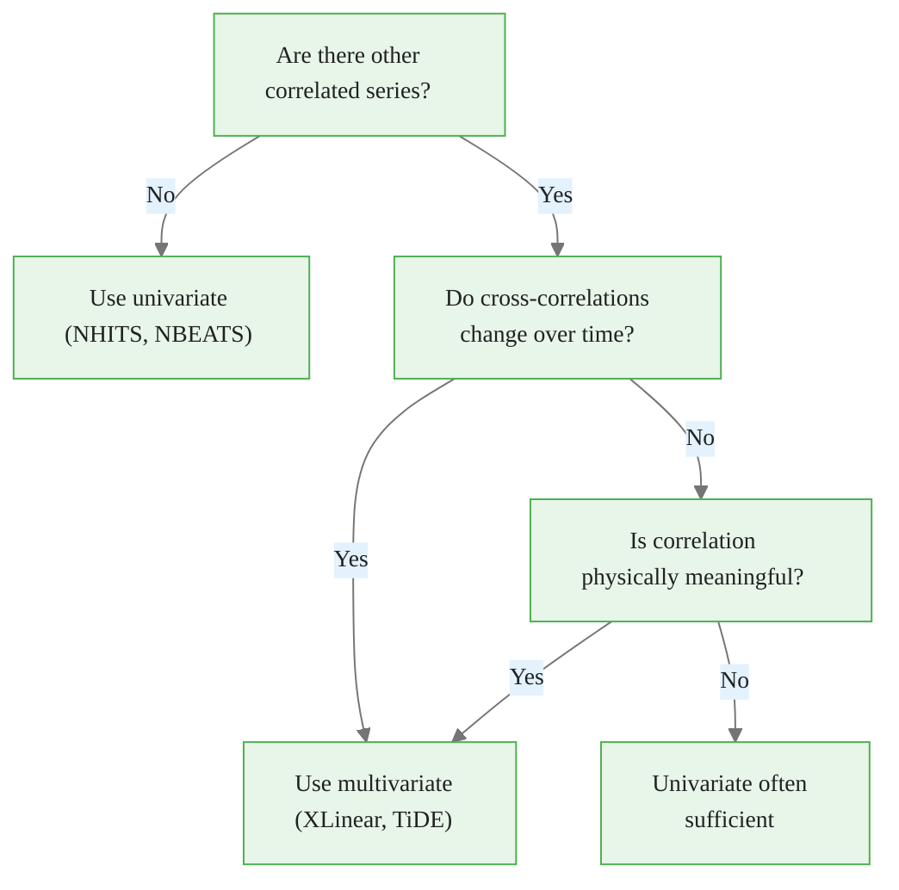

# Multivariate Forecasting with XLinear

> **Reading time:** ~17 min | **Module:** 5 — xLinear | **Prerequisites:** Module 1

## In Brief

Multivariate forecasting feeds all correlated series simultaneously into a single model, letting the model learn cross-variable patterns. XLinear is purpose-built for this: its Variate-wise Gating Module (VGM) learns which series inform which targets, and the `n_series` parameter controls the entire cross-variable pathway. This guide shows when multivariate beats univariate, how to configure XLinear for different feature types, and how to tune the key hyperparameters.

Start here: the code below trains univariate NHITS and multivariate XLinear on ETTm1 and compares their accuracy.


<span class="filename">example.py</span>
</div>
The following implementation builds on the approach above:



**Cases where multivariate wins:**
- Energy systems: electrical load drives transformer temperature
- Supply chains: upstream demand leads downstream demand
- Financial markets: sector indices correlate with individual stocks
- Weather: wind speed correlates with pressure gradient

**Cases where univariate is comparable or better:**
- Many independent SKUs in retail demand (spurious cross-correlation)
- Series with very different scales and frequencies
- Small datasets where cross-variable parameters overfit

**Rule of thumb:** If you can state a physical or causal reason why series A should predict series B, multivariate modeling is worth trying. If the correlation is purely statistical with no domain rationale, be skeptical.

---


<div class="compare">
<div class="compare-card">
<div class="header before">1. Univariate</div>
<div class="body">

See detailed comparison in the table above.

</div>
</div>
<div class="compare-card">
<div class="header after">Multivariate: When Cross-Series Information Helps</div>
<div class="body">

See detailed comparison in the table above.

</div>
</div>
</div>

## 2. The n_series Parameter: XLinear's Cross-Variable Pathway

`n_series` is the most important parameter for multivariate XLinear. It controls three things simultaneously:

<div class="callout-key">

<strong>Key Point:</strong> `n_series` is the most important parameter for multivariate XLinear.

</div>


1. **VGM input dimension** — the channel MLP in VGM operates on `n_series` channels
2. **Weight matrix shapes** — the embedding layer allocates `N × d_model` parameters
3. **Batch construction** — NeuralForecast constructs batches with all `n_series` variables aligned on the time axis


<div class="flow">
<div class="flow-step mint">1. VGM input dimension</div>
<div class="flow-arrow">&#8594;</div>
<div class="flow-step amber">2. Weight matrix shapes</div>
<div class="flow-arrow">&#8594;</div>
<div class="flow-step blue">3. Batch construction</div>
</div>

The following implementation builds on the approach above:


<span class="filename">example.py</span>
</div>

<div class="code-window">
<div class="code-header">
<div class="dots"><span class="dot-red"></span><span class="dot-yellow"></span><span class="dot-green"></span></div>

```python
# n_series must match the number of unique_ids in your DataFrame
n_unique = Y_df["unique_id"].nunique()
print(f"Dataset has {n_unique} series — set n_series={n_unique}")

model = XLinear(
    h=96,
    input_size=96,
    n_series=n_unique,   # must match data
    hidden_size=512,
    ...
)
```

</div>
</div>

**Mismatch consequences:**
- `n_series < actual`: XLinear sees only a subset of variables; cross-variable learning is incomplete
- `n_series > actual`: runtime error — shape mismatch in VGM weight matrices

When in doubt, count unique series in your DataFrame before setting `n_series`.

---

## 3. How VGM Uses n_series

The Variate-wise Gating Module learns a gate over the variable dimension. With `n_series=7` (ETTm1):

<div class="callout-info">

<strong>Info:</strong> The Variate-wise Gating Module learns a gate over the variable dimension.

</div>


```
VGM input:   (B, d_model, N)     — transposed from (B, N, d_model)
MLP hidden:  (B, channel_ff, N)  — channel_ff intermediate representation
Gate output: (B, 1, N)           — N gates, one per series
Gated output: h_TGM × gate       — element-wise multiplication
```

The gate values at inference time tell you which series are most informative:


<span class="filename">example.py</span>
</div>

<div class="code-window">
<div class="code-header">
<div class="dots"><span class="dot-red"></span><span class="dot-yellow"></span><span class="dot-green"></span></div>

```python
# (Illustrative — requires model internals access)
# A gate near 1.0 means "this series is highly informative"
# A gate near 0.0 means "this series is suppressed"
# For ETTm1, VGM typically assigns high gates to HUFL and MUFL
# for predicting OT (oil temperature), consistent with physics
```

</div>
</div>

The `channel_ff` parameter controls the MLP hidden size. Setting `channel_ff < n_series` creates a bottleneck — cross-variable information is compressed before gating. This can act as regularization but risks discarding informative cross-series patterns. The reference setting `channel_ff=21` is larger than `n_series=7` in the base ETTm1 setup, reflecting that the feature space includes lags and date encodings.

---

## 4. Exogenous Features in XLinear

XLinear supports three types of exogenous features, matching the NeuralForecast API:

<div class="callout-warning">

<strong>Warning:</strong> XLinear supports three types of exogenous features, matching the NeuralForecast API:

### Historical Exogenous (`hist_exog_list`)
Known only up to the forecast origin — cannot be projected into the fu...

</div>


### Historical Exogenous (`hist_exog_list`)
Known only up to the forecast origin — cannot be projected into the future.

```python
# Example: yesterday's spot price (known, but not known for tomorrow)
model = XLinear(
    h=96, input_size=96, n_series=7,
    hist_exog_list=["spot_price", "grid_load"],   # available in lookback, not forecast
    hidden_size=512, ...
)
```

### Future-Known Exogenous (`futr_exog_list`)
Known for both the lookback window and the forecast horizon — calendar features, scheduled events.

```python
# Example: hour of day, day of week, holiday flag
model = XLinear(
    h=96, input_size=96, n_series=7,
    futr_exog_list=["hour_sin", "hour_cos", "is_holiday"],
    hidden_size=512, ...
)
```

### Static Covariates (`stat_exog_list`)
Time-invariant features — series metadata like station ID, product category, geographic location.

```python
# Example: transformer capacity rating (constant per series)
model = XLinear(
    h=96, input_size=96, n_series=7,
    stat_exog_list=["transformer_capacity"],
    hidden_size=512, ...
)
```

**How XLinear incorporates exogenous features:** All exogenous features are projected through the embedding layer alongside the endogenous variables. The VGM then gates all channels — both endogenous and exogenous — jointly. This means exogenous features that are not informative for forecasting will receive low VGM gate values and contribute minimally to predictions.

```python
# Full example with calendar features on ETTm1
import pandas as pd

Y_df["ds"] = pd.to_datetime(Y_df["ds"])
Y_df["hour_sin"] = (2 * 3.14159 * Y_df["ds"].dt.hour / 24).apply(pd.np.sin)
Y_df["hour_cos"] = (2 * 3.14159 * Y_df["ds"].dt.hour / 24).apply(pd.np.cos)

model = XLinear(
    h=96, input_size=96, n_series=7,
    futr_exog_list=["hour_sin", "hour_cos"],
    hidden_size=512, temporal_ff=256, channel_ff=21,
    head_dropout=0.5, embed_dropout=0.2,
    learning_rate=1e-4, batch_size=32, max_steps=2000,
)
```

---

## 5. Hyperparameter Tuning Workflow

XLinear has five hyperparameters that materially affect accuracy. Tune them in this order:

<div class="callout-insight">

<strong>Insight:</strong> XLinear has five hyperparameters that materially affect accuracy.

</div>


### Step 1: Fix Architecture to Baseline

Start with the reference ETTm1 configuration and verify it trains without errors:

```python
baseline = XLinear(
    h=96, input_size=96, n_series=7,
    hidden_size=512, temporal_ff=256, channel_ff=21,
    head_dropout=0.5, embed_dropout=0.2,
    learning_rate=1e-4, batch_size=32, max_steps=500,  # fast first run
)
```

### Step 2: hidden_size — Embedding Capacity

`hidden_size` is the single most impactful parameter. It controls the embedding dimension $d_{model}$, which flows through all four components.

```python
# Compare three settings
for hs in [256, 512, 1024]:
    model = XLinear(h=96, input_size=96, n_series=7,
                    hidden_size=hs, temporal_ff=256, channel_ff=21,
                    head_dropout=0.5, embed_dropout=0.2,
                    learning_rate=1e-4, batch_size=32, max_steps=1000)
    # Train and record validation MAE
```

Guideline: 512 is optimal for 7-series datasets. Use 256 for 2–3 series (less cross-variable information). Use 1024 only if you have > 20 series and large training data.

### Step 3: head_dropout — Primary Regularization

If validation loss diverges from training loss after step 2, increase `head_dropout`:

```python
# Typical search
for hd in [0.2, 0.3, 0.5, 0.7]:
    model = XLinear(..., head_dropout=hd, max_steps=2000)
```

Guideline: 0.5 is appropriate for `max_steps >= 1500`. Reduce to 0.3 for shorter training.

### Step 4: input_size — Context Window

Longer context windows capture longer-range dependencies but increase memory:

```python
for inp in [96, 192, 336]:
    model = XLinear(h=96, input_size=inp, n_series=7, ...)
```

Guideline: `input_size = h` (same as horizon) is the benchmark standard. Increase for datasets with strong weekly or monthly seasonality.

### Step 5: temporal_ff and channel_ff

Only tune these after steps 2–4 are fixed. They have smaller effect than `hidden_size`:

```python
# Proportional scaling: temporal_ff ≈ hidden_size // 2
# channel_ff ≥ n_series (never set lower)
model = XLinear(h=96, input_size=96, n_series=7,
                hidden_size=512, temporal_ff=256, channel_ff=21, ...)
```

---

## 6. Dataset Preparation for XLinear

NeuralForecast requires the long (nixtla) format:

```
unique_id | ds          | y
-------------------------------
HUFL      | 2016-07-01  | 5.827
HULL      | 2016-07-01  | 3.193
...
OT        | 2016-07-01  | 30.531
HUFL      | 2016-07-01 00:15  | 5.761
...
```

XLinear's multivariate mode requires that all `n_series` series have **identical timestamps** — every unique_id must appear at every time step. Missing timestamps break batch construction.

```python
# Verify alignment before training
from datasetsforecast.long_horizon import LongHorizon

Y_df, _, _ = LongHorizon.load(directory="data", group="ETTm1")

# Check: all series have same timestamps
timestamps_per_series = Y_df.groupby("unique_id")["ds"].count()
print(timestamps_per_series)
# Should show identical counts for all 7 series

# Check: no missing timestamps
assert Y_df.groupby("unique_id")["ds"].count().nunique() == 1, \
    "Series have different numbers of timestamps — XLinear will fail"

print(f"Dataset: {Y_df['unique_id'].nunique()} series × {timestamps_per_series.iloc[0]} timesteps")
```

---

## 7. Reading and Interpreting Results

The `.cross_validation()` output contains columns for each model's forecasts:

```python
# cv_df columns: unique_id, ds, cutoff, y, XLinear, NHITS (if both trained)
print(cv_df.columns.tolist())
# ['unique_id', 'ds', 'cutoff', 'y', 'XLinear']

# Compute metrics per series using utilsforecast
from utilsforecast.losses import mae, mse
from utilsforecast.evaluation import evaluate

# Filter to test set (last cutoff)
test_df = cv_df[cv_df["cutoff"] == cv_df["cutoff"].max()]

eval_df = evaluate(test_df, metrics=[mae, mse], models=["XLinear"])
print(eval_df)
# Rows: metric × unique_id, Col: XLinear value

# Per-series breakdown
print(eval_df.groupby("unique_id")["XLinear"].mean())
```

**What to look for:**
- OT (oil temperature) typically has lower relative error than load variables — oil temperature is smoother
- HUFL and HULL (high load) typically have higher error — loads have sharper spikes
- If a series has much higher error than others, check if its scale is larger (RevIN should handle this, but verify)

---

## 8. When XLinear Underperforms — Troubleshooting

| Symptom | Likely Cause | Fix |
|---|---|---|
| Training loss oscillates | Learning rate too high | Reduce to 5e-5 |
| Val loss diverges from train | Overfitting | Increase `head_dropout` to 0.7 |
| All series forecast flat line | `n_series` mismatch | Recount unique_ids |
| Worse than NHITS | No cross-series signal | Try univariate model |
| OOM on GPU | `batch_size` too large | Halve `batch_size`, double `max_steps` |
| Slow training | `hidden_size` too large | Reduce to 256 |

---

## Next Steps

- **Notebook:** `notebooks/02_benchmarking.ipynb` — full XLinear vs. NHITS comparison with cross-validation, MAE/MSE reporting, and forecast plots
- **Exercises:** `exercises/01_xlinear_exercises.py` — self-check problems on prediction shapes, benchmark comparison, and hidden_size ablation


## Practice Questions

**Question 1 — Conceptual:** Based on the concepts in this guide, explain in your own words why the core technique matters and when you would choose it over alternatives.

**Question 2 — Application:** Sketch out how you would apply the main concept from this guide to a real-world dataset or problem you have encountered. What would you need to watch out for?


---

## Cross-References

<a class="link-card" href="./02_multivariate_forecasting.md">
  <div class="link-card-title">Companion Slides</div>
  <div class="link-card-description">Interactive slide deck covering the key concepts with visual examples.</div>
</a>

<a class="link-card" href="../notebooks/01_training_xlinear.ipynb">
  <div class="link-card-title">Hands-on Notebook</div>
  <div class="link-card-description">15-minute micro-notebook with guided exercises and real data.</div>
</a>
