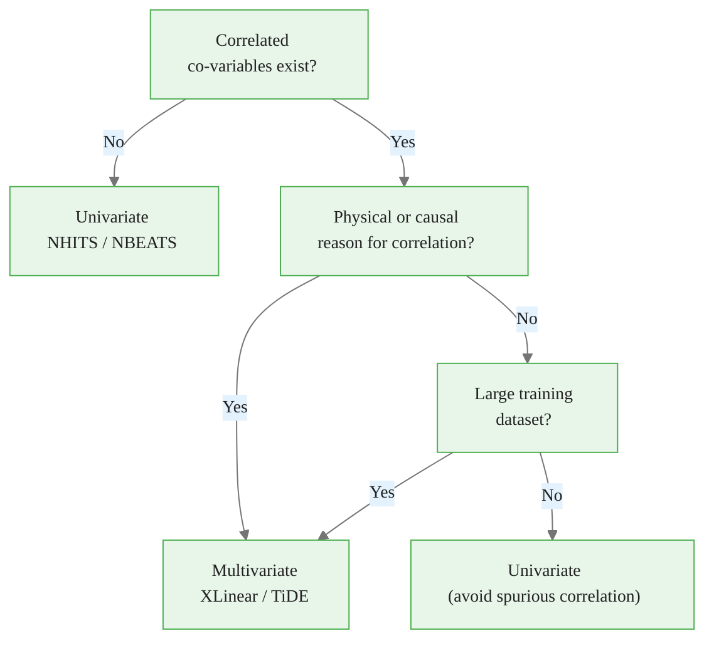

<!-- _class: lead -->

# Multivariate Forecasting with XLinear

## Module 5: n_series, Exogenous Features, and Hyperparameter Tuning
### Modern Time Series Forecasting with NeuralForecast

<!-- Speaker notes: This deck goes deeper on the multivariate aspects of XLinear. The previous deck covered architecture. This deck covers the practical questions: when does multivariate beat univariate, how does n_series work, how do you add exogenous features, and how do you tune the key hyperparameters? -->

---

## Univariate vs. Multivariate: The Core Question

> Do other series carry information about the target that is not already in the target's own history?



**ETTm1:** Electrical load drives transformer temperature → physical reason exists → XLinear.


<div class="callout-insight">
<strong>Insight:</strong> This is a key takeaway from this section that connects to the broader course themes.
</div>

<!-- Speaker notes: Emphasize the "physical reason" criterion. Many datasets have statistically correlated series that are not causally related — they are both driven by a common factor (e.g., time of day). In those cases, a well-specified univariate model with calendar features often matches a multivariate model. The physical/causal test is a useful heuristic: if you can draw an arrow from variable A to variable B in a causal diagram, multivariate modeling is likely to help. -->

---

## The ETTm1 Case: Physical Cross-Correlations

**Electricity transformer physics:**

```
High electrical load (HUFL)
    → Resistive heating in transformer coils
        → Oil temperature rises (OT)
            → Transformer efficiency decreases
                → Load patterns shift (feedback loop)
```

HUFL predicts OT because of **physical causality**, not coincidence.

XLinear's VGM learns to assign high gate values to load variables when forecasting OT.

> Multivariate wins when correlation has a mechanism, not just a statistic.


<div class="callout-key">
<strong>Key Point:</strong> Remember this concept — it appears repeatedly in later modules.
</div>

<!-- Speaker notes: This physical story makes the ETTm1 benchmark meaningful beyond just numbers. Students should be able to describe why HUFL -> OT is a real predictive relationship. When they see XLinear outperform NHITS on this dataset, they can attribute it specifically to the VGM learning these cross-series relationships. This is much more satisfying than "the model found a pattern in the data." -->

---

## Univariate NHITS vs. Multivariate XLinear: Code

<div class="code-window">
<div class="code-header">
<div class="dots"><span class="dot-red"></span><span class="dot-yellow"></span><span class="dot-green"></span></div>
<span class="filename">example.py</span>
</div>

```python
from neuralforecast.models import NHITS, XLinear

# Univariate: NHITS trains 7 independent models
nhits = NHITS(h=96, input_size=192, max_steps=1000)

# Multivariate: XLinear trains one joint model
xlinear = XLinear(
    h=96, input_size=96, n_series=7,
    hidden_size=512, temporal_ff=256, channel_ff=21,
    head_dropout=0.5, embed_dropout=0.2,
    learning_rate=1e-4, batch_size=32, max_steps=2000,
)

# Both use identical NeuralForecast API
nf = NeuralForecast(models=[nhits, xlinear], freq="15min")
cv_df = nf.cross_validation(
    df=Y_df, val_size=11520, test_size=11520
)
```
</div>

Same API. Fundamentally different architectures. The benchmark tells the story.


<div class="callout-warning">
<strong>Warning:</strong> This is a common source of confusion. Pay close attention to the distinction here.
</div>

<!-- Speaker notes: One of NeuralForecast's great strengths is that you can benchmark radically different architectures with identical code — just change the models list. NHITS internally loops over each unique_id and trains a separate model. XLinear receives all 7 series simultaneously and shares parameters across them. The API hides this complexity, which is why n_series is the key parameter to get right when using XLinear. -->

---

## The n_series Parameter: What It Controls

`n_series` must match the number of unique series in your DataFrame.

**Three places n_series affects the architecture:**

| Component | Effect of n_series |
|---|---|
| Embedding | Weight matrix shape: $N \times d_{model}$ |
| VGM | Channel MLP input dimension: $N$ |
| Prediction Head | Output reshape: $(B, H \times N)$ |

<div class="code-window">
<div class="code-header">
<div class="dots"><span class="dot-red"></span><span class="dot-yellow"></span><span class="dot-green"></span></div>
<span class="filename">example.py</span>
</div>

```python
# Always count before setting
n_unique = Y_df["unique_id"].nunique()
print(f"n_series should be: {n_unique}")

# n_series mismatch causes:
# - Shape errors (n_series > actual)
# - Missing cross-variable information (n_series < actual)
```
</div>

**Never guess. Always count.**


<div class="callout-info">
<strong>Info:</strong> This detail is useful context but not required to memorize.
</div>

<!-- Speaker notes: Shape errors from n_series mismatch are a common source of frustration. The error messages from PyTorch can be cryptic — students might see a matrix multiplication error that is hard to trace back to n_series. Make it a habit: count unique_ids first, set n_series second. For ETTm1 this is always 7 (HUFL, HULL, MUFL, MULL, LUFL, LULL, OT). -->

---

## Exogenous Features: Three Types

<div class="columns">

**Historical** (`hist_exog_list`)
Known in lookback window only.
Cannot project into future.

```python
# Yesterday's spot price
hist_exog_list=["spot_price"]
```

**Future-Known** (`futr_exog_list`)
Known for both lookback
and forecast horizon.

```python
# Calendar features
futr_exog_list=[
    "hour_sin",
    "hour_cos",
    "is_holiday"
]
```

</div>

**Static** (`stat_exog_list`) — time-invariant metadata per series.

```python
stat_exog_list=["transformer_capacity"]  # one value per series
```

All exogenous features flow through the **Embedding Layer** and are gated by **VGM** — uninformative features receive near-zero gate values automatically.

<!-- Speaker notes: The three types correspond to different information availability patterns. Future-known features (calendar, scheduled events) are the most common and most valuable — the model can see them for the full forecast horizon. Historical exogenous are useful for lag-style features. Static exogenous are useful for multi-site or multi-product settings where each series has metadata. The key point is that XLinear does not require special handling — all feature types enter through the same embedding layer, and VGM learns their relative importance. -->

---

## Adding Calendar Features to ETTm1

```python
import pandas as pd
import numpy as np

Y_df["ds"] = pd.to_datetime(Y_df["ds"])

# Cyclical encoding preserves periodicity
Y_df["hour_sin"] = np.sin(2 * np.pi * Y_df["ds"].dt.hour / 24)
Y_df["hour_cos"] = np.cos(2 * np.pi * Y_df["ds"].dt.hour / 24)
Y_df["dow_sin"]  = np.sin(2 * np.pi * Y_df["ds"].dt.dayofweek / 7)
Y_df["dow_cos"]  = np.cos(2 * np.pi * Y_df["ds"].dt.dayofweek / 7)

model = XLinear(
    h=96, input_size=96, n_series=7,
    futr_exog_list=["hour_sin", "hour_cos", "dow_sin", "dow_cos"],
    hidden_size=512, temporal_ff=256, channel_ff=21,
    head_dropout=0.5, embed_dropout=0.2,
    learning_rate=1e-4, batch_size=32, max_steps=2000,
)
```

**Cyclical encoding** (`sin`/`cos` pairs) is essential: hour 23 and hour 0 are adjacent in time but distant in raw integer encoding. Sine/cosine wraps the cycle correctly.

<!-- Speaker notes: Cyclical encoding is a commonly missed detail. If you encode hour as an integer 0-23, the model sees a gap of 23 between hour 23 and hour 0 — but they are only 15 minutes apart in the next day. Sine/cosine encoding maps adjacent hours to adjacent values in 2D space, preserving the circular structure of time. Always use sin/cos pairs for cyclical features: hour of day, day of week, month of year. -->

---

## Hyperparameter Tuning: Priority Order

**Tune in this sequence — stop when improvement plateaus:**

```
1. hidden_size    (embedding capacity — biggest effect)
        ↓
2. head_dropout   (regularization — if overfitting observed)
        ↓
3. input_size     (context window — if strong seasonality)
        ↓
4. temporal_ff    (TGM capacity — fine-tuning)
        ↓
5. channel_ff     (VGM capacity — rarely needs changing)
```

**Time budget:** Each step takes 1–2 training runs. Steps 4–5 typically add < 0.5% improvement.

<!-- Speaker notes: This priority ordering is based on empirical results across XLinear benchmarks. hidden_size is the biggest lever — it controls the capacity of every component simultaneously. head_dropout is the primary regularization control — if val loss diverges, this is the first thing to increase. input_size is dataset-specific — longer context helps for datasets with weekly or monthly seasonality. temporal_ff and channel_ff are fine-tuning parameters; the defaults are well-chosen for ETTm1-scale data. -->

---

## Tuning hidden_size: The Capacity Parameter

```python
from utilsforecast.losses import mae, mse
from utilsforecast.evaluation import evaluate

results = {}
for hs in [256, 512, 1024]:
    model = XLinear(
        h=96, input_size=96, n_series=7,
        hidden_size=hs,        # vary this
        temporal_ff=hs // 2,   # scale proportionally
        channel_ff=21,
        head_dropout=0.5, embed_dropout=0.2,
        learning_rate=1e-4, batch_size=32, max_steps=1000,
    )
    nf = NeuralForecast(models=[model], freq="15min")
    cv = nf.cross_validation(df=Y_df, val_size=11520, test_size=11520)
    test_df = cv[cv["cutoff"] == cv["cutoff"].max()]
    eval_df = evaluate(test_df, metrics=[mae, mse], models=["XLinear"])
    results[hs] = eval_df["XLinear"].mean()

for hs, val in results.items():
    print(f"hidden_size={hs:4d}: MAE={val:.4f}")
```

Rule: `temporal_ff ≈ hidden_size // 2` keeps proportions balanced.

<!-- Speaker notes: The proportional scaling rule (temporal_ff = hidden_size / 2) comes from the original XLinear paper's ablation studies. When you increase hidden_size, the TGM MLP should scale proportionally to maintain the same information bottleneck ratio. For ETTm1, hidden_size=512 is typically optimal. You may see hidden_size=1024 giving marginal improvement at significantly higher compute cost. -->

---

## Diagnosing Overfitting with Dropout

**Training curves tell you which dropout setting to use:**

```
Case 1: Train loss ↓, Val loss ↓ (both converging)
→ No overfitting. head_dropout current value is fine.

Case 2: Train loss ↓, Val loss → plateau
→ Mild overfitting. Try head_dropout + 0.1

Case 3: Train loss ↓, Val loss ↑ (diverging)
→ Clear overfitting. Set head_dropout = 0.7

Case 4: Both losses stuck high
→ Underfitting. Reduce head_dropout or increase hidden_size
```

```python
# Enable validation tracking in NeuralForecast
nf = NeuralForecast(models=[model], freq="15min")
nf.fit(df=Y_df, val_size=11520)
# Training logs show train_loss and val_loss per step
```

<!-- Speaker notes: Students often skip diagnostic steps and jump to grid search. Emphasize that two training runs — one with default dropout, one observing the loss curves — tells you exactly which direction to move. Case 2 and Case 3 are most common with XLinear at max_steps=2000. Case 4 is rare but happens if head_dropout is set too high for the dataset size. Reading loss curves is a more efficient tuning strategy than blind grid search. -->

---

## Dataset Alignment: The Critical Check

XLinear requires all `n_series` series to have identical timestamps.

```python
from datasetsforecast.long_horizon import LongHorizon

Y_df, _, _ = LongHorizon.load(directory="data", group="ETTm1")

# Alignment check — must pass before training
counts = Y_df.groupby("unique_id")["ds"].count()
print(counts)
# HUFL    69680
# HULL    69680
# LUFL    69680
# LULL    69680
# MUFL    69680
# MULL    69680
# OT      69680

assert counts.nunique() == 1, "Series have mismatched timestamps — fix before training"
print("Alignment check passed.")
```

**If the check fails:** fill missing timestamps with forward-fill or interpolation before training.

<!-- Speaker notes: This check is cheap and saves debugging time. The most common cause of XLinear failures in practice is misaligned series — one series has a missing observation or starts at a different timestamp. datasetsforecast.long_horizon returns clean aligned data for benchmark datasets, so this is not an issue for ETTm1. But students working with their own data will encounter this frequently. A utility function that runs this check and raises a descriptive error is worth building into any production pipeline. -->

---

## Results Interpretation: Per-Series Analysis

```python
from utilsforecast.evaluation import evaluate
from utilsforecast.losses import mae, mse

test_df = cv_df[cv_df["cutoff"] == cv_df["cutoff"].max()]
eval_df = evaluate(test_df, metrics=[mae, mse], models=["XLinear"])

# Per-series breakdown
per_series = eval_df.pivot(index="unique_id", columns="metric", values="XLinear")
print(per_series.sort_values("mae"))
```

**Expected pattern in ETTm1:**
- OT: lowest MAE (oil temperature is smooth, physically bounded)
- HUFL/HULL: higher MAE (load spikes are harder to predict)
- Cross-series: XLinear improves OT most (physical causality)

> If XLinear does not outperform NHITS on OT specifically, check that `n_series=7` is set and that all 7 series are present in training data.

<!-- Speaker notes: The per-series breakdown is diagnostic. If XLinear is beating NHITS on load variables but not on OT, that is a sign that the VGM cross-variable learning is not working as expected. Common causes: n_series mismatch, missing series in training data, or channel_ff set too small. OT benefits most from multivariate modeling because it is physically downstream of the load variables — the causal chain should manifest as the largest accuracy gain on OT specifically. -->

---

## Troubleshooting Quick Reference

| Symptom | Cause | Fix |
|---|---|---|
| Training oscillates | LR too high | `learning_rate=5e-5` |
| Val loss diverges | Overfitting | `head_dropout=0.7` |
| Flat forecasts | `n_series` mismatch | Count unique_ids |
| Worse than NHITS | No cross-series signal | Use univariate model |
| GPU OOM | Batch too large | Halve `batch_size` |
| Very slow training | `hidden_size` too large | Reduce to 256 |

**The most common issue:** `n_series` not matching the actual series count. Check this first.

<!-- Speaker notes: Post this table in the course resources. Students will hit these issues in their own projects. The n_series mismatch diagnosis rule deserves emphasis — it is the XLinear-specific issue that does not apply to NHITS or other univariate models. Training oscillation from high learning rate is universal across all neural forecasting models, not XLinear-specific. -->

---

## Key Takeaways

1. **Multivariate beats univariate** when cross-series correlations have physical or causal mechanisms — not just statistical correlation

2. **`n_series` must match** the exact number of unique series in your DataFrame — count before setting

3. **VGM gates exogenous features automatically** — uninformative features receive near-zero weights without manual feature selection

4. **Tune in order:** `hidden_size` → `head_dropout` → `input_size` → `temporal_ff`

5. **Alignment is required:** all series must have identical timestamps before XLinear training

<!-- Speaker notes: End with these five takeaways. Ask students to recall one ETTm1 example for each point: (1) load -> temperature causality, (2) n_series=7 for ETTm1, (3) VGM gating of HUFL for OT prediction, (4) hidden_size=512 as starting point, (5) 69680 timestamps per series alignment check. Connecting abstract principles to concrete ETTm1 examples helps retention. -->

<div class="flow">
<div class="flow-step mint">Multivariate beats univar...</div>
<div class="flow-arrow">&#8594;</div>
<div class="flow-step amber">`n_series` must match</div>
<div class="flow-arrow">&#8594;</div>
<div class="flow-step blue">VGM gates exogenous featu...</div>
<div class="flow-arrow">&#8594;</div>
<div class="flow-step lavender">Tune in order:</div>
<div class="flow-arrow">&#8594;</div>
<div class="flow-step rose">Alignment is required:</div>
</div>

---

## What's Next

**Notebook:** `02_benchmarking.ipynb`
- XLinear vs. NHITS head-to-head using `.cross_validation()`
- MAE and MSE reported for all 7 ETTm1 series
- Side-by-side forecast plots
- Decision framework: when to use which model

**Exercises:** `01_xlinear_exercises.py`
- Verify prediction tensor shapes
- Reproduce the MAE comparison
- Ablate `hidden_size` values

<!-- Speaker notes: The benchmarking notebook is the practical payoff for this theoretical deck. Students will run both models, compare numbers, and see for themselves whether the architecture descriptions translate to real accuracy differences. The exercises reinforce the three key skills: shape inspection (debugging), metric computation (evaluation), and ablation (hyperparameter understanding). -->
