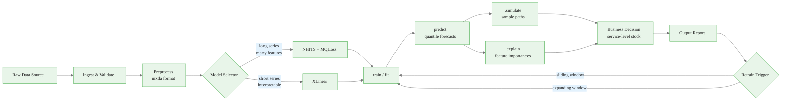
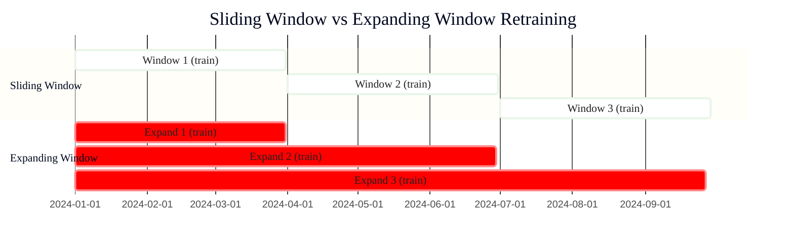

# Production Pipeline: From Raw Data to Operational Decisions

> **Reading time:** ~13 min | **Module:** 6 — Production Patterns | **Prerequisites:** Modules 1-5

## In Brief

This guide shows how to build a complete, production-ready forecasting pipeline using NeuralForecast. You will wrap data ingestion, model training, probabilistic simulation, and explainability into a single `ForecastPipeline` class that makes a complete business decision in one call.

Start here: the pipeline below runs end-to-end on the French Bakery dataset and answers "How many baguettes should we order for next week at an 80% service level?"


<span class="filename">example.py</span>
</div>
The following implementation builds on the approach above:



Each stage is a method on `ForecastPipeline`. This makes unit testing trivial and lets orchestrators (Airflow, Prefect, GitHub Actions) call individual stages.

---

## 3. The ForecastPipeline Class


<span class="filename">example.py</span>
</div>
<div class="callout-info">
<strong>Info:</strong> example.py
The following implementation builds on the approach above:
---
</div>
The following implementation builds on the approach above:

<div class="code-window">
<div class="code-header">
<div class="dots"><span class="dot-red"></span><span class="dot-yellow"></span><span class="dot-green"></span></div>

```python
import pandas as pd
import numpy as np
from neuralforecast import NeuralForecast
from neuralforecast.models import NHITS, LinearRegressor
from neuralforecast.losses.pytorch import MQLoss
from typing import Literal


class ForecastPipeline:
    """
    End-to-end forecasting pipeline: ingest → train → predict → simulate → explain.

    Parameters
    ----------
    horizon : int
        Forecast horizon in time steps.
    freq : str
        Pandas-compatible frequency string ('D', 'W', 'H', etc.).
    quantiles : list[float]
        Quantiles to estimate. Default covers 10th, 50th, 80th, 90th.
    model_type : {'nhits', 'xlinear'}
        Which model to train. Choose based on series length and feature richness.
    max_steps : int
        Training iterations for NHITS. Ignored for XLinear (closed-form).
    random_seed : int
        Reproducibility seed.
    """

    def __init__(
        self,
        horizon: int = 7,
        freq: str = "D",
        quantiles: list[float] | None = None,
        model_type: Literal["nhits", "xlinear"] = "nhits",
        max_steps: int = 500,
        random_seed: int = 42,
    ):
        self.horizon = horizon
        self.freq = freq
        self.quantiles = quantiles or [0.1, 0.5, 0.8, 0.9]
        self.model_type = model_type
        self.max_steps = max_steps
        self.random_seed = random_seed

        self._nf: NeuralForecast | None = None
        self._train_df: pd.DataFrame | None = None

    # ── Stage 1: Ingest ────────────────────────────────────────────────────────
    def ingest(self, df: pd.DataFrame, id_col: str, ds_col: str, y_col: str) -> "ForecastPipeline":
        """
        Convert arbitrary DataFrame to nixtla long format and validate.

        Expected output columns: unique_id | ds | y
        """
        required = {id_col, ds_col, y_col}
        missing = required - set(df.columns)
        if missing:
            raise ValueError(f"Missing columns: {missing}")

        long = (
            df[[id_col, ds_col, y_col]]
            .rename(columns={id_col: "unique_id", ds_col: "ds", y_col: "y"})
            .assign(ds=lambda d: pd.to_datetime(d["ds"]))
            .sort_values(["unique_id", "ds"])
            .reset_index(drop=True)
        )

        # Validate: no duplicate timestamps per series
        dupes = long.duplicated(["unique_id", "ds"]).sum()
        if dupes > 0:
            raise ValueError(f"Found {dupes} duplicate (unique_id, ds) pairs. Deduplicate before ingesting.")

        # Validate: enough history (at least 2x horizon)
        min_len = long.groupby("unique_id")["ds"].count().min()
        if min_len < 2 * self.horizon:
            raise ValueError(
                f"Shortest series has {min_len} observations. Need at least {2 * self.horizon} (2x horizon)."
            )

        self._train_df = long
        print(f"Ingested {long['unique_id'].nunique()} series, {len(long)} total rows.")
        return self

    # ── Stage 2: Train ─────────────────────────────────────────────────────────
    def train(self) -> "ForecastPipeline":
        """Fit the selected model on ingested data."""
        if self._train_df is None:
            raise RuntimeError("Call .ingest() before .train().")

        if self.model_type == "nhits":
            model = NHITS(
                h=self.horizon,
                input_size=3 * self.horizon,
                loss=MQLoss(quantiles=self.quantiles),
                max_steps=self.max_steps,
                random_seed=self.random_seed,
            )
        elif self.model_type == "xlinear":
            model = LinearRegressor(
                h=self.horizon,
                input_size=3 * self.horizon,
                loss=MQLoss(quantiles=self.quantiles),
                random_seed=self.random_seed,
            )
        else:
            raise ValueError(f"Unknown model_type '{self.model_type}'. Use 'nhits' or 'xlinear'.")

        self._nf = NeuralForecast(models=[model], freq=self.freq)
        self._nf.fit(self._train_df)
        print(f"Trained {self.model_type.upper()} model.")
        return self

    # ── Stage 3: Predict ───────────────────────────────────────────────────────
    def predict(self) -> pd.DataFrame:
        """Generate quantile forecasts for the next `horizon` steps."""
        self._require_trained()
        forecast = self._nf.predict()
        return forecast

    # ── Stage 4: Simulate ──────────────────────────────────────────────────────
    def simulate(self, n_samples: int = 100) -> pd.DataFrame:
        """
        Draw sample paths from the fitted model.

        Returns a DataFrame with columns: unique_id | ds | sample_0 ... sample_N
        """
        self._require_trained()
        samples = self._nf.models[0].predict(
            self._nf.uids,
            self._nf.last_dates,
            self._nf.ds,
            step_size=self._nf.step_size,
        )
        # NeuralForecast .predict() with num_samples is available via direct call
        # Use the public API instead:
        sim = self._nf.predict(
            df=self._train_df,
            num_samples=n_samples,
        )
        return sim

    # ── Stage 5: Explain ───────────────────────────────────────────────────────
    def explain(self) -> dict:
        """
        Compute SHAP-style feature importances for the last forecast.

        Returns a dict mapping feature names to importance scores.
        """
        self._require_trained()
        explanation = self._nf.explain(self._train_df)
        return explanation

    # ── Stage 6: Decide ────────────────────────────────────────────────────────
    def service_level_order(
        self,
        forecast: pd.DataFrame,
        service_level: float = 0.8,
        unique_id: str | None = None,
    ) -> dict:
        """
        Compute the order quantity at a given service level.

        Parameters
        ----------
        forecast : pd.DataFrame
            Output from .predict().
        service_level : float
            Target fill rate, e.g. 0.8 for 80%.
        unique_id : str | None
            If None, sums across all series.
        """
        q = service_level
        # Find the quantile column closest to the requested service level
        model_prefix = "NHITS" if self.model_type == "nhits" else "LinearRegressor"
        q_cols = [c for c in forecast.columns if c.startswith(model_prefix) and f"q-{q}" in c]

        if not q_cols:
            available = [c for c in forecast.columns if c.startswith(model_prefix)]
            raise ValueError(
                f"No column for quantile {q}. Available: {available}"
            )

        q_col = q_cols[0]
        df = forecast if unique_id is None else forecast[forecast["unique_id"] == unique_id]

        total = df[q_col].sum()
        peak = df[q_col].max()
        daily = df[q_col].values.tolist()

        return {
            "service_level": service_level,
            "unique_id": unique_id or "all",
            "horizon": self.horizon,
            "total_order": int(np.ceil(total)),
            "peak_day": int(np.ceil(peak)),
            "daily_breakdown": [int(np.ceil(v)) for v in daily],
        }

    # ── Helpers ────────────────────────────────────────────────────────────────
    def _require_trained(self):
        if self._nf is None:
            raise RuntimeError("Call .train() before generating forecasts.")
```

</div>
</div>

---

## 4. Model Selection: NHITS vs XLinear

The choice of model depends on three factors: series length, available features, and interpretability requirements.

<div class="callout-warning">

<strong>Warning:</strong> The choice of model depends on three factors: series length, available features, and interpretability requirements.

</div>


| Factor | Prefer NHITS | Prefer XLinear |
|---|---|---|
| Series length | > 200 observations | < 100 observations |
| Exogenous features | Many (weather, calendar, promotions) | Few or none |
| Interpretability required | Not critical | High priority |
| Training compute | GPU available | CPU-only acceptable |
| Data distribution | Non-linear, seasonal | Near-linear trends |

**Decision rule:**


<span class="filename">example.py</span>
</div>

<div class="code-window">
<div class="code-header">
<div class="dots"><span class="dot-red"></span><span class="dot-yellow"></span><span class="dot-green"></span></div>

```python
def select_model(series_length: int, n_features: int, needs_explanation: bool) -> str:
    """
    Return the recommended model type given series characteristics.

    Uses a conservative heuristic: prefer XLinear when interpretability
    is required or when series are too short for NHITS to generalize.
    """
    if needs_explanation and series_length < 500:
        return "xlinear"
    if series_length < 100:
        return "xlinear"
    if n_features > 10 and series_length > 200:
        return "nhits"
    return "nhits"  # default for long, feature-rich series
```

</div>
</div>

---


<div class="compare">
<div class="compare-card">
<div class="header before">4. Model Selection: NHITS</div>
<div class="body">

See detailed comparison in the table above.

</div>
</div>
<div class="compare-card">
<div class="header after">XLinear</div>
<div class="body">

See detailed comparison in the table above.

</div>
</div>
</div>

## 5. Retraining Strategies

Two retraining approaches dominate production deployments. Neither is universally better; choose based on data volume and concept drift rate.

### Sliding Window Retraining

Train only on the most recent `window_size` observations. Old data is discarded. Use this when the data-generating process changes frequently (seasonal products, promotional events).

```python
def retrain_sliding_window(
    pipeline: ForecastPipeline,
    full_history: pd.DataFrame,
    window_size: int = 365,
) -> ForecastPipeline:
    """
    Retrain using only the most recent `window_size` observations per series.

    This prevents stale patterns from dominating the model — useful for products
    with shifting demand profiles (e.g., seasonal bakery items).
    """
    cutoff = full_history["ds"].max() - pd.Timedelta(days=window_size)
    recent = full_history[full_history["ds"] >= cutoff]

    # Warn if any series is shorter than the minimum required
    series_lengths = recent.groupby("unique_id")["ds"].count()
    short = series_lengths[series_lengths < 2 * pipeline.horizon]
    if len(short) > 0:
        print(f"Warning: {len(short)} series have fewer than {2 * pipeline.horizon} observations after windowing.")

    return pipeline.ingest(recent, "unique_id", "ds", "y").train()


def retrain_expanding_window(
    pipeline: ForecastPipeline,
    full_history: pd.DataFrame,
    min_train_size: int = 90,
) -> ForecastPipeline:
    """
    Retrain using all available history.

    Appropriate when the process is stable and more data always helps
    (e.g., staple products with predictable demand).
    """
    series_lengths = full_history.groupby("unique_id")["ds"].count()
    too_short = series_lengths[series_lengths < min_train_size]
    if len(too_short) > 0:
        print(f"Dropping {len(too_short)} series with fewer than {min_train_size} observations.")
        full_history = full_history[~full_history["unique_id"].isin(too_short.index)]

    return pipeline.ingest(full_history, "unique_id", "ds", "y").train()
```

**Comparison:**



---

## 6. Running the Complete Pipeline

```python
# Load data
url = "https://raw.githubusercontent.com/nixtla/transfer-learning-time-series/main/datasets/french_bakery/bakery.csv"
raw = pd.read_csv(url, parse_dates=["date"])

# Build and run the pipeline
pipeline = (
    ForecastPipeline(horizon=7, freq="D", model_type="nhits", max_steps=300)
    .ingest(raw, id_col="article", ds_col="date", y_col="Quantity")
    .train()
)

# Generate outputs
forecast = pipeline.predict()
decision = pipeline.service_level_order(forecast, service_level=0.8, unique_id="BAGUETTE")

print("\n=== Order Decision ===")
print(f"Service level target: {decision['service_level']:.0%}")
print(f"Total weekly order  : {decision['total_order']} baguettes")
print(f"Peak single day     : {decision['peak_day']} baguettes")
print(f"Daily breakdown     : {decision['daily_breakdown']}")
```

---

## 7. Key Takeaways

1. A `ForecastPipeline` class enforces stage order, fails loudly on bad data, and is callable by any scheduler.
2. NHITS excels on long, feature-rich series; XLinear excels when interpretability is non-negotiable or training data is sparse.
3. Sliding window retraining is appropriate for products with changing demand profiles; expanding window is appropriate for stable products.
4. Every stage — ingest, train, predict, simulate, explain — should be independently testable.
5. The business decision (service level order quantity) is the final output, not the quantile forecast. The pipeline exists to produce that number reliably.

---

**Next:** `02_neuralforecast_patterns.md` — GPU training, custom losses, wandb logging, and error-handling patterns.


## Practice Questions

**Question 1 — Conceptual:** Based on the concepts in this guide, explain in your own words why the core technique matters and when you would choose it over alternatives.

**Question 2 — Application:** Sketch out how you would apply the main concept from this guide to a real-world dataset or problem you have encountered. What would you need to watch out for?


---

## Cross-References

<a class="link-card" href="./01_production_pipeline.md">
  <div class="link-card-title">Companion Slides</div>
  <div class="link-card-description">Interactive slide deck covering the key concepts with visual examples.</div>
</a>

<a class="link-card" href="../notebooks/01_end_to_end_pipeline.ipynb">
  <div class="link-card-title">Hands-on Notebook</div>
  <div class="link-card-description">15-minute micro-notebook with guided exercises and real data.</div>
</a>
