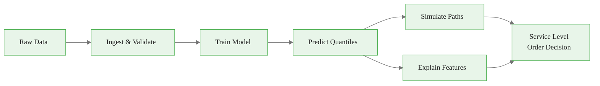

<!-- _class: lead -->

# Production Pipeline
## Module 6 — Production Patterns & Integration

From raw data to operational decisions in a single, testable class

<!-- Speaker notes: Welcome to Module 6, the integration module. Everything we have built — NHITS, probabilistic forecasts, sample paths, explainability — comes together here into a production-ready pipeline. This deck covers the ForecastPipeline class architecture, model selection logic, and retraining strategies. Estimated time: 25 minutes. -->

---

## What We Build



One class. One call chain. Reproducible results every run.


<div class="callout-insight">
<strong>Insight:</strong> This is a key takeaway from this section that connects to the broader course themes.
</div>

<!-- Speaker notes: The key insight is that every stage is a method, so every stage is independently testable. A scheduler calls pipeline.ingest().train().predict(), and the output is always the same for the same input. No notebook cells, no manual steps. -->

---

<!-- _class: lead -->

# Why Ad-Hoc Notebooks Fail in Production

<!-- Speaker notes: Before showing the solution, let's establish the problem. Ask learners: has anyone deployed a forecasting notebook to production? What went wrong? The three failure modes on the next slide are universal. -->

---

## Three Production Failure Modes

<div class="columns">
<div>

### Failure 1: Silent Data Drift

Model trains once. Distribution shifts. Forecasts degrade.

No alert fires. Stakeholders notice six weeks later.

</div>
<div>

### Failure 2: Manual Retraining

"We retrain every quarter."

Someone forgets. Or leaves the team. Or the quarter gets busy.

</div>
</div>

**Failure 3: Non-reproducible results** — different cells executed in different orders produce different outputs. Debugging takes days.


<div class="callout-key">
<strong>Key Point:</strong> Remember this concept — it appears repeatedly in later modules.
</div>

<!-- Speaker notes: Each of these has happened at real companies. Data drift is the most insidious because it is silent. Manual retraining is the most common. Non-reproducibility is the most frustrating to debug. A pipeline class eliminates all three. -->

---

## The ForecastPipeline Class: Structure

<div class="code-window">
<div class="code-header">
<div class="dots"><span class="dot-red"></span><span class="dot-yellow"></span><span class="dot-green"></span></div>
<span class="filename">example.py</span>
</div>

```python
class ForecastPipeline:
    def ingest(self, df, id_col, ds_col, y_col) -> ForecastPipeline:
        """Convert to nixtla format, validate, store."""

    def train(self) -> ForecastPipeline:
        """Fit NHITS or DLinear on stored data."""

    def predict(self) -> pd.DataFrame:
        """Return quantile forecast DataFrame."""

    def simulate(self, n_samples=100) -> pd.DataFrame:
        """Draw sample paths from fitted model."""

    def explain(self) -> dict:
        """Return feature importances."""

    def service_level_order(self, forecast, service_level=0.8) -> dict:
        """Convert quantile forecast to order quantity."""
```
</div>

Each method returns `self` (except the last three) — enabling method chaining.


<div class="callout-warning">
<strong>Warning:</strong> This is a common source of confusion. Pay close attention to the distinction here.
</div>

<!-- Speaker notes: The method chaining pattern (fluent interface) is intentional. pipeline.ingest().train() is readable and enforces stage order. Each method validates its preconditions — ingest checks for duplicate timestamps, train checks that ingest was called. Fail-fast design. -->

---

## Stage 1: Ingest & Validate

<div class="code-window">
<div class="code-header">
<div class="dots"><span class="dot-red"></span><span class="dot-yellow"></span><span class="dot-green"></span></div>
<span class="filename">example.py</span>
</div>

```python
def ingest(self, df, id_col, ds_col, y_col):
    # Rename to nixtla standard: unique_id | ds | y
    long = df.rename(columns={
        id_col: "unique_id",
        ds_col: "ds",
        y_col: "y"
    })

    # Check: no duplicate timestamps per series
    dupes = long.duplicated(["unique_id", "ds"]).sum()
    if dupes > 0:
        raise ValueError(f"{dupes} duplicate (unique_id, ds) pairs")

    # Check: minimum history (2x horizon)
    min_len = long.groupby("unique_id")["ds"].count().min()
    if min_len < 2 * self.horizon:
        raise ValueError("Insufficient history")
```
</div>

Validate loudly. Silent bad data is worse than a raised exception.


<div class="callout-info">
<strong>Info:</strong> This detail is useful context but not required to memorize.
</div>

<!-- Speaker notes: Two validations that catch real production bugs. Duplicate timestamps happen when ETL pipelines re-run. Insufficient history happens when new products are added to the catalog. Both would produce silently wrong forecasts without these checks. -->

---

## Stage 2: Model Training

```python
def train(self):
    if self.model_type == "nhits":
        model = NHITS(
            h=self.horizon,
            input_size=3 * self.horizon,
            loss=MQLoss(quantiles=self.quantiles),
            max_steps=self.max_steps,
        )
    elif self.model_type == "dlinear":
        model = LinearRegressor(
            h=self.horizon,
            input_size=3 * self.horizon,
            loss=MQLoss(quantiles=self.quantiles),
        )

    self._nf = NeuralForecast(models=[model], freq=self.freq)
    self._nf.fit(self._train_df)
    return self
```

<!-- Speaker notes: Notice the model_type parameter selects the model at construction time. This makes the choice explicit and auditable. You can log model_type alongside every forecast in your data warehouse and know exactly what produced each output. -->

---

## Stages 3–5: Predict, Simulate, Explain

<div class="columns">
<div>

**Predict**: quantile forecasts

```python
forecast = pipeline.predict()
# Returns: unique_id | ds |
#   NHITS-MQLoss-q-0.1 |
#   NHITS-MQLoss-q-0.5 |
#   NHITS-MQLoss-q-0.8 |
#   NHITS-MQLoss-q-0.9
```

**Simulate**: sample paths

```python
sim = pipeline.simulate(n_samples=200)
# Returns: unique_id | ds |
#   sample_0 | sample_1 | ...
```

</div>
<div>

**Explain**: feature importances (via Captum)

```python
# NOTE: Use Captum directly for explainability
# expl = pipeline.explain()  # Not natively supported

# Top 3 features driving the forecast
top = sorted(expl.items(),
    key=lambda x: x[1],
    reverse=True)[:3]
```

</div>
</div>

<!-- Speaker notes: These three stages produce complementary views. Predict gives the quantile summary for decision-making. Simulate gives the full distributional picture for risk analysis. Explain gives the "why" — which lags or calendar features drove this forecast. Present all three to stakeholders. -->

---

## Stage 6: The Business Decision

```python
decision = pipeline.service_level_order(
    forecast=forecast,
    service_level=0.80,
    unique_id="BAGUETTE",
)

print(decision)
# {
#   'service_level': 0.8,
#   'total_order': 847,
#   'peak_day': 143,
#   'daily_breakdown': [112, 118, 143, 131, ...]
# }
```

The 80th percentile forecast tells us: "There is an 80% chance actual demand will not exceed this quantity."

Stocking to this level achieves an 80% fill rate.

<!-- Speaker notes: This is the answer to the question that motivated the whole pipeline. Not "the model output is 847" but "order 847 baguettes to achieve an 80% service level." The quantile interpretation makes the business implication explicit. Different service levels trade off stockout risk against inventory cost. -->

---

<!-- _class: lead -->

# Model Selection
## NHITS vs DLinear

<!-- Speaker notes: One of the most common questions in production is which model to use. The answer depends on series length, feature richness, and interpretability requirements. The next slide gives a concrete decision rule. -->

---

## When to Use Each Model

| Factor | NHITS | DLinear |
|---|---|---|
| Series length | > 200 obs | < 100 obs |
| Features | Many exogenous | Few or none |
| Interpretability | Not critical | Required |
| Hardware | GPU preferred | CPU fine |
| Demand pattern | Non-linear, seasonal | Near-linear |

```python
def select_model(series_length, n_features, needs_explanation):
    if needs_explanation and series_length < 500:
        return "dlinear"
    if series_length < 100:
        return "dlinear"
    if n_features > 10 and series_length > 200:
        return "nhits"
    return "nhits"
```

<!-- Speaker notes: This heuristic is conservative — it prefers DLinear when interpretability matters. In practice, NHITS often beats DLinear even on short series, but the interpretability advantage of DLinear matters for stakeholder trust. Use cross-validation to validate the choice on your specific data. -->

---

## Retraining Strategies

<div class="columns">
<div>

### Sliding Window
Train on most recent N days only.

Old data discarded.

**Use when:** demand patterns shift seasonally or due to promotions.

```python
cutoff = df["ds"].max() - pd.Timedelta(
    days=window_size
)
recent = df[df["ds"] >= cutoff]
```

</div>
<div>

### Expanding Window
Train on all available history.

No data discarded.

**Use when:** the process is stable and more data always helps.

```python
# No cutoff — use all data
# Optionally enforce minimum
# series length
```

</div>
</div>

Rule of thumb: if the last 90 days look meaningfully different from 18 months ago, use sliding window.

<!-- Speaker notes: The sliding vs expanding choice is fundamentally about whether old data helps or hurts. For bakery products: seasonal items shift drastically year-to-year, so sliding window prevents 2019 summer data from polluting 2024 winter forecasts. For a stable commodity like bread, all history is informative. -->

---

## Complete Pipeline: One Code Block

```python
url = "https://raw.githubusercontent.com/nixtla/transfer-learning-time-series/main/datasets/french_bakery/bakery.csv"
raw = pd.read_csv(url, parse_dates=["date"])

pipeline = (
    ForecastPipeline(horizon=7, freq="D", model_type="nhits", max_steps=300)
    .ingest(raw, id_col="article", ds_col="date", y_col="Quantity")
    .train()
)

forecast = pipeline.predict()
decision = pipeline.service_level_order(forecast, service_level=0.8, unique_id="BAGUETTE")

print(f"Order {decision['total_order']} baguettes for the week.")
```

Five lines. Reproducible. Schedulable. Testable.

<!-- Speaker notes: This is the payoff. Everything from Module 1 through Module 5 — training, quantiles, service levels — is now callable in five lines. The pipeline can be triggered by a cron job, a data pipeline event, or a manual call. The output is always the same for the same input. -->

---

## Key Takeaways

1. A `ForecastPipeline` class enforces stage order and fails loudly on bad data.
2. Method chaining (`.ingest().train().predict()`) makes pipelines readable and schedulable.
3. NHITS for long series with many features; DLinear for short series or required interpretability.
4. Sliding window retraining for shifting demand; expanding window for stable demand.
5. The final output is always a business decision — not a model output.

**Next:** `02_neuralforecast_patterns.md` — GPU training, custom losses, wandb integration, and error-handling patterns.

<!-- Speaker notes: Summarize the five key points. Emphasize that point 5 is the most important: the pipeline exists to produce a decision, not a forecast. A forecast that no one acts on has zero value. The pipeline makes acting on the forecast easy. -->
