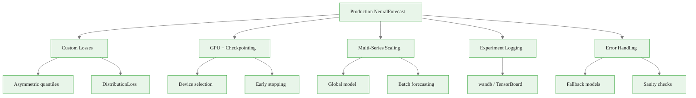

<!-- _class: lead -->

# NeuralForecast Production Patterns
## Module 6 — Production Patterns & Integration

Custom losses · GPU checkpointing · Multi-series scaling · Logging · Error handling

<!-- Speaker notes: This deck covers the patterns that bridge the gap between a working notebook and a robust production system. Each pattern is self-contained — by the end you will have eight copy-paste snippets for the most common production scenarios. Estimated time: 25 minutes. -->

---

## Eight Patterns, One Goal




<div class="callout-insight">
<strong>Insight:</strong> This is a key takeaway from this section that connects to the broader course themes.
</div>

<!-- Speaker notes: Walk through the overview. Each leaf node maps to a concrete code snippet in the guide. This deck focuses on the why and when; the guide contains the complete what. -->

---

<!-- _class: lead -->

# Pattern 1: Custom Losses

<!-- Speaker notes: Loss functions are where the business problem enters the model. The default MQLoss is appropriate for symmetric cost functions. When understocking costs more than overstocking — which is almost always the case in operations — you adjust the quantiles. -->

---

## Asymmetric Quantile Selection

<div class="columns">
<div>

**Symmetric** (default):
<div class="code-window">
<div class="code-header">
<div class="dots"><span class="dot-red"></span><span class="dot-yellow"></span><span class="dot-green"></span></div>
<span class="filename">example.py</span>
</div>

```python
MQLoss(quantiles=[0.1, 0.5, 0.9])
```
</div>

Three heads: lower bound, median, upper bound.

Equal resolution at both tails.

</div>
<div>

**Asymmetric** (upper-tail focus):
<div class="code-window">
<div class="code-header">
<div class="dots"><span class="dot-red"></span><span class="dot-yellow"></span><span class="dot-green"></span></div>
<span class="filename">example.py</span>
</div>

```python
MQLoss(quantiles=[
    0.5, 0.7, 0.8,
    0.85, 0.9, 0.95
])
```
</div>

More heads in the upper tail.

Finer resolution where stockout risk lies.

</div>
</div>

MQLoss trains all quantile heads in a single forward pass — adding quantiles does not double training time.


<div class="callout-key">
<strong>Key Point:</strong> Remember this concept — it appears repeatedly in later modules.
</div>

<!-- Speaker notes: The practical point: adding quantiles is cheap. Training six quantile heads instead of three adds ~20% compute. But you get 3x finer resolution in the tail that matters. For inventory decisions, the upper tail is almost always more important. -->

---

## DistributionLoss: Full Probabilistic Output

```python
from neuralforecast.losses.pytorch import DistributionLoss

# Continuous demand: Normal distribution
normal_loss = DistributionLoss(
    distribution="Normal",
    level=[80, 90]
)

# Count data (units sold): NegativeBinomial
# Handles zero-inflated demand in slow-moving SKUs
nb_loss = DistributionLoss(
    distribution="NegativeBinomial",
    level=[80, 90]
)
```

**Key difference:** MQLoss estimates specific quantiles. DistributionLoss fits a parametric family — then any quantile can be computed analytically, and sample paths can be drawn directly.


<div class="callout-warning">
<strong>Warning:</strong> This is a common source of confusion. Pay close attention to the distinction here.
</div>

<!-- Speaker notes: DistributionLoss is more powerful but requires choosing the right distributional family. For most retail demand data: Normal works for continuous, high-volume SKUs. NegativeBinomial works for integer count data with zeros. If you need sample paths for simulation, DistributionLoss is the natural choice because you sample directly from the fitted distribution. -->

---

## MQLoss vs DistributionLoss: Decision Rule

| Need | Use |
|---|---|
| Specific quantiles (e.g., exactly 80th percentile) | MQLoss |
| Sample paths for Monte Carlo simulation | DistributionLoss |
| Count / integer data | DistributionLoss + NegativeBinomial |
| Calibration is top priority | DistributionLoss (when family matches) |
| General-purpose production default | MQLoss |

Both are valid for production. Start with MQLoss. Switch to DistributionLoss if you need sample paths or if calibration tests fail.


<div class="callout-info">
<strong>Info:</strong> This detail is useful context but not required to memorize.
</div>

<!-- Speaker notes: The practical advice: MQLoss is the safe default. It makes no distributional assumption and trains robustly on any time series. DistributionLoss is the upgrade when you have a specific reason — either you need sample paths or you have count data that violates the continuous assumption. -->

---

<!-- _class: lead -->

# Pattern 2: GPU Training & Checkpointing

<!-- Speaker notes: GPU training is automatic with NeuralForecast on a CUDA machine. But production systems need more: explicit device control, checkpointing to survive crashes, and early stopping to avoid wasting compute. -->

---

## Device Selection

```python
# Auto-detect: GPU if available, CPU otherwise
# This is the correct default for all environments
model_auto = NHITS(h=7, input_size=21, loss=MQLoss())

# Explicit GPU (multi-GPU machines — pin to first GPU)
model_gpu = NHITS(
    h=7, input_size=21, loss=MQLoss(),
    accelerator="gpu",
    devices=1,
)

# CPU only (debugging, never production at scale)
model_cpu = NHITS(
    h=7, input_size=21, loss=MQLoss(),
    accelerator="cpu",
)
```

Rule: let auto-detect handle it. Only override when you need to pin to a specific GPU in a multi-GPU environment.

<!-- Speaker notes: The auto-detect behavior is correct in 95% of cases. The only reason to override is on multi-GPU machines where you want to pin training to a specific device to avoid conflicts with another process. -->

---

## Early Stopping

```python
from pytorch_lightning.callbacks import EarlyStopping

early_stop = EarlyStopping(
    monitor="ptl/val_loss",
    patience=10,     # stop after 10 non-improving epochs
    mode="min",
)

model = NHITS(
    h=7,
    input_size=21,
    loss=MQLoss(),
    max_steps=1000,          # ceiling
    val_check_steps=50,      # validate every 50 steps
    trainer_kwargs={"callbacks": [early_stop]},
)
```

**Effect:** Training stops at the optimal checkpoint, not at `max_steps`. Typical saving: 30–50% of compute on well-behaved series.

<!-- Speaker notes: Early stopping is the most impactful single configuration change for production training. On the French Bakery dataset, NHITS typically converges in 200-300 steps out of a 1000-step budget. Early stopping finds that automatically. The patience parameter controls the trade-off: higher patience allows longer plateaus before stopping, which matters when loss oscillates. -->

---

<!-- _class: lead -->

# Pattern 3: Multi-Series Scaling

<!-- Speaker notes: This is where NeuralForecast really shines versus per-series classical methods. A single global model trained on all unique_ids simultaneously learns shared patterns — weekly seasonality, holiday effects — while still capturing series-specific scale through normalization. -->

---

## The Global Model Advantage

<div class="columns">
<div>

**Classical approach:**
Train one ARIMA per product.

200 products = 200 models.

200 fitting procedures.

200 separate hyperparameter searches.

**Total time:** Hours.

</div>
<div>

**Global NeuralForecast:**
One NHITS on all products.

200 products = 1 model.

Shared patterns learned globally.

Series-specific scale handled by normalization.

**Total time:** Minutes.

</div>
</div>

The global model often beats per-series models when products share seasonality patterns.

<!-- Speaker notes: The French Bakery dataset has multiple products. They all share weekly seasonality — fewer sales on Mondays, more on Fridays and weekends. A global model learns this pattern from all products simultaneously, giving it far more signal than any single product provides. This is the fundamental advantage of global models for forecasting. -->

---

## Batch Forecasting for Large Catalogs

```python
def forecast_in_batches(nf, all_series_df, batch_size=500):
    """Generate forecasts for a large catalog in batches."""
    unique_ids = all_series_df["unique_id"].unique().tolist()
    all_forecasts = []

    for start in range(0, len(unique_ids), batch_size):
        batch_ids = unique_ids[start : start + batch_size]
        batch_df = all_series_df[
            all_series_df["unique_id"].isin(batch_ids)
        ]
        all_forecasts.append(nf.predict(df=batch_df))
        print(f"{min(start+batch_size, len(unique_ids))}/{len(unique_ids)}")

    return pd.concat(all_forecasts, ignore_index=True)
```

Training is still global (one fit call). Only prediction is batched to manage memory.

<!-- Speaker notes: The key insight: batching only applies to prediction, not training. Training on all series at once is more efficient because the global model sees all patterns simultaneously. Prediction is batched because generating forecasts for 10,000 series at once can exceed available memory. The batch loop is trivial to parallelize if needed. -->

---

## Memory-Efficient batch_size Tuning

`batch_size` in NeuralForecast = gradient update batch (not number of series).

```python
def get_recommended_batch_size():
    if torch.cuda.is_available():
        gpu_mem = torch.cuda.get_device_properties(0).total_memory
        gpu_gb = gpu_mem / (1024 ** 3)
        if gpu_gb >= 16:
            return 32
        elif gpu_gb >= 8:
            return 16
    return 8  # CPU fallback

model = NHITS(
    h=7, input_size=21, loss=MQLoss(),
    batch_size=get_recommended_batch_size(),
)
```

If you see CUDA OOM errors: halve `batch_size`. If training is slow and GPU utilization is low: double `batch_size`.

<!-- Speaker notes: CUDA out-of-memory is the most common error when scaling to large datasets. The fix is always to reduce batch_size. The trade-off: smaller batches mean noisier gradients, which can slow convergence. The heuristic shown is a safe starting point — adjust based on observed GPU utilization. -->

---

<!-- _class: lead -->

# Pattern 4: Experiment Logging

<!-- Speaker notes: Logging is the difference between "we ran a model" and "we know which model, trained on what data, with what configuration, produced which forecast." Without logging, reproducing a forecast six months later is impossible. -->

---

## Weights & Biases

```python
import wandb
from pytorch_lightning.loggers import WandbLogger

wandb.init(
    project="bakery-forecasting",
    name="nhits-mqloss-v1",
    config={
        "model": "NHITS",
        "horizon": 7,
        "quantiles": [0.1, 0.5, 0.8, 0.9],
        "max_steps": 500,
    }
)

wandb_logger = WandbLogger(project="bakery-forecasting")

model = NHITS(
    h=7, input_size=21, loss=MQLoss(),
    trainer_kwargs={"logger": wandb_logger},
)
```

W&B logs: training loss curves, validation metrics, system metrics (GPU utilization, memory), and model artifacts.

<!-- Speaker notes: W&B is the gold standard for ML experiment tracking. Every training run gets a URL. You can compare runs side-by-side, see loss curves, and link the model artifact to the forecast it produced. For teams forecasting hundreds of products, this is essential for audit trails. -->

---

## Lightweight JSONL Logging

When W&B is overkill (batch jobs, offline environments):

```python
import json, hashlib
from datetime import datetime

def log_run(model_config, train_df, val_metrics, path="/tmp/runs.jsonl"):
    run_id = hashlib.md5(
        (str(model_config) + datetime.utcnow().isoformat()).encode()
    ).hexdigest()[:8]

    record = {
        "run_id": run_id,
        "timestamp": datetime.utcnow().isoformat(),
        "config": model_config,
        "n_series": train_df["unique_id"].nunique(),
        "metrics": val_metrics,
    }
    with open(path, "a") as f:
        f.write(json.dumps(record) + "\n")
    return run_id
```

One line per run. Readable by `pandas.read_json(path, lines=True)`.

<!-- Speaker notes: JSONL logging is zero-dependency and works everywhere. Each line is a valid JSON object, so the file can be read incrementally. Append-only writes mean no read-write conflicts in concurrent environments. For small teams, this is often all the logging infrastructure needed. -->

---

<!-- _class: lead -->

# Pattern 5: Error Handling & Fallbacks

<!-- Speaker notes: Production systems fail. NHITS may fail on very short series, on series with too many NaNs, or due to GPU memory issues. A fallback to XLinear ensures the pipeline always produces an output, even when the primary model fails. -->

---

## Fallback to XLinear

```python
def train_with_fallback(df, horizon=7, freq="D"):
    """Train NHITS, fall back to LinearRegressor on failure."""
    loss = MQLoss(quantiles=[0.1, 0.5, 0.8, 0.9])

    try:
        model = NHITS(h=horizon, input_size=3*horizon,
                      loss=loss, max_steps=300)
        nf = NeuralForecast(models=[model], freq=freq)
        nf.fit(df)
        return nf, "NHITS"

    except Exception as e:
        print(f"NHITS failed: {e}. Falling back to LinearRegressor.")
        fallback = LinearRegressor(h=horizon,
                                   input_size=3*horizon, loss=loss)
        nf = NeuralForecast(models=[fallback], freq=freq)
        nf.fit(df)
        return nf, "LinearRegressor"
```

Always return which model was used — log it.

<!-- Speaker notes: The return value tuple (nf, model_name) is critical. You need to know which model produced a given forecast. If the fallback fires frequently, that is a signal that the primary model needs configuration changes (e.g., shorter input_size, fewer max_steps) or that the data has quality issues. -->

---

## Forecast Sanity Checks

```python
def validate_forecast(forecast, train_df, median_col,
                       max_multiplier=5.0):
    """Reject forecasts that exceed 5x historical median."""
    hist_medians = (train_df.groupby("unique_id")["y"]
                    .median())
    fc_medians = (forecast.groupby("unique_id")[median_col]
                  .median())

    status = {}
    for uid in forecast["unique_id"].unique():
        hist = hist_medians.get(uid, 0)
        fc = fc_medians.get(uid, 0)
        if fc < 0:
            status[uid] = "rejected_negative"
        elif hist > 0 and fc > max_multiplier * hist:
            status[uid] = f"rejected_{fc/hist:.1f}x_spike"
        else:
            status[uid] = "ok"

    forecast["status"] = forecast["unique_id"].map(status)
    return forecast
```

A model that produces 10x the historical demand is almost certainly wrong.

<!-- Speaker notes: Sanity checks are the last line of defense before a forecast reaches a decision-maker. The 5x threshold is conservative — adjust based on domain knowledge. For seasonal products, you might allow 3x during peak season. For staple products, 2x might already indicate a problem. Log every rejection and investigate the root cause. -->

---

## Pattern Summary

| Pattern | Primary Benefit | Key Code |
|---|---|---|
| Asymmetric quantiles | Upper-tail resolution | `quantiles=[0.7, 0.8, 0.9]` |
| DistributionLoss | Sample paths, count data | `distribution="NegativeBinomial"` |
| Early stopping | 30–50% compute savings | `patience=10` |
| Global model | Shared pattern learning | Single `nf.fit(all_df)` |
| Batch forecasting | Memory management | Loop over `unique_id` batches |
| W&B logging | Full experiment audit trail | `WandbLogger` |
| Fallback model | Pipeline never fails | Try/except chain |
| Sanity checks | Catch model failures | `max_multiplier` threshold |

<!-- Speaker notes: This table is the takeaway reference. Each pattern is a single configuration change or a ~10-line function. Together they transform a notebook prototype into a production system. -->

---

## Key Takeaways

1. MQLoss is the default; DistributionLoss unlocks sample paths and count-data support.
2. Early stopping is the single highest-ROI training optimization — implement it always.
3. Global models (all unique_ids in one fit call) outperform per-series models when patterns are shared.
4. Log every training run with model_config, n_series, and metrics — JSONL is sufficient.
5. Fallback models and sanity checks ensure the pipeline always produces a usable output.

**Next:** Notebook `01_end_to_end_pipeline.ipynb` — run everything on real bakery data.

<!-- Speaker notes: Summarize the five key takeaways. Point out that takeaway 2 (early stopping) can be implemented in two minutes and immediately reduces training cost. Takeaway 5 is the most important for production reliability — a pipeline that fails silently is worse than one that fails loudly. -->
