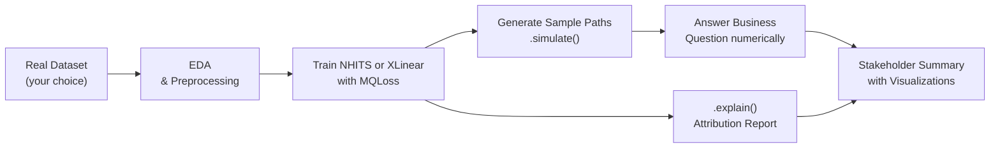

# Portfolio Project Specification: Demand Forecasting System

## Start Here: What You Are Building

By the end of this project you will have a complete, deployable demand forecasting system that produces:

1. A trained neural model with probabilistic output
2. Sample paths from the joint forecast distribution
3. A quantitative answer to a real business decision
4. An explainability report showing which inputs drive forecasts
5. A stakeholder-facing summary with visualizations

This is a portfolio artifact, not a graded assignment. Build something you are proud to show.

---

## Project Goal

Design and implement a **demand forecasting system** that goes from raw time series data to actionable business intelligence. The system must demonstrate the full forecasting stack covered in this course:



---

## Requirements

### Requirement 1: Select a Real Time Series Dataset

You must use real data. The dataset must have:
- At least one identifiable series with strong seasonal structure
- At least 6 months of daily observations (or 2 years of monthly)
- A plausible business context for the forecasts

**Suggested datasets** — all load without ETL using `datasetsforecast`:

| Dataset | Series | Frequency | Business Context |
|---|---|---|---|
| **French Bakery** | 8 products | Daily | Inventory planning for perishable goods |
| **M5** | 30,490 Walmart items | Daily | Retail supply chain optimization |
| **Australian Tourism** | 304 regions | Quarterly | Capacity planning for tourism operators |
| **ETT (Energy)** | 7 transformer loads | Hourly | Energy grid load balancing |
| **PeMS Traffic** | Highway stations | Hourly | Infrastructure capacity planning |

You may bring your own dataset if it meets the requirements above.

### Requirement 2: Train a Neural Model with Probabilistic Output

Train either NHITS or XLinear using `MQLoss`. Your trained model must:
- Achieve lower CRPS than a naive seasonal baseline
- Be calibrated: 80% intervals should cover actuals 80% of the time (±5%)
- Produce quantile forecasts at minimum levels [10, 50, 90]

```python
from neuralforecast.models import NHITS
from neuralforecast.losses.pytorch import MQLoss

model = NHITS(
    h=7,                    # set to match your business question
    input_size=28,          # typically 4x horizon for daily data
    loss=MQLoss(level=[80, 90]),
    scaler_type="robust",   # required for real-world data
    max_steps=1000,
)
```

### Requirement 3: Generate Sample Paths

Use `.simulate()` to generate at least 200 sample paths over the full forecast horizon. Your paths must:
- Be stored as a DataFrame with columns `unique_id`, `ds`, `sample_1`, ..., `sample_N`
- Be used to answer the business question (Requirement 4)
- Be visualized as a fan chart or spaghetti plot

```python
paths_df = nf.models[0].simulate(
    futr_df=None,
    step_size=1,
    n_paths=200,
)
```

### Requirement 4: Answer a Specific Business Question Using the Joint Distribution

Pick exactly one business question. Compute a numeric answer with uncertainty bounds. The question must require the joint distribution — it cannot be answered by looking at each forecast step independently.

**Template business questions by domain:**

**Inventory / retail:**
> "What stock level covers 80% of weekly demand scenarios for product X, minimizing the combined cost of stockouts ($15/unit) and overstock ($3/unit)?"

**Energy / utilities:**
> "What generation capacity (in MWh) must be online to ensure the grid is undersupplied fewer than 5% of days next month?"

**Tourism / hospitality:**
> "At 80% confidence, what is the minimum staffing level that covers peak demand across the 14-day forecast window?"

**Budget / finance:**
> "What contingency reserve, as a percentage of baseline revenue, covers 90% of revenue shortfall scenarios over the next quarter?"

Document your answer as: `[numeric result] [units] with [confidence level]% confidence`.

### Requirement 5: Produce an Explainability Report

Run `.explain()` on your trained model and report:
- The top 5 input features by mean absolute attribution across all series
- A bar chart of attributions ordered by magnitude
- One sentence interpreting the most important feature in business terms

```python
explanations = nf.models[0].explain(df=df_test, level=90)
# explanations: dict with keys 'attributions', 'feature_names'
```

### Requirement 6: Create a Stakeholder-Facing Summary

Produce a single document (markdown or notebook) containing:
- **One paragraph** executive summary: the business question, the answer, and the confidence level
- **Fan chart** showing median forecast and 80% prediction band
- **Sample paths plot** showing 50 individual trajectories
- **Attribution bar chart** from `.explain()`
- **Calibration check**: table of actual coverage at 50%, 80%, 90% levels

The summary must be readable by a non-technical stakeholder — no model internals, no loss function discussion.

---

## Milestones

The project is organized into four weekly milestones. These are checkpoints for your own planning — nothing is submitted or graded.

### Milestone 1: Data Selection and EDA (Week 1)

**Deliverable:** A notebook or document containing:
- Dataset loaded in nixtla format (`unique_id`, `ds`, `y`)
- Series count, date range, frequency, and missing value summary
- Time series plot for the series you will forecast
- Identification of the dominant seasonal period(s)
- Statement of the business question you will answer

**Self-check:**
- [ ] Data loads without errors in nixtla format
- [ ] At least one series plotted with visible seasonal structure
- [ ] Business question written as a single sentence with a numeric target

### Milestone 2: Model Training and Evaluation (Week 2)

**Deliverable:** A trained model with evaluation metrics:
- CRPS on held-out test set (last `h` steps per series)
- Coverage at 80% and 90% levels
- Comparison to a naive seasonal baseline (seasonal naive or seasonal mean)

**Self-check:**
- [ ] Model trains without errors
- [ ] CRPS lower than seasonal naive baseline
- [ ] 80% coverage between 75% and 85%

### Milestone 3: Sample Paths and Business Decision (Week 3)

**Deliverable:** The core business answer:
- 200+ sample paths generated with `.simulate()`
- Monte Carlo computation of the answer to your business question
- Fan chart and spaghetti plot
- The numeric answer with confidence level documented

**Self-check:**
- [ ] `paths_df` shape is `(n_series * h, n_paths + 2)`
- [ ] Business answer is a single number with units and confidence level
- [ ] Both plot types produced and readable

### Milestone 4: Explainability Report and Final Presentation (Week 4)

**Deliverable:** The complete stakeholder summary:
- Explainability report with top-5 attributions and interpretation
- All six required visualizations
- Executive summary paragraph

**Self-check:**
- [ ] `.explain()` returns attribution dict without errors
- [ ] Top-5 features identified and plotted
- [ ] Executive summary passes the "non-technical reader" test

---

## Example Project Outline

The following outline shows what a complete project looks like for the French Bakery dataset with an inventory stocking question. Use it as a structural template, not a content template — your business question and dataset should be your own choices.

```
Project: Optimal Baguette Inventory Under Demand Uncertainty
Dataset: French Bakery (daily baguette sales, 3 stores)
Model: NHITS, h=7, MQLoss(level=[80, 90])
Business Question: What weekly stocking level minimizes total cost
                   (€12 stockout / €2 overstock per unit) at 80% confidence?

Milestone 1: Loaded 3 series, 2019-2022, strong weekly pattern (Fri/Sat peaks)
Milestone 2: CRPS = 8.4 vs seasonal naive CRPS = 14.2 (41% improvement)
             80% coverage: 81.3%, 90% coverage: 89.7%
Milestone 3: 200 paths generated
             Answer: Stock 148 units/week per store
             (optimal under cost asymmetry, 80% confidence)
Milestone 4: Top attribution: lag_7 (0.42 mean absolute attribution)
             Interpretation: Last Friday's sales is the strongest predictor
             of next Friday's demand — weekly regulars drive volume.
```

---

## Dataset Loading Reference

```python
# Option 1: French Bakery (fastest to load, recommended for prototyping)
import pandas as pd

url = (
    "https://raw.githubusercontent.com/Nixtla/transfer-learning-time-series/"
    "main/datasets/french_bakery_daily.csv"
)
df = pd.read_csv(url, parse_dates=["ds"])

# Option 2: M5 via datasetsforecast (large — use a subset)
from datasetsforecast.m5 import M5
df_m5, *_ = M5.load("./data/")
# Subset to 10 series to start
series_sample = df_m5["unique_id"].unique()[:10]
df = df_m5[df_m5["unique_id"].isin(series_sample)].copy()

# Option 3: Australian Tourism
from datasetsforecast.long_horizon import LongHorizon
df_tourism, *_ = LongHorizon.load("./data/", group="Tourism")

# Option 4: ETT (Energy)
from datasetsforecast.long_horizon import LongHorizon
df_ett, *_ = LongHorizon.load("./data/", group="ETTh1")

# Verify nixtla format for any dataset
assert set(["unique_id", "ds", "y"]).issubset(df.columns), "Missing required columns"
print(df.dtypes)
print(df.groupby("unique_id").size().describe())
```

---

## What Makes a Strong Portfolio Project

A strong project demonstrates **decision-usefulness** — the forecast output changes what a decision-maker does.

| Dimension | Adequate | Strong |
|---|---|---|
| Dataset | Toy or tutorial dataset | Operationally relevant dataset |
| Business question | Vague ("forecast demand") | Specific with cost function |
| Model evaluation | Loss reported only | Calibration + comparison to baseline |
| Sample paths | Generated and plotted | Used to answer a specific probability question |
| Explainability | Attributions listed | Attributions interpreted in domain language |
| Stakeholder summary | Technical writeup | Readable by a non-data-scientist |

The difference between adequate and strong is always interpretation. Numbers without decisions are not actionable.

---

## Connections to Previous Modules

| Module | Concept Used In This Project |
|---|---|
| Module 01 | NHITS architecture, `.fit()` / `.predict()` API |
| Module 02 | MQLoss, calibration check, CRPS evaluation |
| Module 03 | `.simulate()`, Monte Carlo framework, joint distribution |
| Module 04 | `.explain()`, attribution interpretation |
| Module 05 | XLinear as an alternative model choice |
| Module 06 | Production patterns for the final deployment |

---

## What's Next

After completing this project, the natural next steps are:

- **Hierarchical forecasting**: reconcile store-level forecasts to regional totals using `hierarchicalforecast`
- **Cross-series transfer learning**: fine-tune on your dataset using a foundation model from `nixtla` TimeGPT
- **Real-time inference**: wrap the trained `NeuralForecast` object in a FastAPI endpoint
- **Monitoring**: track calibration drift in production using `utilsforecast` on rolling windows
