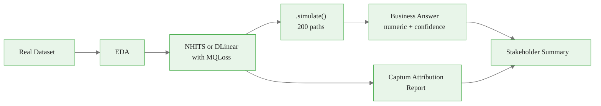
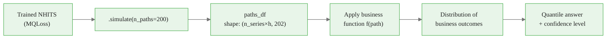

<!-- _class: lead -->

# Portfolio Project: Demand Forecasting System

**Module 7 — Capstone**

Build a complete forecasting pipeline. Ship something real.

<!-- Speaker notes: Welcome to Module 7. Everything in the previous six modules has been preparation for this. Learners have trained neural models, generated sample paths, run explainability, and built production patterns. Now they integrate all of it into a single cohesive system and produce something they can show to a hiring manager or a client. Emphasize that this is not a graded assignment — the only audience that matters is someone the learner wants to impress. -->

---

## What You Are Building



Six components. Four weeks. One deployable artifact.


<div class="callout-insight">
<strong>Insight:</strong> This is a key takeaway from this section that connects to the broader course themes.
</div>

<!-- Speaker notes: Walk through the pipeline. Each box maps directly to a module: model training is Module 1-2, sample paths are Module 3, explainability is Module 4, and the stakeholder summary synthesizes all of them. The key design principle is that every step produces output that feeds the next — nothing is produced just to show the model works. Everything connects to the business question. -->

---

## The Four Milestones

| Week | Milestone | Deliverable |
|---|---|---|
| 1 | Data selection + EDA | Nixtla-format dataset, business question |
| 2 | Model training + evaluation | CRPS < baseline, calibration verified |
| 3 | Sample paths + business decision | Numeric answer with confidence level |
| 4 | Explainability + stakeholder summary | Attribution report, executive summary |

No submissions. No grades. These are your own checkpoints.


<div class="callout-key">
<strong>Key Point:</strong> Remember this concept — it appears repeatedly in later modules.
</div>

<!-- Speaker notes: The four-week structure gives learners a pacing guide. Each milestone has a concrete, tangible deliverable that is either done or not done — there is no partial credit to hide behind. Milestone 2 is where most learners get stuck: calibration verification catches overconfident models. Encourage them to iterate on the model before moving to sample paths. -->

---

<!-- _class: lead -->

# Milestone 1: Data Selection

<!-- Speaker notes: Choosing the right dataset sets the tone for the whole project. The key criterion is operational relevance — the business question should be something a real organization would care about. A learner who chooses a dataset from their own industry will produce a more compelling portfolio piece than one who uses the same tutorial dataset as everyone else. -->

---

## Suggested Datasets

| Dataset | Series | Frequency | Why It's Good |
|---|---|---|---|
| **French Bakery** | 8 products | Daily | Fast to load, strong weekly seasonality |
| **M5 (Walmart)** | 30K+ items | Daily | Industry scale, hierarchical structure |
| **Australian Tourism** | 304 regions | Quarterly | Long history, clear capacity planning story |
| **ETT Energy** | 7 loads | Hourly | Technical, grid balancing applications |
| **Bring your own** | — | Any | Most compelling if from your own domain |

All except "bring your own" load via `datasetsforecast` with zero ETL.


<div class="callout-warning">
<strong>Warning:</strong> This is a common source of confusion. Pay close attention to the distinction here.
</div>

<!-- Speaker notes: The French Bakery dataset is the recommended starting point for learners who want to move fast. It loads in seconds, has clear weekly seasonality, and maps naturally to the inventory stocking business question. M5 is the right choice for learners targeting retail or supply chain roles — it is the industry benchmark. Tourism is good for learners in hospitality or government. Learners who bring their own data almost always produce the strongest projects. -->

---

## The Business Question Test

A good business question passes three tests:

**1. Requires the joint distribution**
It cannot be answered by looking at each forecast day independently.
"What is the total inventory needed for the week?" — requires the sum distribution.

**2. Produces a numeric answer**
"About 148 units" not "more inventory when demand is high."

**3. Has a cost context**
Stockouts and overstock have different costs. The optimal answer depends on this ratio.

$$\text{Optimal stock} = Q_\tau\!\left(\sum_{t=1}^H y_t\right), \quad \tau = \frac{c_\text{under}}{c_\text{under} + c_\text{over}}$$


<div class="callout-info">
<strong>Info:</strong> This detail is useful context but not required to memorize.
</div>

<!-- Speaker notes: The formula is the newsvendor solution, generalized to a distributional forecast. The optimal quantile tau is the critical ratio from operations research — it equals the cost of understocking divided by the total cost. For a bakery where stockouts cost €12 and overstock costs €2, tau = 12/(12+2) = 0.857. The business question forces learners to think about cost asymmetry, which is one of the main reasons probabilistic forecasting exists. -->

---

<!-- _class: lead -->

# Milestone 2: Model Training

<!-- Speaker notes: Milestone 2 is about verification, not just training. Any model can be trained. A model that passes calibration verification is a model you can trust. Walk learners through what calibration failure looks like and how to diagnose it before they commit to using a miscalibrated model for the business decision. -->

---

## What "Good" Looks Like

<div class="columns">
<div>

### Target metrics

- **CRPS**: lower than seasonal naive baseline
- **80% coverage**: 75%–85%
- **90% coverage**: 87%–93%

If coverage is too low: model is overconfident. Widen intervals or reduce `max_steps`.

If coverage is too high: model is underconfident. Narrow intervals or add `scaler_type`.

</div>
<div>

### Calibration check code

<div class="code-window">
<div class="code-header">
<div class="dots"><span class="dot-red"></span><span class="dot-yellow"></span><span class="dot-green"></span></div>
<span class="filename">example.py</span>
</div>

```python
from utilsforecast.evaluation import evaluate
from utilsforecast.losses import coverage

results = evaluate(
    df=forecasts,
    metrics=[coverage],
    models=["NHITS"],
    level=[80, 90],
)
print(results)
```
</div>

</div>
</div>

<!-- Speaker notes: Coverage between 75% and 85% for an 80% interval is the practical acceptance criterion. Tighter than this means the model is overconfident and the business answer will be too aggressive. Wider means the model is underconfident and the answer will be overly conservative. Both directions have real business costs — overconfident models cause stockouts, underconfident models cause waste. -->

---

## Comparing Against Baselines

Always compare your neural model against a classical baseline. Complexity must earn its keep.

<div class="code-window">
<div class="code-header">
<div class="dots"><span class="dot-red"></span><span class="dot-yellow"></span><span class="dot-green"></span></div>
<span class="filename">example.py</span>
</div>

```python
from statsforecast import StatsForecast
from statsforecast.models import SeasonalNaive

# Seasonal naive baseline
sf = StatsForecast(
    models=[SeasonalNaive(season_length=7)],
    freq="D",
)
sf.fit(df_train)
baseline_forecasts = sf.predict(h=7)

# Compare CRPS
from utilsforecast.losses import crps
baseline_crps = crps(baseline_forecasts, df_test)
neural_crps = crps(neural_forecasts, df_test)

improvement = (baseline_crps - neural_crps) / baseline_crps * 100
print(f"CRPS improvement over seasonal naive: {improvement:.1f}%")
```
</div>

A 20%+ improvement justifies the complexity.

<!-- Speaker notes: The comparison against seasonal naive is essential for portfolio credibility. A model that does not beat seasonal naive is a model that should not be deployed. If learners find their neural model does not improve on the baseline, the most common causes are: insufficient max_steps, wrong input_size (too small), or a dataset without enough non-seasonal signal for the model to learn. -->

---

<!-- _class: lead -->

# Milestone 3: Sample Paths and the Business Decision

<!-- Speaker notes: This milestone is the heart of the project. Sample paths are what distinguish this course from a standard forecasting tutorial. The business decision is what distinguishes the project from a model training exercise. Emphasize that the numeric answer is the point — the model exists to produce this number. -->

---

## From Paths to Decisions



The Monte Carlo framework from Module 3 applied to real model output.

<!-- Speaker notes: The diagram maps directly to the Monte Carlo framework learners saw in Module 3. The only new element is that the paths now come from a trained neural model instead of a synthetic AR(1) process. The business function f is whatever converts a path (a sequence of demand values) into the quantity of interest — a sum for inventory, a maximum for capacity, a threshold crossing for risk. -->

---

## Example: Inventory Stocking Decision

```python
# paths_df: wide format, one column per sample path
path_matrix = paths_df.filter(like="sample_").values  # shape: (h, n_paths)

# Business function: total weekly demand
weekly_totals = path_matrix.sum(axis=0)  # shape: (n_paths,)

# Cost-optimal stocking level (newsvendor solution)
cost_understock = 12   # €12 per unit short
cost_overstock  = 2    # €2 per unit excess
tau = cost_understock / (cost_understock + cost_overstock)  # 0.857

optimal_stock = np.quantile(weekly_totals, tau)
print(f"Optimal stock: {optimal_stock:.0f} units  (tau={tau:.3f})")

# Also report P(demand exceeds stock level)
p_stockout = (weekly_totals > optimal_stock).mean()
print(f"Stockout probability at optimal: {p_stockout:.3f}")
```

The result is a **single actionable number** the business can act on.

<!-- Speaker notes: The newsvendor calculation is a classic result from operations research that now becomes effortless with sample paths. Without sample paths, computing the optimal stocking level under asymmetric costs requires either a parametric distribution assumption or complex optimization. With sample paths, it is one line of numpy. This is the practical payoff of everything in the course. -->

---

<!-- _class: lead -->

# Milestone 4: Explainability + Stakeholder Summary

<!-- Speaker notes: The final milestone is about communication, not modeling. The explainability report translates model internals into business language. The stakeholder summary makes the entire project accessible to someone who does not know what CRPS means. This is the skill that separates data scientists who get promoted from those who do not. -->

---

## Explainability with Captum

> **Note:** NeuralForecast does not have a `.explain()` method. Use Captum directly.

```python
from captum.attr import IntegratedGradients

pytorch_model = nf.models[0]
ig = IntegratedGradients(pytorch_model)
# attributions = ig.attribute(input_tensor, baselines=baseline_tensor)
# See Captum docs: https://captum.ai/
```

Turn the top feature into plain English:
> "Last week's same-day sales (lag_7) explains 42% of forecast variance — weekly regulars drive volume."

<!-- Speaker notes: NeuralForecast does not have a native .explain() method. Use Captum's IntegratedGradients on the underlying PyTorch model. The interpretation step is the one learners most often skip — push them to translate lag indices into business language. lag_7 in daily data means "one week ago today," which often maps to a recognizable business pattern like "weekly regulars." -->

---

## The Stakeholder Summary: Six Components

| Component | What It Shows |
|---|---|
| Executive summary paragraph | Answer + confidence, one paragraph |
| Fan chart | Median forecast + 80% band |
| Spaghetti plot | 50 individual sample paths |
| Attribution bar chart | Top features from Captum attribution |
| Calibration table | Actual coverage at 50%, 80%, 90% |
| Business answer box | The number, in large type |

Everything else is supporting material. If a non-technical reader cannot understand the executive summary and business answer box, the project is not done.

<!-- Speaker notes: The six components are the minimum viable stakeholder summary. The fan chart and spaghetti plot show the same information in different ways — the fan chart is cleaner for executives, the spaghetti plot is more honest about what the model is actually producing. The calibration table is the accountability section — it shows that the 80% intervals actually contain the actual value 80% of the time, which is what makes the business answer defensible. -->

---

## What a Strong Portfolio Piece Looks Like

<div class="columns">
<div>

### Adequate
- Model trains and produces forecasts
- CRPS reported
- Sample paths generated
- Attributions listed

</div>
<div>

### Strong
- Forecast improves on baseline
- Calibration verified
- Business answer with cost context
- Attributions interpreted in domain language
- Summary readable by a non-specialist

</div>
</div>

**The gap is always interpretation.** Numbers without decisions are not actionable.

<!-- Speaker notes: Use this comparison in code review or peer feedback. The difference is not about model sophistication — a simple well-calibrated NHITS with a clear business interpretation beats a complex model with vague outputs every time. The word "interpretation" is key: what do the numbers mean for the business? What should a decision-maker do differently because of this forecast? -->

---

## Module Summary

You have everything you need:
- **Module 01–02**: Train neural models, evaluate with CRPS, verify calibration
- **Module 03**: Generate sample paths, answer probability questions
- **Module 04**: Run Captum attribution, interpret results
- **Module 05**: DLinear as a fast, strong alternative model
- **Module 06**: Production patterns for the final system

The project starter notebook at `notebooks/01_project_starter.ipynb` has working skeleton code for every section.

The milestone checklist at `exercises/01_milestone_checklist.py` validates each deliverable programmatically.

<!-- Speaker notes: Close by pointing learners to the two supporting files. The starter notebook removes the blank-page problem — learners can run the reference implementation end-to-end with French Bakery data, then swap in their own dataset and business question. The milestone checklist is the self-verification tool: if all checks pass, the project is structurally complete. -->

---

<!-- _class: lead -->

# Start Building

`notebooks/01_project_starter.ipynb`

<!-- Speaker notes: End with the call to action. The starter notebook is the entry point. Everything else is documentation. Learners should open it, run the French Bakery reference implementation, verify it works, and then start adapting it to their chosen dataset. The best projects are the ones where learners spend 90% of their time on interpretation and domain knowledge, not on debugging the pipeline. -->
