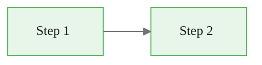

# Course Styling Overhaul — Design Spec

**Date:** 2026-04-04
**Status:** Approved
**Test Course:** `genetic-algorithms-feature-selection`
**Scope:** All content types (slides, guides, notebooks, Streamlit browser) + standalone styling guide

---

## 1. Problem Statement

Current course materials use functional but visually undifferentiated styling — basic Marp themes, plain Mermaid diagrams, standard code blocks, and a minimal Streamlit browser. The target is the visual quality of [Daily Dose of Data Science](https://www.dailydoseofds.com/), which uses:

- Custom illustrated infographics with pastel palettes between every 2-3 paragraphs
- Annotated code blocks styled as macOS windows with side labels and arrows
- Yellow/amber process flow boxes with numbered steps
- Serif editorial headings with generous whitespace
- Dark sidebar navigation with progress tracking
- Rich callout boxes with emoji icons and tinted backgrounds

## 2. Approach

**Theme Layer Architecture** — a unified styling system in `resources/` that all content types inherit from. Changes to the theme propagate to all courses automatically.

### Deliverables

1. **New Marp CSS theme** (`resources/themes/course-theme.css` — rewrite)
2. **SVG diagram generator** (`resources/graphics/diagram_generator.py`)
3. **Matplotlib/Seaborn plot theme** (`resources/graphics/plot_theme.py`)
4. **Notebook style injector** (`resources/notebook_style.py`)
5. **Streamlit app overhaul** (`app.py` + `resources/streamlit/`)
6. **Standalone styling guide** (`STYLING_GUIDE.md` + `styling_guide.html`)
7. **Test course restyled** (`courses/genetic-algorithms-feature-selection/`)

---

## 3. Color Palette

| Token | Hex | Usage |
|-------|-----|-------|
| `--bg-primary` | `#ffffff` | Main content background |
| `--bg-section-mint` | `#e8f5e9` | Section backgrounds, success contexts |
| `--bg-section-amber` | `#fff8e1` | Process flows, warning contexts |
| `--bg-section-blue` | `#e3f2fd` | Architecture diagrams, info contexts |
| `--bg-section-lavender` | `#f3e5f5` | Insight callouts, highlight contexts |
| `--bg-section-rose` | `#fce4ec` | Danger/error contexts |
| `--bg-code` | `#1e1e2e` | Code block background (Catppuccin Mocha) |
| `--bg-sidebar` | `#1a1a2e` | Navigation sidebar |
| `--accent-green` | `#4caf50` | Success, checkmarks, positive |
| `--accent-orange` | `#ff9800` | Warnings, highlights, steps |
| `--accent-blue` | `#2196f3` | Links, interactive, info |
| `--accent-red` | `#ef5350` | Errors, important, danger |
| `--accent-purple` | `#7c4dff` | Special emphasis |
| `--text-primary` | `#212121` | Body text |
| `--text-heading` | `#1a1a2e` | Headings |
| `--text-muted` | `#757575` | Captions, metadata |
| `--text-on-dark` | `#f5f5f5` | Text on dark backgrounds |
| `--border-light` | `#e0e0e0` | Subtle borders |
| `--shadow` | `rgba(0,0,0,0.08)` | Card/component shadows |

### Semantic Color Sets

Each content context maps to a pastel background + accent border:

| Context | Background | Border/Accent | Icon |
|---------|-----------|---------------|------|
| Insight | `--bg-section-lavender` | `--accent-purple` | 💡 |
| Warning | `--bg-section-amber` | `--accent-orange` | ⚠️ |
| Key Point | `--bg-section-mint` | `--accent-green` | 🔑 |
| Danger | `--bg-section-rose` | `--accent-red` | 🚨 |
| Info | `--bg-section-blue` | `--accent-blue` | ℹ️ |

### Token Migration (old → new)

The existing `course-theme.css` uses different token names. This is a full rewrite — old tokens are removed entirely.

| Old Token | New Token | Notes |
|-----------|-----------|-------|
| `--color-primary` (`#1a365d`) | `--bg-sidebar` / `--text-heading` | Split into separate semantic tokens |
| `--color-primary-light` (`#2b6cb0`) | `--accent-blue` | |
| `--color-accent` (`#dd6b20`) | `--accent-orange` | |
| `--color-accent-light` (`#ed8936`) | removed | Single accent orange suffices |
| `--color-success` (`#276749`) | `--accent-green` | |
| `--color-danger` (`#c53030`) | `--accent-red` | |
| `--color-bg-light` (`#f7fafc`) | `--bg-primary` | |
| `--color-bg-code` (`#1a202c`) | `--bg-code` | Catppuccin Mocha dark |
| `--color-text` (`#2d3748`) | `--text-primary` | |
| `--color-text-light` (`#718096`) | `--text-muted` | |
| `--color-border` (`#e2e8f0`) | `--border-light` | |

**Class renames:**

| Old Class | New Class | Notes |
|-----------|-----------|-------|
| `.callout` | `.callout-info` | Blue context |
| `.callout-warning` | `.callout-warning` | Unchanged |
| `.callout-danger` | `.callout-danger` | Unchanged |
| `.callout-success` | `.callout-key` | Renamed to match semantic icon (🔑) |
| `.columns` | `.compare` | For side-by-side; generic `.columns` removed |

All existing slide content referencing old tokens or classes will need updating as part of the test course restyle. For the other 18 courses, a find-and-replace pass will be included in the rollout plan.

### Accessibility Contrast Ratios

| Combination | Ratio | AA Status |
|------------|-------|-----------|
| `--text-primary` (#212121) on `--bg-primary` (#ffffff) | 16.1:1 | Pass |
| `--text-heading` (#1a1a2e) on `--bg-primary` (#ffffff) | 17.4:1 | Pass |
| `--text-muted` (#757575) on `--bg-primary` (#ffffff) | 4.48:1 | Pass (normal text), Fail (UI components <3px) |
| `--text-on-dark` (#f5f5f5) on `--bg-sidebar` (#1a1a2e) | 14.8:1 | Pass |
| `--text-on-dark` (#f5f5f5) on `--bg-code` (#1e1e2e) | 14.1:1 | Pass |
| `--accent-blue` (#2196f3) on `--bg-primary` (#ffffff) | 3.26:1 | Fail for text — use only for interactive elements with underline/border affordance |
| `--accent-green` (#4caf50) on `--bg-primary` (#ffffff) | 3.07:1 | Fail for text — use as border/icon color only, never standalone text |

**Rule:** Muted text and accent colors are never used as the sole text color for essential content. They are always paired with borders, icons, or high-contrast body text.

---

## 4. Typography

| Element | Font Stack | Size | Weight |
|---------|-----------|------|--------|
| Headings (H1-H3) | `Georgia, 'Playfair Display', serif` | H1: 2.2em, H2: 1.6em, H3: 1.2em | 700, 600, 600 |
| Body | `'Inter', 'Segoe UI', system-ui, sans-serif` | Slides: 26px, Guides: 18px | 400 |
| Code | `'JetBrains Mono', 'Fira Code', 'Cascadia Code', monospace` | 0.85em | 400 |
| Captions | Body font | 0.85em | 400, italic |
| Metadata badges | Body font | 0.75em | 500 |

### Heading Styles

- **H1:** Serif, dark, no underline, 0.5em bottom margin
- **H2:** Serif, with a 3px bottom border in `--accent-orange` spanning 60px (not full width)
- **H3:** Serif, `--text-primary`, no decoration
- All headings use `letter-spacing: -0.01em` for tighter editorial feel

### Font Loading

The Marp CSS includes `@import` for Google Fonts (Inter, Playfair Display) at the top of the theme file. This requires network access during `marp-cli` rendering. For offline/CI environments, `Georgia` (system serif) serves as the heading fallback — the visual target is achievable with system fonts only. `Inter` falls back to `Segoe UI` / system sans-serif.

```css
@import url('https://fonts.googleapis.com/css2?family=Inter:wght@400;500;600;700&family=Playfair+Display:wght@600;700&display=swap');
```

---

## 5. Marp Slide Theme Components

### 5.1 Slide Classes

**`lead`** — Title/section opener:
- Background: linear-gradient(135deg, `--bg-sidebar`, #16213e)
- Text: white, centered
- H1: 2.4em serif, text-shadow
- H2: 1.1em sans-serif, 70% opacity
- Subtle radial gradient overlay for depth

**`module-break`** — Module section break:
- Background: `--bg-section-mint`
- H2: centered, serif, `--text-heading`
- Decorative top border: 4px `--accent-green`
- Note: named `module-break` (not `section`) to avoid conflict with Marp's base `<section>` element

**`comparison`** — Side-by-side layout:
- Applies `.compare` grid styling (Section 5.5) automatically to the slide
- Authors use `<!-- _class: comparison -->` and write `.compare-card` divs inside
- This is a convenience class — `.compare` can also be used inside any slide without this class

### 5.2 Code Window Component

```css
.code-window {
  background: var(--bg-code);
  border-radius: 12px;
  overflow: hidden;
  box-shadow: 0 4px 16px rgba(0,0,0,0.15);
  position: relative;
}

.code-header {
  background: #2d2d44;
  padding: 8px 16px;
  display: flex;
  align-items: center;
  gap: 8px;
}

/* Traffic light dots — three separate spans */
.code-header .dots {
  display: flex;
  gap: 6px;
}
.code-header .dot-red,
.code-header .dot-yellow,
.code-header .dot-green {
  width: 12px;
  height: 12px;
  border-radius: 50%;
}
.code-header .dot-red { background: #ff5f57; }
.code-header .dot-yellow { background: #ffbd2e; }
.code-header .dot-green { background: #28ca41; }

.code-header .filename {
  color: #a0a0b0;
  font-family: var(--font-code);
  font-size: 0.8em;
}
```

**Annotation positions:** `.code-annotation.right`, `.code-annotation.left`, `.code-annotation.top`
- Positioned absolutely relative to `.code-window`
- Arrow drawn via CSS borders (triangle) or `::before` pseudo-element
- Background: white pill with subtle shadow
- Font: sans-serif, 0.75em, `--text-heading`

### 5.3 Process Flow Component

```css
.flow {
  display: flex;
  align-items: center;
  justify-content: center;
  gap: 0;
  padding: 1.5rem;
  flex-wrap: wrap;
}

.flow-step {
  padding: 1rem 1.5rem;
  border-radius: 12px;
  font-weight: 600;
  text-align: center;
  min-width: 140px;
  box-shadow: 0 2px 8px var(--shadow);
}

.flow-step.mint { background: var(--bg-section-mint); border: 2px solid var(--accent-green); }
.flow-step.amber { background: var(--bg-section-amber); border: 2px solid var(--accent-orange); }
.flow-step.blue { background: var(--bg-section-blue); border: 2px solid var(--accent-blue); }
.flow-step.lavender { background: var(--bg-section-lavender); border: 2px solid var(--accent-purple); }

.flow-arrow {
  font-size: 1.5em;
  color: var(--text-muted);
  padding: 0 0.5rem;
}
```

### 5.4 Callout Boxes

```css
.callout-insight, .callout-warning, .callout-key, .callout-danger, .callout-info {
  padding: 1.2rem 1.5rem;
  border-radius: 8px;
  margin: 1rem 0;
  border-left: 4px solid;
  font-size: 0.95em;
  line-height: 1.6;
}

.callout-insight { background: var(--bg-section-lavender); border-color: var(--accent-purple); }
.callout-warning { background: var(--bg-section-amber); border-color: var(--accent-orange); }
.callout-key { background: var(--bg-section-mint); border-color: var(--accent-green); }
.callout-danger { background: var(--bg-section-rose); border-color: var(--accent-red); }
.callout-info { background: var(--bg-section-blue); border-color: var(--accent-blue); }
```

### 5.5 Comparison Cards

```css
.compare {
  display: grid;
  grid-template-columns: 1fr 1fr;
  gap: 1rem;
}

.compare-card {
  border-radius: 12px;
  overflow: hidden;
  box-shadow: 0 2px 8px var(--shadow);
}

.compare-card .header {
  padding: 0.6rem 1rem;
  font-weight: 600;
  color: white;
  text-align: center;
}

.compare-card .header.before { background: var(--accent-red); }
.compare-card .header.after { background: var(--accent-green); }
.compare-card .body { padding: 1rem; background: white; }
```

### 5.6 Table Styling

- Header row: `--bg-sidebar` background, white text, no border-radius
- Body rows: alternating white / `#fafafa`
- Hover: `--bg-section-blue`
- Border: 1px `--border-light`
- Full width, clean sans-serif

### 5.7 Mermaid Theme Override

Mermaid does not read CSS custom properties from stylesheets. Theming is applied via the `%%{init}%%` directive at the top of each fenced Mermaid block. Every Mermaid diagram in slides and guides must include this header:

```
%%{init: {"theme": "base", "themeVariables": {"primaryColor": "#e8f5e9", "primaryBorderColor": "#4caf50", "primaryTextColor": "#212121", "secondaryColor": "#e3f2fd", "tertiaryColor": "#fff8e1", "lineColor": "#757575", "fontFamily": "Inter, sans-serif", "fontSize": "14px"}}}%%
```

**Migration note:** Existing diagrams in the GA course use inline `style` directives (e.g., `style H fill:#f96`). These will be removed and replaced with the theme-based approach above. Any per-node color overrides that remain necessary should use `classDef` + `class` syntax rather than inline `style`.

**Snippet for copy-paste into every diagram:**
````markdown

````

---

## 6. SVG Diagram Generator

### Module: `resources/graphics/diagram_generator.py`

**Dependencies:** Python stdlib only (`xml.etree.ElementTree`) — no external deps required.

### Style Constants

```python
COLORS = {
    "mint": {"bg": "#e8f5e9", "border": "#4caf50", "text": "#1b5e20"},
    "amber": {"bg": "#fff8e1", "border": "#ff9800", "text": "#e65100"},
    "blue": {"bg": "#e3f2fd", "border": "#2196f3", "text": "#0d47a1"},
    "lavender": {"bg": "#f3e5f5", "border": "#7c4dff", "text": "#4a148c"},
    "rose": {"bg": "#fce4ec", "border": "#ef5350", "text": "#b71c1c"},
    "gray": {"bg": "#f5f5f5", "border": "#9e9e9e", "text": "#424242"},
}

FONTS = {
    "heading": "Georgia, serif",
    "body": "Inter, sans-serif",
    "code": "JetBrains Mono, monospace",
}

NODE_RADIUS = 12  # border-radius for rounded rects
PADDING = 20
ARROW_HEAD_SIZE = 8
```

### Public API

```python
def process_flow(steps: list[str], colors: list[str] = None, title: str = None,
                 orientation: str = "horizontal") -> SVGDocument:
    """Generate a numbered step-by-step process flow diagram."""

def architecture_diagram(layers: list[dict], connections: list[tuple],
                         title: str = None) -> SVGDocument:
    """Generate a multi-layer architecture diagram with labeled connections."""

def comparison_graphic(left: dict, right: dict, title: str = None) -> SVGDocument:
    """Generate a side-by-side comparison (before/after, approach A/B)."""

def concept_map(nodes: list[dict], edges: list[dict], title: str = None) -> SVGDocument:
    """Generate a node-and-edge concept relationship map."""

def timeline(events: list[dict], title: str = None,
             orientation: str = "horizontal") -> SVGDocument:
    """Generate a timeline with labeled milestones."""

def annotated_code(code: str, language: str, annotations: list[dict],
                   filename: str = None) -> SVGDocument:
    """Generate a code block with positioned annotation callouts."""
```

### SVGDocument Class

Each public function returns a new, independent `SVGDocument` instance. Instances are immutable after creation — no composition or accumulation.

```python
class SVGDocument:
    def save(self, path: str) -> None: ...
    def to_string(self) -> str: ...
    def to_data_uri(self) -> str: ...  # For inline embedding in notebooks
    def _repr_svg_(self) -> str: ...   # Jupyter display integration
```

### Public Import Surface

`resources/graphics/__init__.py` exports:

```python
from .diagram_generator import (
    process_flow, architecture_diagram, comparison_graphic,
    concept_map, timeline, annotated_code, SVGDocument, COLORS, FONTS
)
from .plot_theme import apply_plot_theme
```

### Icon Library

Reusable SVG fragments stored in `resources/graphics/icons/`:
- `robot.svg`, `brain.svg`, `gear.svg`, `chart.svg`, `database.svg`
- `arrow_right.svg`, `arrow_down.svg`, `checkmark.svg`, `warning.svg`
- `dna.svg` (for GA course specifically), `magnifier.svg`, `target.svg`

Icons are 24x24 base size, single-color, embeddable in diagram nodes.

**Note:** The file structure in Section 12 must include all icons listed here. The canonical list is this section; Section 12 is updated to match.

---

## 7. Matplotlib/Seaborn Plot Theme

### Module: `resources/graphics/plot_theme.py`

```python
def apply_plot_theme():
    """Apply course-consistent matplotlib/seaborn styling."""
```

**Settings:**
- Color cycle: `[#4caf50, #2196f3, #ff9800, #7c4dff, #ef5350, #00bcd4]`
- Background: white with light grid (`#f5f5f5` grid lines)
- Font: Inter for labels/titles, JetBrains Mono for tick labels
- Spine style: left + bottom only, light gray
- Figure size default: (10, 6)
- Title: serif font, left-aligned, `--text-heading` color
- Legend: no frame, outside right or below

---

## 8. Notebook Style Injector

### Module: `resources/notebook_style.py`

```python
def apply_course_theme():
    """Inject CSS into notebook for consistent styling."""
```

**Injected styles:**
- H1/H2 in markdown cells: serif font, same color palette
- DataFrame output: striped rows, colored header (`--bg-sidebar`), rounded corners
- Code cell output: monospace, subtle background
- Custom HTML renderers for:
  - Learning objectives (green checklist card)
  - Section dividers (styled `<hr>` with icon)
  - Key takeaway boxes (callout components)

**Helper functions:**
```python
def learning_objectives(items: list[str]) -> HTML:
    """Render a styled learning objectives card."""

def section_divider(title: str = None) -> HTML:
    """Render a styled section break."""

def callout(text: str, kind: str = "insight") -> HTML:
    """Render a styled callout box (insight/warning/key/danger/info)."""

def key_takeaways(items: list[str]) -> HTML:
    """Render a styled takeaways summary card."""
```

---

## 9. Streamlit Course Browser

### Layout Structure

```
┌──────────────────────────────────────────────────┐
│  Logo + Title                        Search      │
├──────────┬───────────────────────────────────────┤
│ SIDEBAR  │  MAIN CONTENT                         │
│          │                                       │
│ Courses  │  [Breadcrumbs: Home > Course > Mod]   │
│ ├─ 🧬 GA│                                       │
│ │  ├ M0  │  Module cards (pastel grid)           │
│ │  ├ M1  │  or                                   │
│ │  ├ M2  │  Content viewer (slides/guide/nb)     │
│ │  └ M3  │                                       │
│ ├─ 🤖 AI│                                       │
│ ...      │                                       │
│          ├───────────────────────────────────────┤
│ Progress │  Navigation: ← Previous | Next →      │
│ ████░░   │                                       │
└──────────┴───────────────────────────────────────┘
```

### Custom CSS Components

Injected via `st.markdown(unsafe_allow_html=True)`:

- **Module cards:** Pastel backgrounds, SVG icon, title, lesson count badge
- **Content type tabs:** Styled tab bar for Slides / Guide / Notebook / Exercises
- **Slide viewer:** 800px height iframe with dark surround and navigation arrows
- **Guide viewer:** Rendered markdown with all callout/flow CSS classes active
- **Metrics cards:** Icon + number + label, grid layout, subtle shadows

### Theme Config (`.streamlit/config.toml`)

```toml
[theme]
primaryColor = "#2196f3"
backgroundColor = "#ffffff"
secondaryBackgroundColor = "#f5f5f5"
textColor = "#212121"
font = "sans serif"
```

**Migration from dark theme:** The current `config.toml` has `backgroundColor = "#0e1117"` (dark) and `app.py` has CSS targeting light-on-dark text (e.g., `.hero-title { color: #fafafa; }`). This is a full `app.py` rewrite — all custom CSS classes in the current app will be replaced. The sidebar dark appearance is achieved via `st.markdown()` CSS injection targeting Streamlit's `.css-1d391kg` sidebar container, not the global theme.

**Progress tracking:** The sidebar progress bar shows per-course completion calculated from session state — percentage of content pages visited in the current session. Stored in `st.session_state.visited_pages` as a set of `(course, module, content_type, filename)` tuples. This is session-scoped only (no persistence across browser sessions).

---

## 10. Standalone Styling Guide

### File: `STYLING_GUIDE.md`

Portable document with:

1. **Design Principles** — visual-first, high graphic density, pastel palette, editorial typography, annotated code
2. **Color Reference** — full token table, semantic sets, accessibility contrast ratios (all AA compliant)
3. **Typography Spec** — font stacks, size scale, weight guide, heading hierarchy
4. **Component Library** — every CSS class with HTML markup example:
   - Code windows (annotated)
   - Process flows
   - Callout boxes (5 types)
   - Comparison cards
   - Tables
   - Section breaks
5. **SVG Graphics Guide** — diagram generator API, style constants, usage examples
6. **Mermaid Theme Config** — copy-paste JSON config
7. **Plot Theme** — matplotlib/seaborn config
8. **Content Conventions:**
   - Guide structure template
   - Slide deck structure template
   - Notebook structure template
   - Visual density rule (graphic every 2-3 paragraphs)
9. **Quick Start Checklist** — steps to apply this styling to any new project
10. **File Map** — which files to copy and where they go

### Companion: `styling_guide.html`

A handwritten standalone HTML file with embedded CSS showing live examples of every component. Not generated from `STYLING_GUIDE.md` — it is a separate deliverable with interactive previews (hover states, color swatches, component demos). Added to the deliverables list in Section 2.

---

## 11. Test Course Application

Apply the full styling system to `genetic-algorithms-feature-selection`:

### Per-module work:
- Rewrite all `_slides.md` files using new theme components
- Update all guide `.md` files with callout boxes, visual density
- Generate SVG diagrams for key concepts (GA lifecycle, selection methods, crossover/mutation, fitness landscape)
- Update notebooks with `apply_course_theme()` and styled helper functions
- Regenerate all `.html` slide files with new theme

### New assets to create:
- `ga_lifecycle.svg` — full GA process flow
- `selection_methods.svg` — comparison of tournament/roulette/rank
- `crossover_types.svg` — single-point, two-point, uniform
- `mutation_types.svg` — bit-flip, swap, scramble
- `fitness_landscape.svg` — concept visualization
- `feature_selection_pipeline.svg` — end-to-end pipeline architecture
- `walk_forward_timeline.svg` — time series validation approach

---

## 12. File Structure

```
resources/
├── themes/
│   └── course-theme.css          # Marp theme (full rewrite)
├── graphics/
│   ├── diagram_generator.py      # SVG generator module
│   ├── plot_theme.py             # Matplotlib/Seaborn theme
│   ├── icons/                    # Reusable SVG icon fragments
│   │   ├── robot.svg
│   │   ├── brain.svg
│   │   ├── gear.svg
│   │   ├── chart.svg
│   │   ├── database.svg
│   │   ├── dna.svg
│   │   ├── target.svg
│   │   ├── magnifier.svg
│   │   ├── arrow_right.svg
│   │   ├── arrow_down.svg
│   │   ├── checkmark.svg
│   │   └── warning.svg
│   └── __init__.py
├── notebook_style.py             # Notebook CSS injector
├── streamlit/
│   └── custom.css                # Streamlit custom styles
└── templates/
    ├── slide_template.md         # Starter slide deck
    ├── guide_template.md         # Starter guide
    └── notebook_template.ipynb   # Starter notebook

STYLING_GUIDE.md                  # Standalone portable guide
styling_guide.html                # Live HTML component preview
```

---

## 13. Success Criteria

1. Restyled GA course slides render in Marp with all new components (code windows, flows, callouts, comparison cards)
2. SVG generator produces diagrams matching the DDoDS aesthetic (pastel, illustrated, annotated)
3. Notebooks display with consistent themed output (DataFrames, plots, callouts)
4. Streamlit browser shows card-based navigation, dark sidebar, styled content viewers
5. `STYLING_GUIDE.md` is self-contained — copying it + `resources/` to a new project enables full styling
6. All 19 courses can adopt the new theme by re-rendering slides with the updated CSS (no per-course changes needed for base styling)
