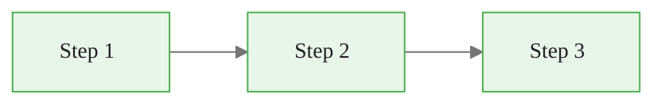

<!-- _class: lead -->

# Deck Title
## Module N — Course Name

<!-- Speaker notes: Welcome to this module. Introduce the topic and set expectations for what learners will achieve. -->

---

## Learning Objectives

- Objective 1: Describe what learners will understand
- Objective 2: Describe what learners will be able to do
- Objective 3: Describe the practical outcome

<!-- Speaker notes: Review the objectives. By the end of this deck, learners will be able to accomplish all three. -->

---

## Concept Overview

Key explanation text goes here. Keep to 2-3 sentences, then introduce a visual.



<!-- Speaker notes: Walk through the diagram. Explain each step and the transitions between them. -->

---

## Code Example

<div class="code-window">
  <div class="code-header">
    <div class="dots"><span class="dot-red"></span><span class="dot-yellow"></span><span class="dot-green"></span></div>
    <span class="filename">example.py</span>
  </div>

```python
import numpy as np

def process(data):
    """Process input data and return results."""
    transformed = np.array(data)
    return transformed
```

</div>

<!-- Speaker notes: Walk through the code. Highlight the key function and what it returns. -->

---

<div class="callout-key">
  <strong>Key Point:</strong> Summarize the most important takeaway from the previous slide here.
</div>

<div class="callout-insight">
  <strong>Insight:</strong> Add a deeper observation that connects this concept to the broader topic.
</div>

<!-- Speaker notes: Emphasize the key point. This is the one thing learners should remember. -->

---

## Process Flow

<div class="flow">
  <div class="flow-step mint">1. Load Data</div>
  <div class="flow-arrow">&#8594;</div>
  <div class="flow-step amber">2. Transform</div>
  <div class="flow-arrow">&#8594;</div>
  <div class="flow-step blue">3. Train</div>
  <div class="flow-arrow">&#8594;</div>
  <div class="flow-step lavender">4. Evaluate</div>
</div>

<!-- Speaker notes: Walk through each step of the pipeline. Explain what happens at each stage. -->

---

<!-- _class: module-break -->

## Next Section Title

---

## Comparison

<div class="compare">
  <div class="compare-card">
    <div class="header before">Before</div>
    <div class="body">
      Description of the old approach or baseline state.
    </div>
  </div>
  <div class="compare-card">
    <div class="header after">After</div>
    <div class="body">
      Description of the improved approach or target state.
    </div>
  </div>
</div>

<!-- Speaker notes: Contrast the two approaches. Highlight why the "after" is an improvement. -->

---

## Summary

| Concept | Key Takeaway |
|---------|-------------|
| Concept 1 | One-line summary of the main point |
| Concept 2 | One-line summary of the main point |
| Concept 3 | One-line summary of the main point |

<div class="callout-info">
  <strong>Next:</strong> Continue to the hands-on notebook to apply these concepts with real data.
</div>

<!-- Speaker notes: Recap the three main takeaways. Direct learners to the companion notebook. -->
